# 1005: Transformation Advisor

**Last updated:** March 2023

**Duration:** 45 minutes

Need support? Contact **Kevin Postreich, Yi Tang**

## Introduction

**IBM Cloud Transformation Advisor** (Transformation Advisor) is an
application modernization tool that is entitled through IBM WebSphere
Hybrid Edition.

Transformation Advisor is used to help modernize your Java applications
and move them to Liberty on VMs and optionally to Liberty on
Kubernetes-based platforms.

Transformation Advisor determines the complexity of your applications,
identifies needed application changes, estimates the development cost
for a move to Liberty, and generates reports and deployment artifacts
that can help you update applications and move them to the target
environment.

The Transformation Advisor tool provides the following value:

  - identify the Java EE programming models in the app.

  - determine the complexity of apps by listing a high-level inventory
    of the content and structure of each app.

  - highlight Java EE programming model and WebSphere API differences
    between the WebSphere profile types

  - identify Java EE specification implementation differences that might
    affect the app

  - generate accelerators for deploying the application to Liberty and
    containers in a target environment.

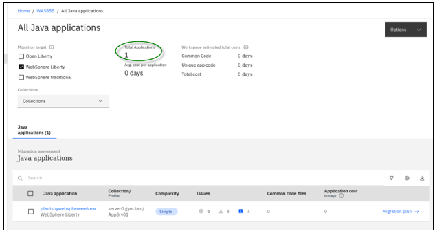

## **Accessing the environment**

If you are doing this lab as part of an instructor led workshop (virtual
or face to face), an environment has already been provisioned for you.
The instructor will provide the details for accessing the lab
environment.

Otherwise, you will need to reserve an environment for the lab. You can
obtain one here. Follow the on-screen instructions for the “**Reserve
now**” option.

KLP: TBD LINK TO ENV RESERVATION

The lab environment contains two (2) Linux VMs.

A Published Service is configured to provide access to the **server0**
VM through the noVNC interface for the lab environment.

1.  Access the lab environment from your web browser.

    a. When the environment is provisioned, right-mouse click on the
 **Published Service** link/ Then select “**Open link in New Tab**”
 from the context menu.
 
    
 
    b. Click on the **"vnc.html"** link to open the lab environment
 through the **noVNC** interface.
 
    
 
    c. Click the **Connect** button
 
    
 
    d. Enter the password as: **passw0rd**. Then click the **Send
 Credentials** button to access the lab environment.
 
    **Note:** That is a numeric zero in passw0rd
 
    

2.  Login to the **server0** VM using the credentials below:
    
      - User ID: **techzone**
    
      - Password: **IBMDem0s!**

## Tips for working in the lab environment

1.  You can use your Browsers **zoom in** and **zoom out** options to
    resize the virtual desktop to fit your screen.

    The examples below are using Firefox and Chrome browsers.

    - Firefox example:

    

    - Chrome example:

    

2.  You can copy / paste text from the lab guide into the lab
    environment using the clipboard in the noVNC viewer.

    a. Copy the text from the lab guide that you want to paste into the
 lab environment
 
    b. Click the **Clipboard** icon and **paste** the text into the noVNC
 clipboard
 
    
 
    c. Paste the text into the VM, such as to a terminal window, browser
 window, etc.
 
    d. Click on the **clipboard** icon again to close the clipboard
 
    **NOTE:** Sometimes pasting into a Terminal window in the VM does not
 work consistently. In this case you might try again or paste the text
 into a **Text Editor** in the VM, and then paste it into the Terminal
 window in the VM.

3.  An alternative to using the noVNC Copy / Paste option, you may
    consider opening the lab guide in a web browser inside of the VM.
    Using this method, you can easily copy / paste text from the lab
    guide without having to use the noVNC clipboard.

## Lab: Transformation Advisor

This lab demonstrates using Transformation Advisor for **"runtime
modernization to Liberty"**. It uses the PlantsByWebSphere application,
which originates from WebSphere ND V8.5.5.

It shows the value of using Transformation Advisor (TA) to evaluate
on-premises Java applications and identify the effort required for
migrating the application to Liberty.

You will also explore the deployment accelerators that TA generates to
help deploy and run Java applications on Liberty on VMs and
Kubernetes-based platforms.

**This lab contains the following
activities:**

  - Clone the git repository to the VM, which contains artifacts
    required for the lab

  - Review the existing WebSphere application used in the scenario

  - Use Transformation Advisor to collect data about the WebSphere
    application and server configuration, under assessment.

  - Use Transformation Advisor to assess the application for suitability
    for Liberty

  - Explore the deployment accelerator artifacts generated by
    Transformation Advisor that streamlines the configuration and
    deployment of the application to WebSphere Liberty

## Clone the GitHub repo for this workshop

This lab requires artifacts that are stored in a GitHub repository. Run
the command below to clone the repository to the local VM used for the
lab.

1.  Clone the GitHub repo that contains lab artifacts needed for the
    lab.

    a.  Open a new terminal window on the “**server0.gym.lan**” VM

    

     b.  Clone the GitHub repository required for the lab

        git clone https://github.com/IBMTechSales/liberty_admin_pot.git

    c. Navigate to the “lab-scripts” directory in the cloned repo

        cd ~/liberty_admin_pot/lab-scripts 

    d. Add the “execute” permissions to the lab-scripts directories and shell scripts

        chmod -R 755 ./

## **Part 1: Review the on-prem WebSphere “PlantsByWebSphere” app that is used for the Liberty Runtime Modernization scenario**

In this section, you take a quick look at the current WebSphere
Application Server environment and the PlantsByWebSphere application
deployed to the local WebSphere Application Server (WAS) environment on
the VM.

1.  Start the PlantsByWebSphere application DB2 database, which runs in
    a local docker container

    To start the DB2 database in the container:

    a.  Open a new terminal window

    
 
    b. In the terminal window, issue the command below to start the DB2
 database. Then use the “**docker ps**” command to verify the database
 container is running

        docker start db2_demo_data
        
        docker ps

    

2.  Start WebSphere Application Server

    In the desktop VM, you have a local WebSphere Application Server (WAS)
 which hosts the PlantsByWebSphere application. To start the WAS
 server:
 
    From the terminal window, issue the command below to start the WAS
 server.

        /opt/IBM/WebSphere/AppServer85515/bin/startServer.sh tWAS\_85515\_server

    The WebSphere Application Server is ready when you see the message
 stating the server is “**open for e-business”**, as illustrated below:
 
    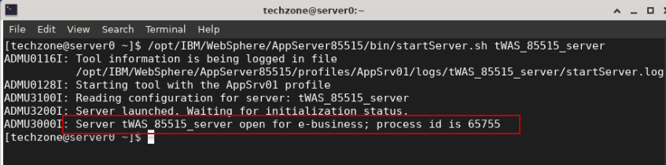

3.  Access the WebSphere Administration Console to view the application
    deployed.
    
    a. Open the **Firefox** Browser on the VM.

    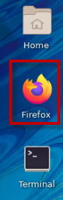

    b. From the Firefox browser, click **WebSphere Integrated Solution
     Console** bookmark to launch the WAS console. Or launch the WAS
     admin console using the URL:

        https://localhost:9043/ibm/console/

    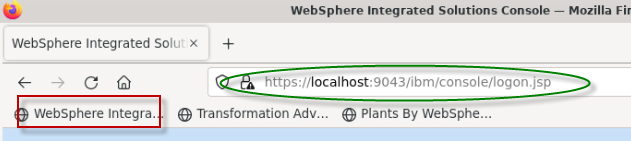
 
    c. If you see the **Warning: Potential Security Risk Ahead** message,
 click **Advanced**\>**Accept the Risk and continue**.
 
    d. In the **WAS Admin Console** login page, enter the WebSphere Admin User
 ID and Password as: **wsadmin** / **wsadmin** and click **Login**.
 
    
 
    e. On the **WAS Console** page, click **Applications** -\> **Application
 \> Types** -\> **WebSphere enterprise applications** to view the
 deployed applications.
 
    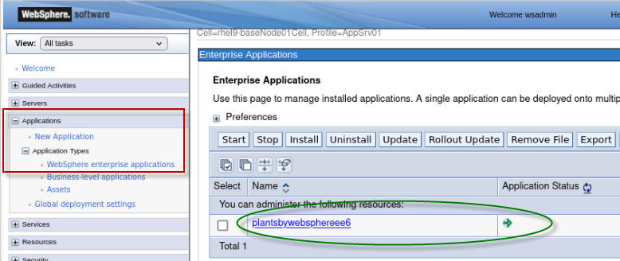
 
    In the **Enterprise Applications** list, you can see the PlantsByWebSphere
 application is deployed and in the “**running**” status, as indicated
 by the GREEN Started icon.
 
    Next, you will quickly run the PlantsByWebSphere application from the
 Firefox browser to ensure it works as expected.

4.  Launch and test the PlantsByWebSphere application
    
    a.  From the Firefox Browser, open a **new** browser tab.
    
    b.  Click on the “**Plants By WebSphere**” bookmark, or enter the
        following URL in the browser:

        http://server0.gym.lan:9080/PlantsByWebSphere

    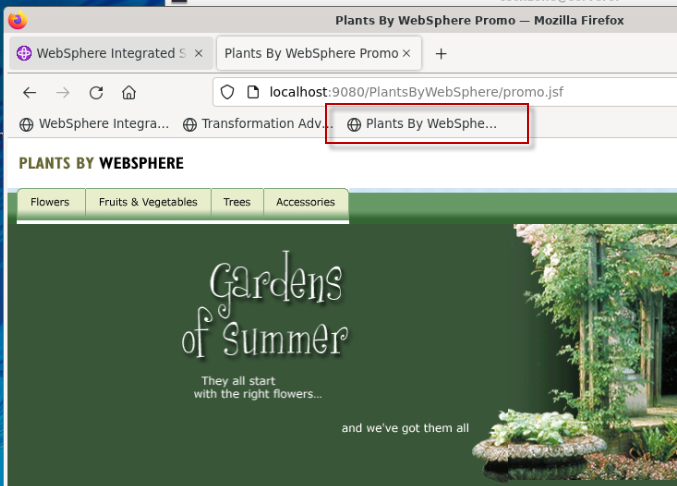

    c. Click on the “**Flowers**” tab, which will retrieve the catalog of
     flowers from the DB2 Database.

    If the list of Flowers is displayed, then the application is
 functioning as expected in the WebSphere Application Server
 environment.
 
    

5.  **Close** the Browser

In the next section of the lab, you will leverage Transformation Advisor
to accelerate the “Runtime Modernization” from the traditional WebSphere
Application Server to the cloud-enabled, right-sized, cost effective,
and modern Liberty Application Server.

Transformation Advisor is entitled for use through the IBM WebSphere
Hybrid Edition product, as is all editions of WebSphere Liberty.

## Part 2: Transformation Advisor data collector and migration bundle 

In this section of the lab, you will:

  -  Use Transformation Advisor data collector utility to collect
     application and configuration data from the WebSphere Application
     Server that is currently running the PlantsByWebSphere application

  -  Use Transformation Advisor to do a quick analysis to gain valuable
     insights to determine the feasibility and effort required to
     migrate the PlantsByWebSphere application to the modern Liberty
     runtime.
    
      - In this lab, no application code changes are required to run
        PlantsByWebSphere application on WebSphere liberty.

  -  Download the Liberty deployment artifacts generated by
     Transformation Advisor to facilitate a quick configuration and
     deployment of the PlantsByWebSphere application to WebSphere
     Liberty running on the VM.

### Access Transformation Advisor using the local installation

Transformation Advisor can be installed into an existing RedHat
OpenShift Cluster or locally on a VM into docker containers.

You can try Transformation Advisor – Local for yourself by registering
for a 90-day free trial: <http://ibm.biz/cloudta-trial>

In this lab environment, we have pre-installed Transformation Advisor –
Local which runs in docker containers.

1.  Launch the **Transformation Advisor** using the following commands:

        cd /home/techzone/transformation-advisor-local-3.4.0
    
        ./launchTransformationAdvisor.sh

    Wait for Transformation Advisor to initialize and display the action
 menu list.

2.  Type **5** and press **Enter** to start the **Transformation
    Advisor**.

    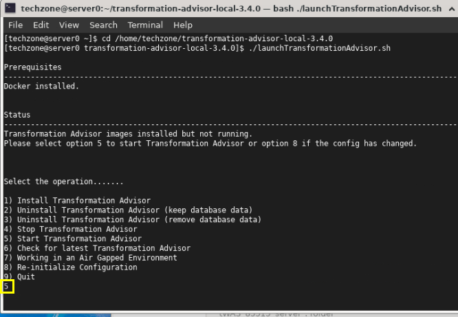

3.  After a few moments, the **Transformation Advisor** application is
    started. Right-click the application URL link and select **Open
    Link** to launch it in a web browser window.

    The URL is displayed in the output from the TA command:
 <http://server0.gym.lan:3000>
 
    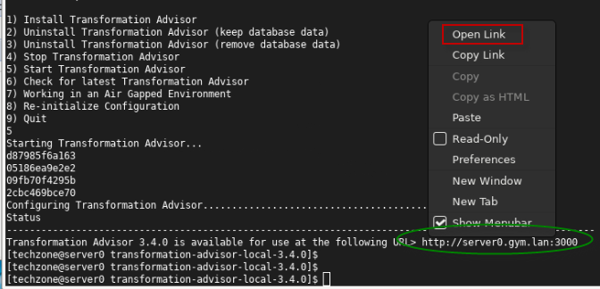
 
    This **Transformation Advisor** Home page is displayed in the Web
 Browser.
 
    
 
 In the next section, you will use the Transformation Advisor UI to
 download the **data collector utility** for the WebSphere Application
 Server environment. For this lab WebSphere is running on the Linux VM.

### **Download Transformation Advisor Data Collector utility**

Now the Transformation Advisor is running, you will download its Data
Collector utility that will run against the WebSphere Application Server
to gather application and server configuration data for analysis and an
assessment for modernizing the runtime to Liberty.

To evaluate on-premises Java applications, you need to run
**Transformation Advisor Data Collector utility** against the
Application server environment. It will extract application and
configuration from the environment.

Use the following steps to download the data collection utility from the
Transformation Advisor

1.  From the Transformation Advisor Home page, create a **new
    workspace**

    a. Click the **Create New** button
 
    b. Enter the workspace name as **WAS855**, then click the **Create**
 button
 
    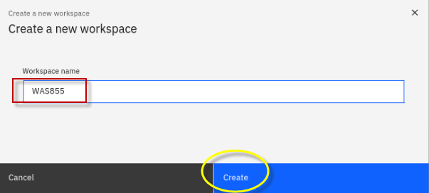

    <table>
    <tbody>
    <tr class="odd">
    <td></td>
    <td>
<strong>Info:</strong>

    
A workspace is a designated area that will house the migration recommendations provided by **Transformation Advisor** from your application server environment. You can name and organize these however you want, whether it’s by business application, location, or teams.
</td>
    </tr>
    </tbody>
    </table>

    Once the Workspace is created, you will have options to either
 **download** the Data Collector utility or **upload** existing data
 file into TA for analysis.
 
    

2.  Click the **Download** button to download the data collector for
    Linux

    

3.  In the Download page, you can download data collector utility based
    on your source operating system for your WebSphere environment. It
    also shows how to use the command line utility to collect
    application and configuration data from WebSphere, WebLogic, and
    Tomcat servers.

    a. Since WebSphere is running on the lab VM, which is Linux OS, click
 **Download Linux** to get the utility.
 
    
 
    b. In the Firefox browser, when the download is complete, you will see
 the file shown in the “**Downloads**” folder.
 
    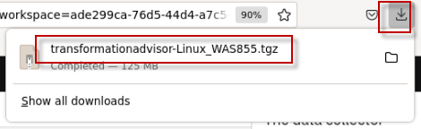
 
    **Note:** The zipped Data Collector utility file will be saved as:
 
    /**home/techzone/Downloads/transformationadvisor-Linux\_WAS855.tgz**

### **Run the Transformation Advisor Data Collector utility**

After downloading the zipped Data Collector utility, it needs to be
unpacked and run against a WebSphere Application server (WAS) to collect
all the data of deployed applications and their configuration from the
WAS server.

Now, let’s run the data collector.

1.  Go back to the terminal window and navigate the
    **/home/techzone/Downloads** directory and view its contents with
    commands:

        cd /home/techzone/Downloads/

        ls -l | grep transformationadvisor

    You can see the downloaded data collector utility file named
 “**transformationadvisor-Linux\_WAS855.tgz**”
 
    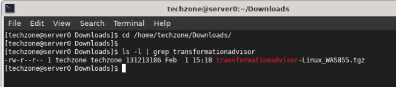

2.  Create a new directory and extract the data collector utility to the
    new directory, using the following commands:

        mkdir ~/Student/lab_1005

        tar xvfz transformationadvisor-Linux_WAS855.tgz --directory ~/Student/lab_1005

    The data collector utility will be extracted to:
 
     "/home/techzone/Student/lab_1005/transformationadvisor-3.4.0"

3.  Verify the data collector was extracted to the target directory:

        ls -l /home/techzone/Student/lab_1005/transformationadvisor-3.4.0

    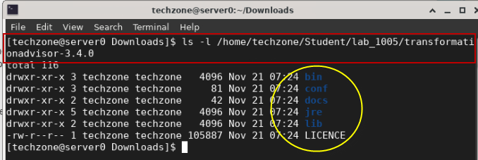
 
    **Note:** At this point, the data collector is ready to execute
 against a WebSphere environment.

4.  Return to the Transformation Advisor UI in the Web browser to view
    the section on “**Run the Tool**”, which shows the command to run on
    the WebSphere environment.

    a. From the **Data Collector** page, scroll down to the “**Run Tool**”
 section.
 
    The data collector command to be executed is based on the **domain**
 and **analysis type** selections you make in this section.
 
    

5.  Choose the **IBM WebSphere** Domain.

    **Note:** The data collector tool command changes based on this
 selection.
  
    

6.  Select the Analysis type of “**Apps and Configuration**”

    Selecting **Apps & Configuration** ensures that the application data
 and server configuration data is collected.
 
    The server configuration data is extremely helpful in Transformation
 Advisor to generate deployment artifacts in the migration bundle,
 which we will explore later in the lab.
 
    

7.  Run the data collector command shown below, which is based on the
    selected options.

        cd /home/techzone/Student/lab_1005/transformationadvisor-3.4.0/

        bin/transformationadvisor -w /opt/IBM/WebSphere/AppServer85515 -p AppSrv01

    <table>
    <tbody>
    <tr class="odd">
    <td></td>
    <td>
<strong>Tip:</strong>

    
<strong>-w</strong> option is the installation directory for WebSphere Application Server.  <strong>-p</strong> option is the name of the WebSphere “profile” to collect the data from
    
</td>
    </tr>
    </tbody>
    </table>

8.  Type the number “**1”** to accept the license agreement and press
    **Enter**, as illustrated below.

    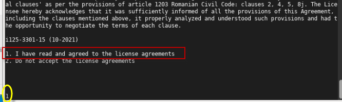
 
    This process takes time to complete, depending on how many
 applications are deployed on the WebSphere Application server.
 
    When the data collector completes, it will indicate the following:

    - Status: **Finished**
    - Configuration analysis: **Completed**
    - Profile name: **AppSrv01**
    - Applications Competed: **1**
    - Progress: **100%**

    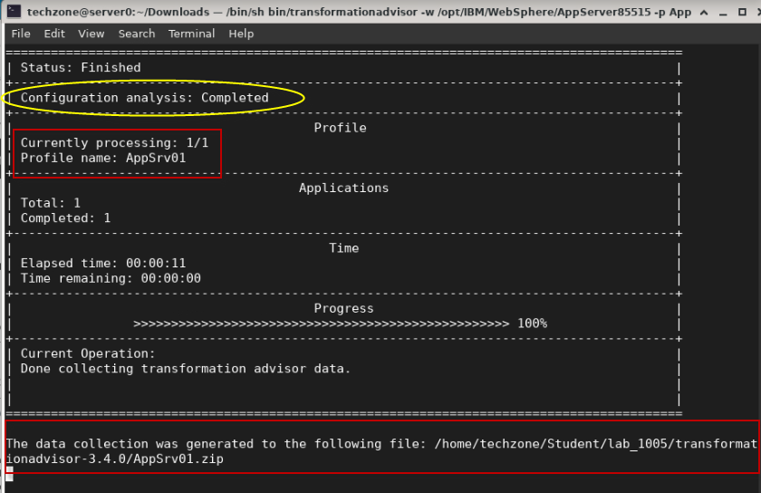
 
    When the collection utility completes, the following messages is
 displayed.
 
    > **“The data collection was generated to the following file:
 /home/techzone/Student/lab\_1005/transformationadvisor-3.4.0/AppSrv01.zip”**
    >
    >  “**Thank you for uploading your data. You can proceed to the
 application UI for doing further analysis.”**
 
    Your application data is collected and is saved to the
 “**AppSrv01.zip**” file.
 
    In general, if your application server and the **Transformation
 Advisor** are in the same network infrastructure, the collected data
 will be automatically uploaded to **Transformation Advisor** for you
 to view the analysis results.
 
    Otherwise, you must manually upload the data to **Transformation
 Advisor** before you can view the results.

### **Upload the data collection into Transformation Advisor**

In this section, you will upload the data collection zip file
“**AppSrv01.zip**” from the WebSphere environment for analysis.

1.  Go back to the Transformation Advisor page in the web browser, click
    the “**Workload type**”

    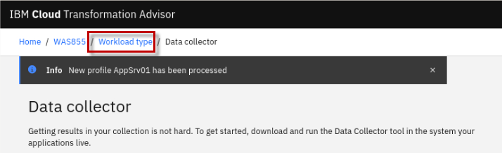
 
    Once the data collection has been uploaded to Transformation Advisor,
 you are redirected back to the Transformation Advisor “**All Java
 applications**” view.

2.  Optionally, resize the Firefox browser window and reduce the size of
    the text, to be able to provide an optimal view of the
    Transformation Advisor Analysis results.

    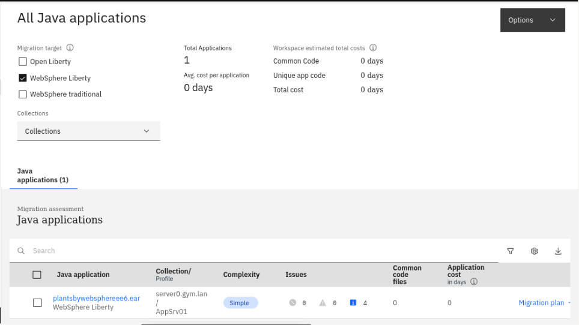

3.  Review the **workspace summary information** at the top of the page.

    Notice that the page shows “**All Java applications**” from the
 WebSphere Application Server profile named **AppSrv01**. In this case,
 only one application is shown, “**plantsbywebsphereee6.ear**”
 
    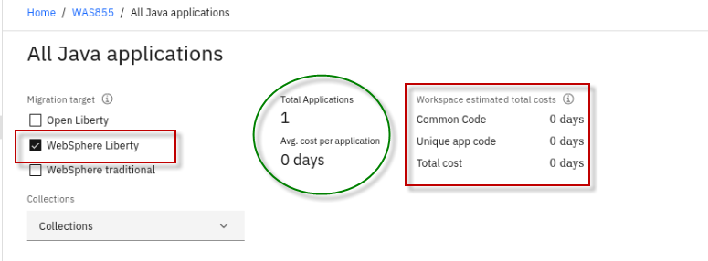
 
    The following details are included in the “**workspace summary**”
 located at the top of the page.

    - **Migration Target:** The default selection is “**WebSphere
    Liberty**” as the most optimal migration target. However, you may
    also display analysis details for Open Liberty and WebSphere
    traditional

    - **Total Applications**: The total number of applications in the
    workspace.

    - **Avg. cost per application**: The average number of days of
    development effort required to migrate an application to WebSphere
    Liberty target.

    - **Common Code**: The total cost to migrate all the common code in
    the workspace to the target platform.

    - **Unique app code**: The total cost to migrate all the unique app
    code (code that is not shared between applications) in the workspace
    to the target platform.

    - **Total cost**: The total cost to migrate all the applications and
    common code in the workspace to the target platform.

    In the next section, you will use Transformation Advisor and do a
 quick review of the application data analysis that was collected for
 the “**PlantsByWebSphere**” application.

## Part 3: Quick evaluation of the PlantsByWebSphere application

The goal of **runtime modernization** for the PlantsByWebSphere
application is to be able to deploy and run the application on WebSphere
Liberty to leverage the many benefits of the modern Liberty Application
Server runtime.

The first insight you will gain from Transformation Advisor is the
overall complexity required to modernize to the Liberty runtime for the
specific application being assessed.

In this section you will do a quick review the analysis results for the
**plantsbywebsphereee6.ear** application to get a clear understanding of
the development effort to modernize the runtime to WebSphere Liberty for
the PlantsByWebSphere application.

1.  Ensure you are at the “**All Java Applications**” page in
    Transformation Advisor.

    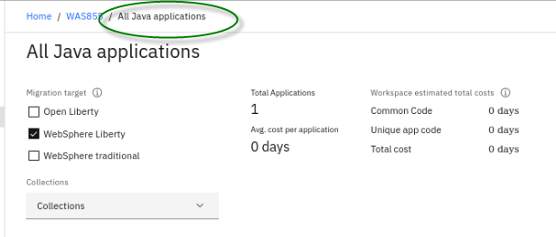

2.  Ensure “**WebSphere Liberty**” is the only selected migration target

    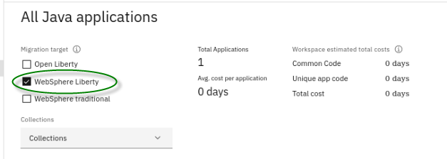

3.  In the **"Java applications"** section, locate
    **plantsbywebsphereee6.ear** which is the only application that was
    analyzed by the data collector.

    Let’s breakdown the summary analysis for the application with an
 explanation of the data columns based on the illustration for
 **plantsbywebsphereee6.ear** below:
 
    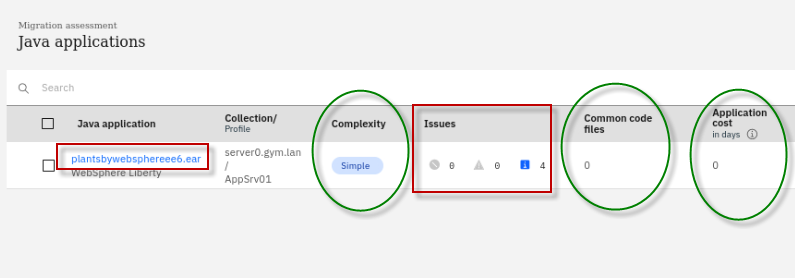

    - Complexity: **Simple**

      Complexity indicates how complex Transformation Advisor considers this
 application to be if you were to migrate it to WebSphere Liberty.
 
      The complexity can be “Simple”, “Moderate”, or “Complex”.
 
       **Simple** means there will not be any code changes to modernize to
 the WebSphere Liberty runtime.
 
       **Moderate** means there could be some application code changes
 required, but the changes are well known and easily managed.
 
       **Complex** means that application code must change, most often due to
 the fact that the application uses APIS that are not available in
 Liberty, and therefore the application code must be refactored using
 different APIs that are supported in Liberty.

    - **Issues**: 4 Informational issues

       The number and severity of potential issues with the migration of the
 application.
 
      The PlantsByWebSphere application has 4 “Informational” issues
 discovered. Informational issues often flag external dependencies and
 configuration that need to be considered, such as security, databases,
 and considerations if moving the application to containers.

    - **Common code files**: 0 common code files discovered among the
    applications in the workspace

       The number of common code files this application uses. A file is
 considered common if it is from a Shared Library or is used by at
 least one other application.

    - **Application cost in days**: 0 days of development effort (**No
    application code changes required**)

      Provides an estimate in days for the development effort to perform the
 migration for just this application.
 
      In this example, if you want to modernize the Java runtime to
 WebSphere Liberty for the plantsbywebsphereee6.ear application, the
 complexity level is **Simple**, which indicates that the application
 code does not need to be changed before it can be moved to WebSphere
 Liberty.
 
      The application has no dependencies, does not contain any know common
 code or shared library files. It has four minor (informational level)
 issues.
 
      **Note:** The estimated development effort is **"zero days"** because no code change is required.
 
    

4.  Click the **plantsbywebsphereee6.ear** link to expand its analysis
    results to access various assessment reports.

    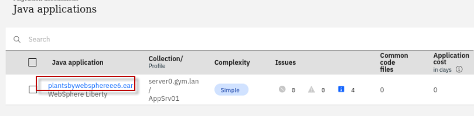

5.  Scroll down to bottom of the page and click the **Technology
    report** link, this opens a new browser window and displays the
    Technology report.

    
 
    The **Technology report** lists all java technologies the application
 used and whether these technologies are supported by a specific
 WebSphere platform from Liberty for Java on IBM Cloud to WebSphere
 traditional for z/OS.
 
    It is used to determine whether a particular WebSphere edition is
 suitable for an application in the various target runtime
 environments.
 
    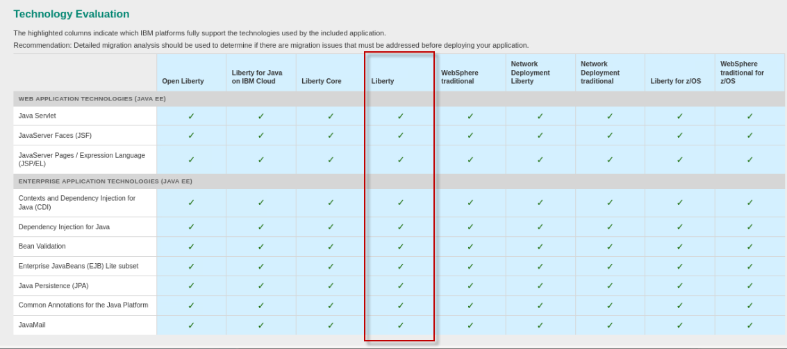

    <table>
    <tbody>
    <tr class="odd">
    <td></td>
    <td>
<strong>Tip:</strong>

    
Notice that the APIs used in the PlantsByWebSphere application are 100% available in WebSphere Liberty, further evidence that the application is a suitable candidate for runtime modernization to WebSphere Liberty
</td>
    </tr>
    </tbody>
    </table>

6.  **Close** the Application Technology Report tab in the Firefox
    browser.

7.  Return to the “**All Java Applications**” view in Transformation
    Advisor

    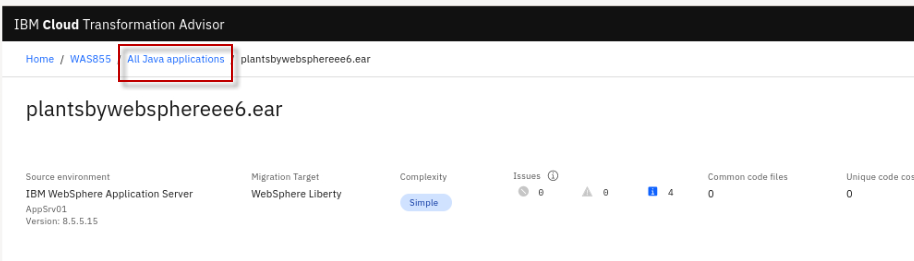
 
    From this quick analysis you reviewed above, you learned that
 PlantsByWebSphere application is suitable for runtime modernization to
 WebSphere Liberty.
 
    In the next section, you will explore and download the deployment
 artifacts that Transformation Advisor generated to facilitate the
 deployment of the PlantsByWebSphere application to WebSphere Liberty.
 
    Then, in a separate lab, you will leverage these deployment artifacts
 while you deploy the PlantsByWebSphere application to WebSphere
 Liberty that you will install on the VM.

## Part 4: Explore and download the migration bundle for the PlantsByWebSphere application

Transformation Advisor displays details about the **migration plan**
that it generated to accelerate the migration from WebSphere traditional
to WebSphere Liberty.

The migration plan includes a **bundle** of diverse artifacts, depending
on the needs of the application to accelerate the build, configuration,
and deployment of an application to VMs or to containers.

Now, let’s quickly explore the **Migration Plan** for the
PlantsByWebSphere application to see the artifacts that Transformation
Advisor created to expedite the application deployment to the WebSphere
Liberty target runtime.

1.  Ensure you are at the “**All Java applications**” view in
    Transformation Advisor which displays the Java application summary
    list

    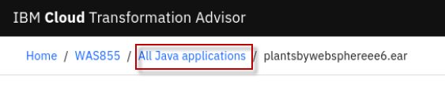

2.  Ensure only the **WebSphere Liberty** migration target is selected

    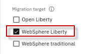

3.  Click on the **Migration plan** link located next to the
    **plantsbywebsphereee6.ear** application which will display its
    **migration plan** for the WebSphere Liberty target runtime.

    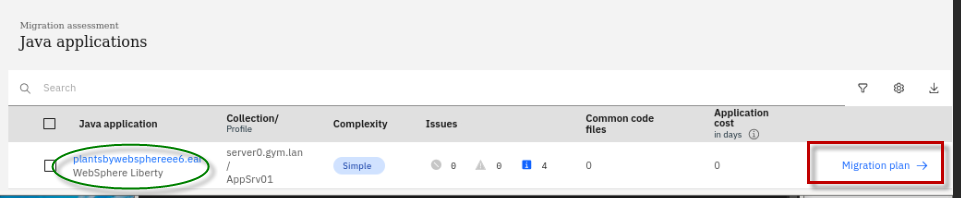

4.  The Migration Plan page is displayed

    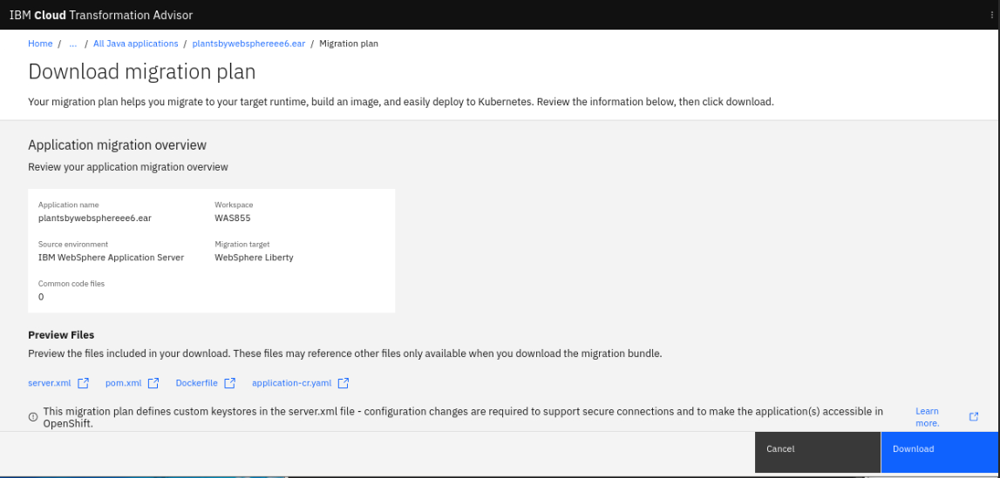

5.  Scroll down to the **Preview Files** section of the migration plan.
    Notice the files that were generated by Transformation Advisor to
    accelerate build and deployment of the application to Liberty.

    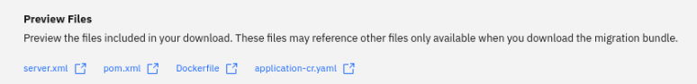
 
    To accelerate the application modernization, the artifacts produced by
 Transformation Advisor include:

    - **server.xml**: the configuration for the Liberty server
    - **pom.xml**: Build the application using Maven
    - **Application CR**: Custom Resource for the application to be
    deployed to OpenShift via the Open Liberty Operator
     - **Dockerfile**: Create the Docker image for the application

    The user can choose to **download** the artifacts as a migration
 bundle.

6.  Scroll down and review the “**Application Dependencies**” of the
    application. Then, expand the **plantsbywebsphereee6.ear**
    application.

    Transformation Advisor detected two DB2 database libraries as required
 dependencies for the PlantsByWebSphere application. During your
 migration project, you will need to gather the required libraries and
 place in the Liberty library path.
 
    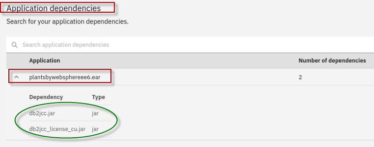

7.  Click the **Download** button to download the bundle of artifacts to
    the local filesystem on the server0.gym.lan VM.

    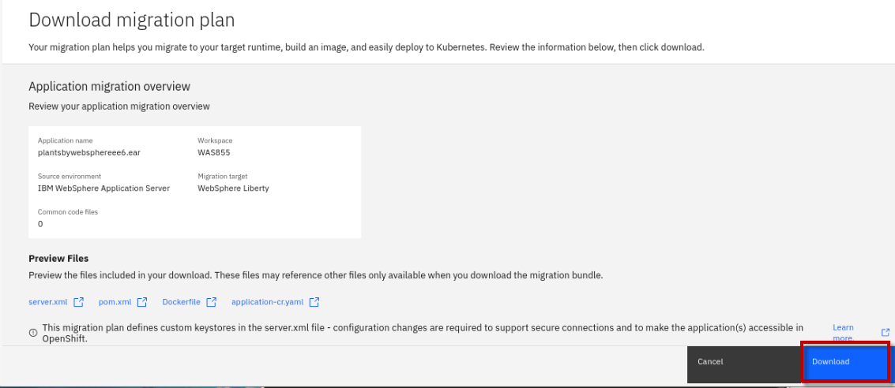
 
    The migration bundle named
 “**plantsbywebsphereee6.ear\_migrationBundle .zip”** file will be
 downloaded to the **/home/techzone/Downloads** directory.
 
    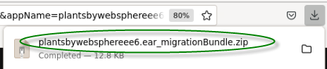

8.  Unzip the migration bundle artifacts to a new folder on the
    server0.gym.lan VM

    a. From a terminal window, run the following commands to unzip the
 migration bundle to a new directory named "**pbw**-**bundle**":

        mkdir /home/techzone/Student/lab_1005/pbw-bundle

        cd /home/techzone/Student/lab_1005/pbw-bundle

        unzip ~/Downloads/plantsbywebsphereee6.ear_migrationBundle.zip -d ~/Student/lab_1005/pbw-bundle

        ls -l

    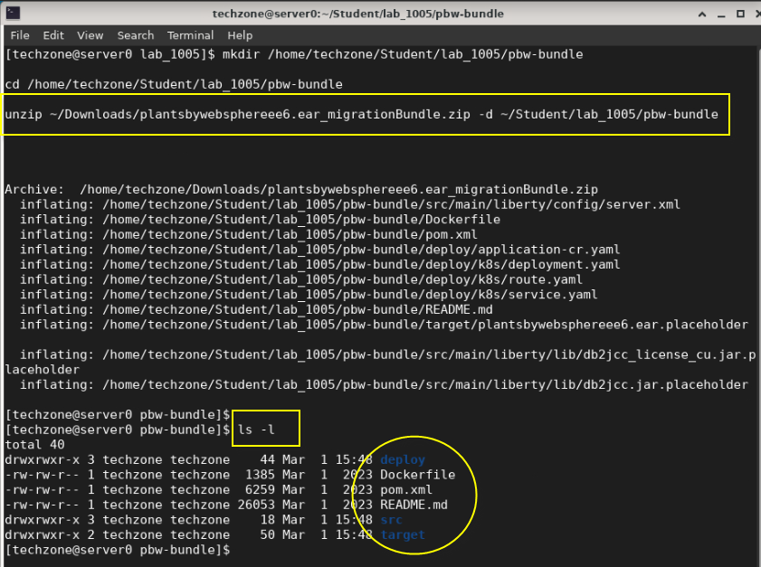

**Congratulations\!** You have successfully assessed the
PlantsByWebSphere application, found that it is suitable to be deployed
on a modern WebSphere Liberty Server runtime.

You have downloaded the deployment accelerator artifacts generated by
Transformation Advisor, which will accelerate the configuration and
deployment of PlantsByWebSphere to Liberty.

The next steps, which are detailed in the next lab; “**Lab\_1010-Runtime
Modernization**” are:

  - Install WebSphere Liberty using the archive installation method

  - Create a new WebSphere Liberty Server

  - Configure the WebSphere Liberty server using the deployment
    accelerators generated by Transformation Adviser, namely the
    “**server.xml**”

  - Deploy the PlantsByWebSphere application to WebSphere Liberty

## **Summary**

In this lab, you learned how to evaluate the existing Java application
using Transformation Advisor.

You downloaded Transformation Advisors generated deployment accelerators
from the migration bundle that accelerate the build, configuration, and
deployment of an application to Liberty.

Transformation Advisor accelerates application migration to Liberty and
helps minimize errors and risks, while speeding time to value.

**Congratulations\!**

**You have successfully completed the lab “Transformation Advisor”**
