# Lab 1010: Modernize your runtime to WebSphere Liberty

**Last updated:** March 2023

**Duration:** 60 - 90 minutes

Need support? Contact **Kevin Postreich, Yi Tang**

## Introduction

**Modernizing the runtime** refers to moving an application to a modern
Java runtime with the least amount of effort.

**WebSphere Liberty** is a fast, dynamic, and easy-to-use Java
application server, ideally suited for monolithic applications and
cloud-native applications.

WebSphere Liberty is built on the open-source Open Liberty project.
Liberty has extremely fast start-up times, requires no server restarts
to pick up changes, and is easy to configure with a simple
human-readable XML configuration file.

Runtime modernization gets the application to the WebSphere Liberty with the 
least amount of effort. The goal is to achieve efficiencies and agility
based on the value propositions of WebSphere Liberty, while keeping the
existing application code changes to a minimum.

An important point of “runtime modernization” is that the application
itself is not being 'modernized' to a newer architecture such as
microservices**.** As such, the application remains mostly unchanged
while achieving significant business outcomes with limited risk.

The diagram below shows the high-level decision flow where IBM Cloud
Transformation Advisor is used to analyze existing applications and a
decision is made to move the monolithic application to WebSphere Liberty
on VMs.

This lab demonstrates **runtime modernization**. It uses the
PlantsByWebSphere application, which originates from WebSphere ND
V8.5.5.

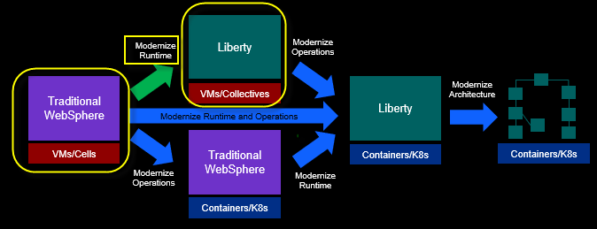

After modernizing the runtime to WebSphere Liberty on VMs, the business
is well positioned to containerize the application for Kubernetes
cloud-based deployments, if or when it’s appropriate to implement a
containerization strategy.

**A brief overview of “Why modernize my runtime to Liberty”**

Before you get into the hands-on aspect of modernizing the runtime to
WebSphere Liberty, let’s take a step back and understand why modernizing
to the Liberty runtime matters and how it brings significant value and
efficiencies to your business.

For your reference, here is a full article on the high value of
WebSphere Liberty. But let’s just hit some of the key highlights in this short overview.

**Read the full article**:
[ibm.biz/6ReasonsWhyLiberty](https://ibm.biz/6ReasonsWhyLiberty)

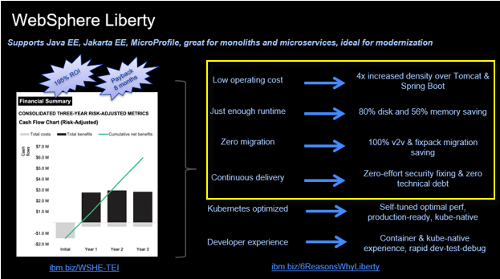

### Low operating costs

Liberty and IBM Semeru Java are designed to be extremely efficient in
terms of memory and disk, while also delivering industry leading
throughput. As a result, a significant cost saving can be achieved using
Liberty and the OpenJ9-based Semeru Java.

Since Liberty uses less memory and disk space than any other Java
runtime, you can deploy more Liberty Java applications, using fewer
physical resources, which is a great cost savings to your business.

This is equally beneficial for monolithic application and cloud-native
application efficiency.

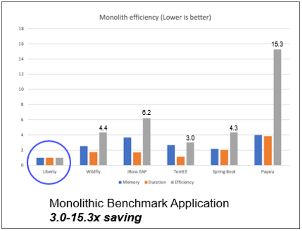

### Just enough runtime – Right sized for your specific application

Liberty is a fully **modular runtime**, letting you pick and choose the
capabilities you need for your application. With Liberty, you have one
runtime and one approach to developing and deploying applications that
scale from small microservices all the way up to full modern enterprise
monoliths and anything in between.

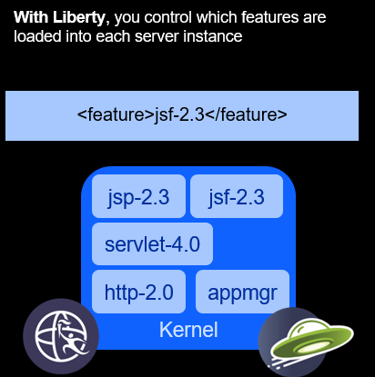

### Zero migration

With traditional Application Servers, in fact any other runtime,
application code migration is required when upgrading to newer versions
of the runtime.

Version to version migration is a painful process because of
configuration changes, runtime behavior changes, and deprecation
removals. The leads to costly migrations with little perceivable benefit
to the business. As a result, it’s not unusual for migrations to take
from months to over a year to complete.

Liberty is different. Liberty’s zero migration architecture means that
configuration behavior is preserved from one release to the next.

Feature behaviors are not changed, and feature are not removed. This
means that a server and application that worked on Liberty years ago,
continue to work, and will continue to work in the future, without
change.

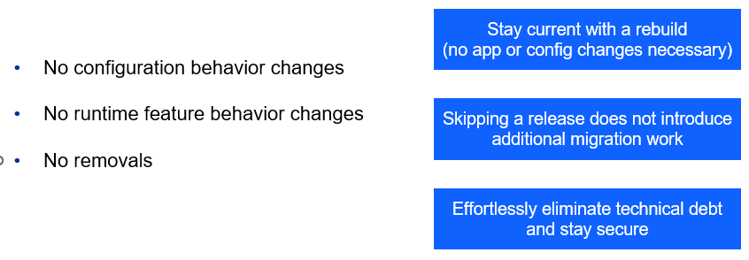

### Continuous Delivery - Low maintenance, zero technical debt

Because of the Liberty **feature model** and **Zero Migration**
architecture, Liberty follows a single stream delivery model.

There is only one stream of Liberty, no version upgrades necessary.
Better still, each new release resets the 5-year support window and so
there’s no need for support extensions.

Simply install new fixpacks to get the latest performance enhancements,
features, and bug fixes. Then just point to your existing Liberty
servers from the latest Liberty installation, basically removing your
biggest headaches for managing technical debt.

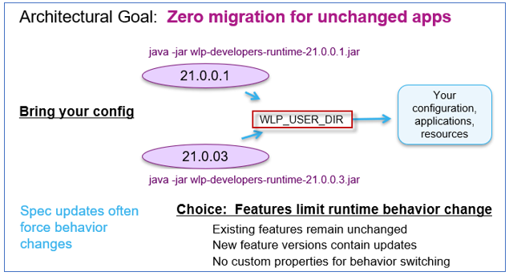

## **Accessing the environment**

If you are doing this lab as part of an instructor led workshop (virtual
or face to face), an environment has already been provisioned for you.
The instructor will provide the details for accessing the lab
environment.

Otherwise, you will need to reserve an environment for the lab. You can
obtain one here. Follow the on-screen instructions for the “**Reserve
now**” option.

KLP: TBD LINK TO ENV RESERVATION

The lab environment contains two (2) Linux VMs.

A Published Service is configured to provide access to the **server0**
VM through the noVNC interface for the lab environment.

1.  Access the lab environment from your web browser.

    a. When the environment is provisioned, right-mouse click on the
 **Published Service** link/ Then select “**Open link in New Tab**”
 from the context menu.
 
    
 
    b. Click on the **"vnc.html"** link to open the lab environment
 through the **noVNC** interface.
 
    
 
    c. Click the **Connect** button
 
    
 
    d. Enter the password as: **passw0rd**. Then click the **Send
 Credentials** button to access the lab environment.
 
    **Note:** That is a numeric zero in passw0rd
 
    

2.  Login to the **server0** VM using the credentials below:
    
      - User ID: **techzone**
    
      - Password: **IBMDem0s!**

## Tips for working in the lab environment

1.  You can use your Browsers **zoom in** and **zoom out** options to
    resize the virtual desktop to fit your screen.

    The examples below are using Firefox and Chrome browsers.

    - Firefox example:

     

    - Chrome example:

     

2.  You can copy / paste text from the lab guide into the lab
    environment using the clipboard in the noVNC viewer.

    a. Copy the text from the lab guide that you want to paste into the
 lab environment
 
    b. Click the **Clipboard** icon and **paste** the text into the noVNC
 clipboard
 
    
 
    c. Paste the text into the VM, such as to a terminal window, browser
 window, etc.
 
    d. Click on the **clipboard** icon again to close the clipboard
 
    **NOTE:** Sometimes pasting into a Terminal window in the VM does not
 work consistently. In this case you might try again or paste the text
 into a **Text Editor** in the VM, and then paste it into the Terminal
 window in the VM.

3.  An alternative to using the noVNC Copy / Paste option, you may
    consider opening the lab guide in a web browser inside of the VM.
    Using this method, you can easily copy / paste text from the lab
    guide without having to use the noVNC clipboard.

## Lab: Modernize your Runtime to WebSphere Liberty

The focus of this lab is to demonstrate **Modernizing the runtime,**
which refers to moving a Java application to WebSphere Liberty with the
least amount of effort.

This lab focuses on modernizing From Traditional WebSphere Application
Server to WebSphere Liberty on VMs.

In this section, you will install WebSphere Liberty, create a new
Liberty server, and leverage the artifacts generated by Transformation
Advisor to configure and run the PlantsByWebSphere application on your
new WebSphere Liberty server.

This lab contains the following activities:

  - Clone the git repository to the VM, which contains artifacts
    required for the lab

  - Install WebSphere Liberty Kernel using the “Archive method”

  - Configure WebSphere Liberty using the server.xml generated by
    Transformation Advisor

  - Run the application on the new WebSphere Liberty server on the VM

## **Clone the GitHub repo for this workshop**

This lab requires artifacts that are stored in a GitHub repository. Run
the command below to clone the repository to the local VM used for the
lab.

1.  If you have not already done so in a previous lab, clone the GitHub
    repo that contains lab artifacts for the lab.

    a.  Open a new terminal window on the “**server0.gym.lan**” VM

    

    b.  Clone the GitHub repository required for the lab

        git clone https://github.com/IBMTechSales/liberty_admin_pot.git

    c. Navigate to the “lab-scripts” directory in the cloned repo

        cd ~/liberty_admin_pot/lab-scripts 

    d. Add the “execute” permissions to the lab-scripts directories and shell scripts

        chmod -R 755 ./

## Install WebSphere Liberty using the archive method

In the initial setup of Liberty, you will install Liberty using the
**Archive** method. Then, you will create your first Liberty server,
start it, and view the logs to ensure the server starts successfully.

You will use the Linux VM environment that has been prepared for the lab
and includes the following software:

  - The **Liberty** archive has been downloaded to
    **/home/techzone/Student/LabFiles/wlp-kernel-22.0.0.8** directory

  - The **IBM JDK 1.8** is installed in **/opt/IBM/ibm-java-x86\_64-80**
    directory

WebSphere Liberty can be installed via IBM Installation Manager, but the
more convenient way is to use an Archive Install.

To install Liberty using the “**archive method**”, perform the following
steps:

1.  Open a Terminal window by clicking on the appropriate icon on the VM
    desktop:

2.  Navigate to the techzone user’s home directory:

        cd /home/techzone

3.  Create a directory named “lab\_1010” where you will install
    WebSphere Liberty. Then navigate to that directory

        mkdir /home/techzone/Student/lab_1010

        cd /home/techzone/Student/lab_1010

4.  Extract the WebSphere Liberty Kernel package to the
    **\~/Student/lab\_1010** directory.

    The Liberty Archive is a “zip” file. To extract the archive, use the unzip command.

        unzip ~/Student/LabFiles/wlp-kernel-22.0.0.8.zip -d ~/Student/lab_1010

    - The Liberty archive is extracted, and Liberty is now installed in
    **/home/techzone/Student/lab\_1010/wlp**.

5.  Set the **JAVA\_HOME** path to tell Liberty to use the Java SDK that
    has been installed for the lab.

        export JAVA_HOME=/opt/IBM/ibm-java-x86_64-80/jre/

<table>
<tbody>
<tr class="odd">
<td></td>
<td>
<strong>Info:</strong>

In this lab, the application that you configure to run on WebSphere Liberty requires Java 8, as the application has not been modified to run on newer versions of Java.
</td>
</tr>
</tbody>
</table>

6.  Navigate to the WebSphere Liberty directory. This is where Liberty
    was installed via the unzipping of the Liberty zip file.

        cd /home/techzone/Student/lab_1010/wlp

7.  Display the “**product information”** for WebSphere Liberty

    a. Display the Liberty product edition and version

        bin/productInfo version

    The output should indicate the Liberty Edition is **BASE**, and the
 product version will match the Liberty Archive that was used to
 install Liberty in the lab, 22.0.0.8.
 
    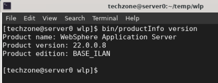
 
    Liberty fixpacks are delivered on a four-week continues delivery
 interval.

    - The Version indicates the YEAR and MONTH of the Liberty fixpack
    installed.
    - 22.0.0.8 is the 8th fixpack in 2022

    b. Display the list of features that are installed in the Liberty
 installation.

        bin/productInfo featureInfo

    The **blank line** output indicates that there are not any features
 installed. This is because you installed the WebSphere Liberty Kernel.
 
    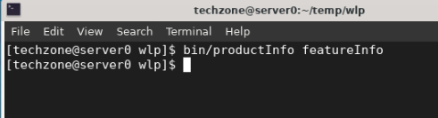
 
    The “**kernel**” contains just the Liberty kernel and no additional
 runtime features. This is recommended so that you can install only the
 features required for a specific application and operational
 requirements.
 
    Later in the lab when you deploy the PlantsByWebSphere application,
 you will install only the Liberty features that are specified in the
 Liberty’s server configuration file, server.xml, which was generated
 by Transformation Advisor.
 
    **Congratulations\! You have just installed Liberty using the archive install method**.

## Create a new Liberty server that will run the sample application, “PlantsByWebSphere”

1.  From the terminal window, ensure you are at the Liberty runtime
    installation directory

        cd /home/techzone/Student/lab_1010/wlp

2.  Run the following command to **create** a new server named
    “**pbwServer**”

        bin/server create pbwServer

    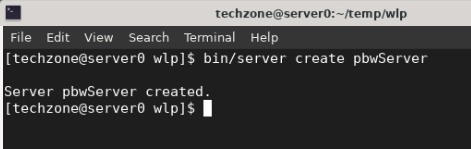
 
    The server create command creates a new Liberty server with the name
 “pbwServer”.
 
    The server command also supports actions for starting, stopping,
 creating, packaging, and dumping a Liberty server.
 
    **Additional detail on the server command can be found here:**
 
    <https://www.ibm.com/docs/en/was-liberty/base?topic=line-server-command-options>

3.  The new Liberty server is created in the following directory:

    /home/techzone/Student/lab\_1010/wlp/usr/servers/pbwServer
 
    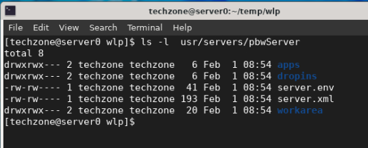

4.  Open an editor to view the server configuration file.

        gedit ~/Student/lab_1010/wlp/usr/servers/pbwServer/server.xml

    The **server.xml** file is the complete default server configuration
 when only the Liberty kernel is installed.
 
    The **server.xml** defines a minimal configuration needed to start a
 Liberty server.
 
    In this example, since you installed the Liberty kernel which does not
 include any JAVA EE features, the server.xml only includes the
 required \<server\> definition to be able to start the Liberty server.
 
    Later, you will install the features that are required to run the
 PlantsByWebSphere application.
 
    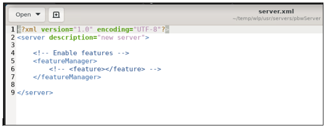

5.  **Close** the gedit editor.

6.  **Start** the server instance using the **server start** command:

        bin/server start pbwServer

    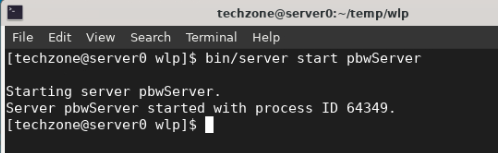
 
    This command starts the Liberty server. The server log,
 “**messages.log**” is written to **wlp/usr/servers/pbwServer/logs**
 directory.

7.  View the Liberty server’s **messages.log** file to see the server
    startup messages

        cat ~/Student/lab_1010/wlp/usr/servers/pbwServer/logs/messages.log

    The server is started when the message “T**he pbwServer server is
 ready to run a smarter planet”** is displayed in the messages.log
 file.
 
    The messages.log also displays the server’s product and environment
 details, as highlighted in the illustration below.
 
    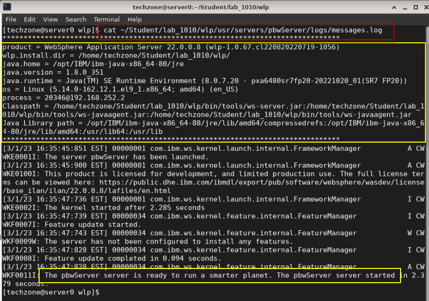

8.  **Stop** the server with the **server stop** command:

        bin/server stop pbwServer

    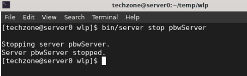
 
    Having verified the Liberty installation, you will continue the lab to
 modernize the runtime for the PlantsByWebSphere application from
 Traditional WebSphere Application Server to your new WebSphere Liberty
 Application Server.

## Use Transformation Advisor deployment accelerators to configure PlantsByWebSphere application for WebSphere Liberty deployment

In this section, you will leverage the **server.xml** file generated by
Transformation Advisor to configure and run the PlantsByWebSphere
application on the WebSphere Liberty Server that you installed and
created in the previous section of the lab.

Transformation Advisor can generate a collection of deployment
artifacts, as a zip archive, known as a “**migration bundle**” that
includes customized deployment files that accelerate the deployment of
your Java application to WebSphere Liberty, and optionally to Liberty in
containers.

The generated “**server.xml**” file is configured for the
**PlantsByWebSphere** application based on the WebSphere configuration
discovered when the Transformation Advisor data collector was run
against the WebSphere Application Server hosting the application.

The **server.xml** file is just one of the deployment accelerators
generated by Transformation Advisor and included in a “migration
bundle”.

Additional deployment artifacts for deploying the application to
containers was also generated but is not the focus of this lab.

<table>
<tbody>
<tr class="odd">
<td></td>
<td>
<strong>Note:</strong> Using the Transformation Advisor data collection utility is outside the scope of this lab.

Lab_1005 in this PoT series showcases how to use the data collector and generate the migration bundle that you will leverage in this lab.
</td>
</tr>
</tbody>
</table>

### **Preparing for your migration to WebSphere Liberty**

Transformation Advisor is an innovative modernization tool entitled
through the IBM WebSphere Hybrid Edition product. It us used to collect
application and runtime configuration data from the source Java runtime,
such as WebSphere Application Server, and produce the analysis results
for your review.

Transformation Advisor also automatically generates a “**migration
bundle**” with the artifacts you will need to deploy the
PlantsByWebSphere application running on Liberty for VM deployment and
optionally to a Kubernetes platform.

So, after deciding to migrate the PlantsByWebSphere application to
WebSphere Liberty, you would download the “**migration bundle**” and
extract its contents to your developer machine to leverage the generated
artifacts for application deployment to WebSphere Liberty.

### Unzip the PlantsByWebSphere migration bundle that was generated by Transformation Advisor

In this lab, we are providing the “**migration bundle**” for you, which
was generated by Transformation Advisor based on its data collection
from a WebSphere Application Server hosting the PlantsByWebSphere
application.

We offer additional hands-on labs that focus on using Transformation
Advisors data collection, application analysis, and migration plan.

To accelerate the application modernization, the artifacts produced by
Transformation Advisor in the migration bundle include:

  - **server.xml**: the configuration for the Liberty server
  
  - **pom.xml**: Build the application using Maven
  
  - **Application CR**: Custom Resource for the application to be
    deployed to OpenShift via the Open Liberty Operator
  
  - **Dockerfile**: Create the Docker image for the application

   

1.  Unzip the migration bundle artifacts to a new folder on the
    server0.gym.lan VM

    a. From a terminal window, run the following commands to unzip the
 migration bundle to a new directory named "**pbw**-**bundle**":

        mkdir /home/techzone/Student/lab_1010/pbw-bundle
    
        cd /home/techzone/Student/lab_1010/pbw-bundle
    
        unzip ~/liberty_admin_pot/pbw_migrationBundle.zip -d ~/Student/lab_1010/pbw-bundle

    b. List the contents of the "pbw-bundle" directory

        ls -l

    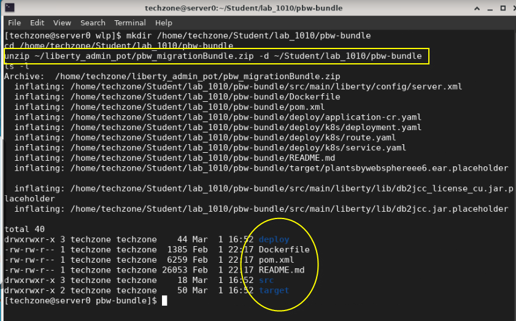

    Next, you will leverage the **server.xml** file from the migration bundle
of artifacts to facilitate faster time to value when configuring and
deploying the PlantsByWebSphere application to a new WebSphere Liberty
Server environment.

    - **First**, you will review the contents of the **server.xml** file
    that **Transformation Advisor** generated.

    - **Second**, you will make minor updates to the server.xml file that
    is required to properly run the PlantsByWebSphere application on
    WebSphere Liberty.

### Examine the server.xml file generated by Transformation Advisor

Let’s briefly examine the **server.xml** file that was generated to
understand the value that Transformation Advisor provided to accelerate
the deployment of PlantsByWebSphere application to WebSphere Liberty.

The **server.xml** file is in the migration bundle:
/home/techzone/Student/lab\_1010/pbw-bundle/src/main/liberty/config/server.xml

1.  Open the server.xml file in an editor (gedit)

        gedit /home/techzone/Student/lab_1010/pbw-bundle/src/main/liberty/config/server.xml

    - **Lines 4-16:** The Liberty Features required by PlantsByWebSphere

      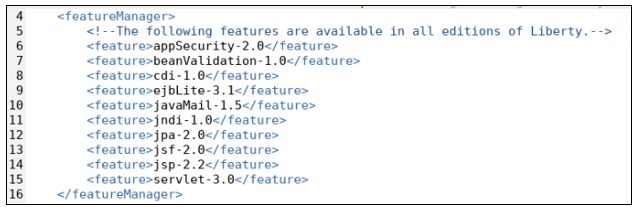

    - **Lines 48 – 67: Variables**, which often differ between
    environments have been created.

      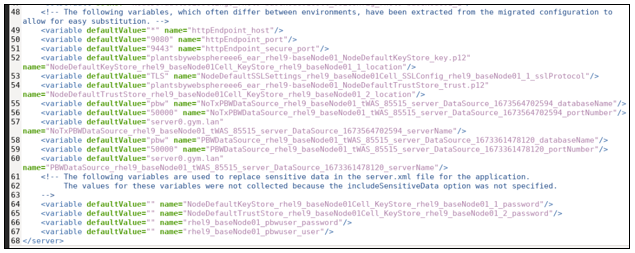

      >- The variables are used throughout the server.xml file to avoid hard
    coded values in the configuration.

      >- Default values are set for many of the variables but can be
    overridden in a variety of ways.

      **The variables can be overridden at deployment time by:**

      - Environment variables on the system
      - Liberty config/overrides files
      - Liberty bootstrap.properties file
      - Secrets and Configmaps in Kubernetes deployments

    - **Lines 64-67:** Variables that may contain sensitive information,
     such as User and Password DO NOT contain default values.

      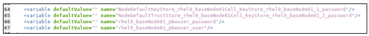

    - **Lines 20-21:** Application location and HTTP(S) Ports

      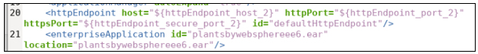

    - **Lines 23-28**: DB2 JDBC Database Drivers

      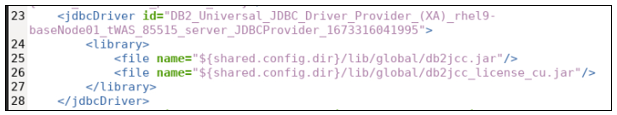

    - **Lines 29-32:** One of the two DB2 DataSources used by the
    application

      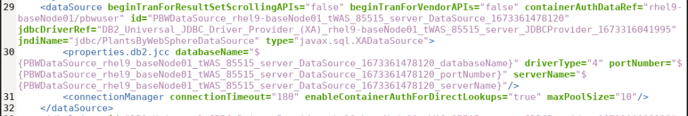

    - **Lines 44-47:** Custom KeyStores to support secure connections to
    the application. (We will not use these in this lab)

      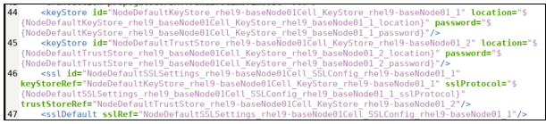

2.  **Close** the editor when you finish reviewing the server.xml file.
    **DO NOT SAVE any changes** to the contents.

## Modify the generated server.xml for our lab environment

The following server.xml configuration is required to be modified for
the PlantsByWebSphere application to properly run in WebSphere Liberty:
  
  >- The Variables for Username and Password of the DB2 Database
  >- The HTTP and HTTPS Ports
  >- Location of the DB2 Database Driver libraries

1.  Open the server.xml file in an editor (gedit)

        gedit /home/techzone/Student/lab_1010/pbw-bundle/src/main/liberty/config/server.xml

2.  Set default values for the following DB2 user and password variables

    These are the credentials the application uses to access the DB2
 application database.

    a. Go to line numbers **66** and **67**

    b. Set defaultValue=”**db2inst1**” for the
     “**rhel9\_baseNode01\_pbwuser\_user”** variable

    c. Set defaultValue=”**db2inst1-pwd**” for the
     “**rhel9\_baseNode01\_pbwuser\_password”** variable

    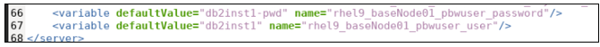

3.  Modify the application HTTP and HTTP ports to avoid possible port
    conflicts

    a.  Go to line numbers **50** and **51**

    b.  Set defaultValue=”**9088**” for the “**httpEndpoint\_port”**
    variable

    c.  Set defaultValue=”**9448**” for the “**httpEndpoint\_secure\_port”**
    variable

    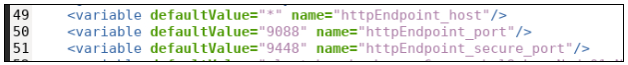

4.  Modify the path location for the DB2 driver libraries used by the
    **"DB2\_Universal\_JDBC\_Driver\_Provider\_(XA)**” driver.

    <table>
    <tbody>
    <tr class="odd">
    <td></td>
    <td>
<strong>Tip:</strong>

    
${shared.config.dir} is a built-in Liberty variable. The default value is &lt;WLP_HOME&gt;/usr/shared/config.

    
Later, you will copy the DB2 libraries to this specified path in the server.xml file<strong>.</strong>
</td>
    </tr>
    </tbody>
    </table>

    a.  Go to line numbers **25** and **26**

    b.  On line 25, remove "**/global**" from the path:
    ${shared.config.dir}/lib/db2jcc.jar

    c.  On line 26, remove "**/global**" from the path
    ${shared.config.dir}/lib/db2jcc\_license\_cu.jar

    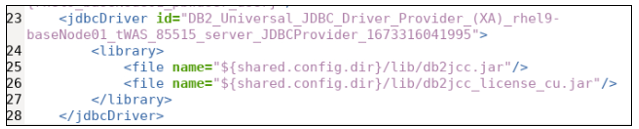

    <table>
    <tbody>
    <tr class="odd">
    <td></td>
    <td>
<strong>Tip:</strong>

    
<strong>/global</strong> is generated by the Transformation Advisor for building container images using the migration bundle.

    
However. we’ve modified the migration bundle for creating Liberty JVMs running in a VM.
</td>
    </tr>
    </tbody>
    </table>

5.  Modify the path location for the DB2 driver libraries used by the
    "**DB2\_Universal\_JDBC\_Driver\_Provider**” driver

    a.  Go to line numbers **35** and **36**

    b.  On line 35, remove "**/global**" from the path:
    ${shared.config.dir}/lib/db2jcc.jar

    c.  On line 36, remove "**/global**" from the path
    ${shared.config.dir}/lib/db2jcc\_license\_cu.jar

    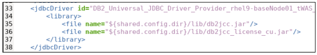

6.  **Save** the changes to server.xml. Then C**lose** the gedit editor.

    **Note:** Ignore the **Gtk-WARING** message emitted from gedit.

## Complete the WebSphere Liberty configuration for PlantsByWebSphere

The WebSphere Liberty server named “**pbwServer**”, which you created
earlier in the lab, only contains the minimal configuration needed to
start the Liberty server. The server configuration file, application database libraries, and the PlantsByWebSphere application must all be configured and added to the Liberty server.

In this section of the lab, you will perform the following activities to
complete the WebSphere Liberty configuration for the “**pbwServer**” to
properly support and run the PlantsByWebSphere application.

  - Copy the PlantsByWebSphere EAR file into the WebSphere Liberty
    server configuration

  - Copy the DB2 database driver libraries into the WebSphere Liberty
    configuration

  - Copy the server.xml file from the Transformation Advisor migration
    bundle into the WebSphere Liberty server configuration

Applications deployed to WebSphere Liberty must be placed in the Liberty
“**apps**” or “**dropins**” directory.

The “**dropins**” directory is a monitored directory in Liberty, meaning
that when application binaries such as WAR, EAR JAR files are dropped
into the directory, Liberty will automatically deploy and start the
application. Use of this directory is great for development, but not
recommended for deployments to production environments, whereas the
“**apps**” directory, which is not monitored, is intended to be used for production deployments.

In this lab, you will copy the PlantsByWebSphere EAR file into the
“**apps**” directory, which will get deployed when the Liberty server
is started or restarted.

1.  Install the PlantsByWebSphere EAR file into the Liberty server
    
    a.  Copy the **PlantsByWebSphere “EAR”** file into the Liberty
         server’s “**apps**” directory

        cd /home/techzone

        cp ~/liberty_admin_pot/plantsbywebsphereee6.ear ~/Student/lab_1010/wlp/usr/servers/pbwServer/apps

    b.  Verify plantsbywebsphereee6.ear is now in the server configuration
     directory

        ls ~/Student/lab_1010/wlp/usr/servers/pbwServer/apps

    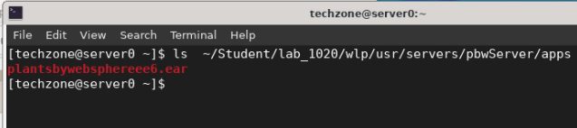

2.  Copy the DB2 database driver libraries into the WebSphere Liberty
    configuration
    
    a.  Create the “**lib**” folder under Liberty ${shared.config.dir}

        mkdir ~/Student/lab_1010/wlp/usr/shared/config/lib

    b.  Copy the DB2 library jar files to ${shared.config.dir}/lib folder
     of Liberty

        cp /opt/IBM/db2_drivers/* ~/Student/lab_1010/wlp/usr/shared/config/lib

    c.  Verify the two DB2 database driver libraries are now in the server
     configuration directory

        ls ~/Student/lab_1010/wlp/usr/shared/config/lib

    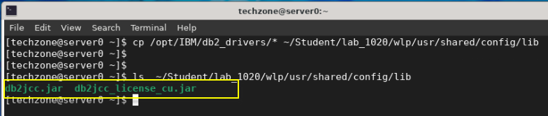

3.  Replace the Liberty server configuration file using the customized
    server.xml file from the migration bundle
    
    a.  Copy the server.xml from the migration bundle into the Liberty
         server configuration

        \cp ~/Student/lab_1010/pbw-bundle/src/main/liberty/config/server.xml ~/Student/lab_1010/wlp/usr/servers/pbwServer

    b.  Verify server.xml file has been replaced, by seeing the runtime
     features listed in the server.xml file

        head -16 ~/Student/lab_1010/wlp/usr/servers/pbwServer/server.xml

    **Note:** You should see the set of **\<feature\>** listed in the
 first 16 lines of the server.xml file, as illustrated below.
 
    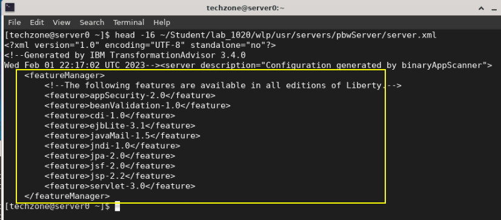
 
    At this point, the Liberty server configuration is complete. However,
 there is one final step that must be performed before you can
 successfully start the Liberty server and run the PlantsByWebSphere
 application.
 
    The final step is to **install all the Liberty features** that are
 listed in the server.xml file, as illustrated in the previous step.
 
    Recall that you installed only the “**Liberty Kernel**” in the lab
 environment, and the Liberty kernel does not have any features
 installed.
 
    Liberty provides a simple “**installUtility**” command you can run,
 which will ensure that all the features listed in the server.xml are
 installed on the runtime. If a feature is required, but not installed,
 the utility will install the feature.

4.  Run the **installUtility** command to install the features required
    for PlantsByWebSphere application
    
    a. From a terminal window, navigate to the WebSphere Liberty home
        directory so you can run Liberty commands

        cd /home/techzone/Student/lab_1010/wlp

    b.  Run the install command

        bin/installUtility install pbwServer

    The installUtility command installs all the runtime features that are
 listed in the server.xml file for the “pbwServer, along with any
 additional dependency features.
 
    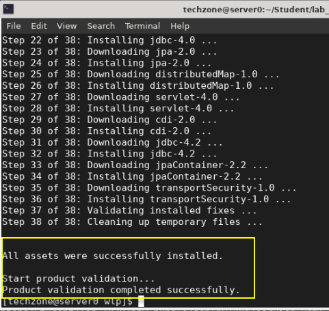
 
    Next, verify the required features are installed.

5.  Display the list of installed features in the pbwServer Liberty
    server.

        bin/productInfo featureInfo

    The output should indicate that the features required by the
 PlantsByWebSphere application are now installed.
 
    **Note:** You might recall that earlier in the lab, this command
 returned and empty list, as there were not any features installed when
 installing the Liberty Kernel.
 
    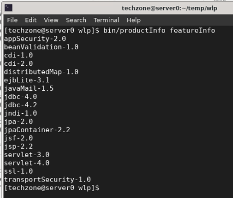

6. Show the size of the WebSphere Liberty installation directory

        du -ch --max-depth=0 /home/techzone/Student/lab_1010/wlp

    Note that the disk space used by WebSphere Liberty, including the db2 libraries and the application is only **113 MB**.

    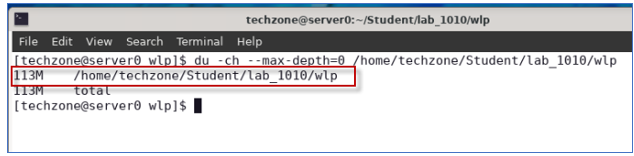     

## **Start the DB2 application database for PlantsByWebSphere**

You are now ready to start running the PlantsByWebSphere application
 using the new WebSphere Liberty server that you configured.
 
The PlantsByWebSphere application requires an application database,
 which you need to ensure is up and running.

<table>
<tbody>
<tr class="odd">
<td><blockquote>

</blockquote></td>
<td>
<strong>Info:</strong>

You may have already started the db2 container in a preceding lab.

To find out if the db2 container is already running, execute the following command:
<blockquote>

docker ps | grep db2_demo_data

</blockquote>

<strong>FYI:</strong> It is OK to execute the docker start command below, even if the container is already running.
</td>
</tr>
</tbody>
</table>

1.  Start the PlantsByWebSphere application DB2 database, which runs in

    a.  Open a new terminal window

    b. In the terminal window, issue the command below to start the DB2
 database. Then use the “**docker ps**” command to verify the database> container is running

        docker start db2_demo_data

        docker ps | grep db2_demo_data

    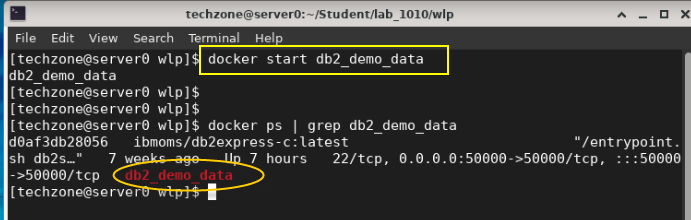

## **Start and verify the pbwServer Liberty Server**

The Liberty server named **pbwServer** should now be fully configured
 and ready to run the PlantsByWebSphere Application.
 
In this section, you will start the pbwServer server and review the
 logs to ensure everything starts up clean.

1.  From a terminal window, start the Liberty server named
    “**pbwServer**”

        cd ~/Student/lab_1010/wlp

        bin/server start pbwServer

    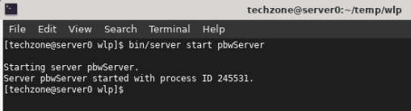

2.  View the Liberty Server log, “**messages.log**” to verify the server
    and PlantsByWebSphere application started cleanly.
    
    a.  Look for the message indicating the plantsbywebsphereee6
         application started

        cat usr/servers/pbwServer/logs/messages.log | grep "CWWKZ0001I: Application plantsbywebsphereee6 started"

    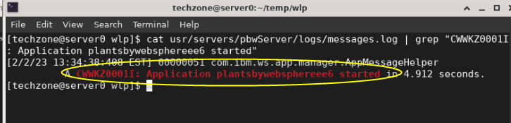

    b. Look for the message indicating the pbwServer started successfully

        cat usr/servers/pbwServer/logs/messages.log | grep "CWWKF0011I: The pbwServer server is ready to run a smarter planet. The pbwServer server started"

    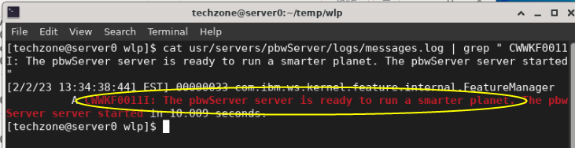
    

    c. Optionally, view the entire “messages.log” file in an editor

        gedit usr/servers/pbwServer/logs/messages.log

3.  Run the PlantsByWebSphere application from the **Firefox** browser
    on the VM.

    The HTTP port is **9088**, which is defined in the **server.xml**
 file.

    a.  Launch Firefox browser from the VM

    

    b.  Go to the PlantsByWebSphere application URL:

        http://server0.gym.lan:9088/PlantsByWebSphere

    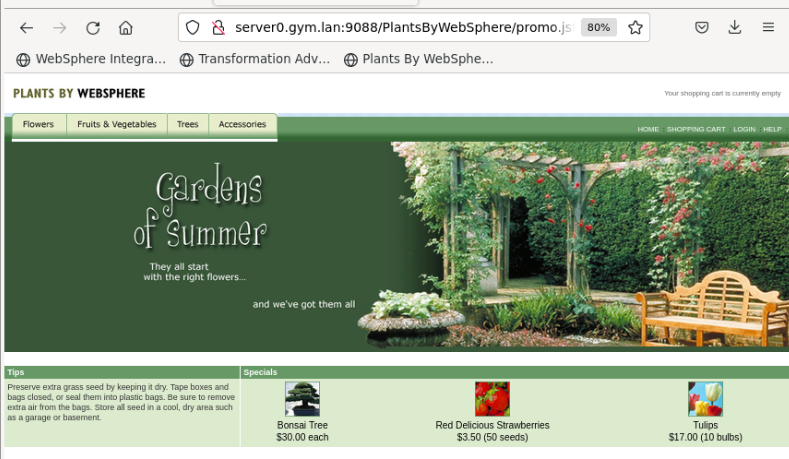

4.  Verify the PlantsByWebSphere application displays items from the
    catalog

    The PlantsByWebSphere application accesses the DB2 database when you
 navigate to any of the tabs to view the catalog of “**Flowers**”,
 “**Fruits & Vegetables**” or “**Trees**”.

    a.  Click on one of the tabs to view the catalog, which is loaded from
    the DB2 database.

    
 
    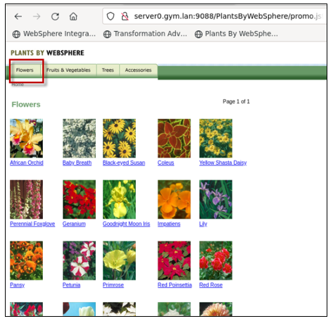

## **Summary**

**Congratulations\!**

**You have successfully completed the lab “Modernize your runtime to
WebSphere Liberty”**

In this lab, you learned how easy it is to install WebSphere Liberty
using the archive installation method, and how quickly you can create a
new Liberty server that includes the minimal configuration for the
Server to start.

You then learned how to use Transformation Advisors generated deployment
accelerators from the migration bundle to configure and run the migrated
application in WebSphere Liberty in stand-alone mode on a VM.

You learned how little disk space WebSphere Liberty requires, when right-sized based on the application needs. 

Transformation Advisor accelerates application migration to Liberty and
helps minimize errors and risks while accelerating time to market.

