**Lab 1020: Liberty application deployments in Collectives**

**Last updated:** March 2023

**Duration:** 60 minutes

Need support? Contact **Kevin Postreich, Yi Tang**

## 

## **Introduction to the Lab**

The goal of this lab is to provide hands-on experience using recommended practices for deploying Java applications to Liberty in collectives,
using automation and flexible deployment methodologies.

Following the methodology, you will gain an understanding of how you
might apply your own Devops processes or automation to achieve
significant agility and flexibility managing Liberty deployments with
repeatable automated processes that significantly reduces risk to your
business.

After completing the lab, you should have an appreciation for how simple
Liberty is to manage though automation, which equally applies to
integration with your own Devops tools.

**This lab contains the following hands-on
activities:**

  - Build Liberty server packages

  - Create a Liberty Collective Controller

  - Deploy Liberty Server packages to the collective

  - Apply Liberty configuration overrides during deployment

  - Use Liberty Admin Center to start Liberty servers in the collective

  - Validate the deployment and test the application

The lab environment consists of two Host VMs:

  - server0.gym.lan

  - server1.gym.lan

You will use Linux shell scripts provided for the lab, to build Liberty
server packages, construct a Liberty Collective that spans two host VMs,
and deploy the server package to both host VMs.

The Liberty Collective that you will create is illustrated below:

The “**server0.gym.lan**” host VM, which is the
primary VM, contains the following components:

  - **Liberty Builds and Server packages:** Think of this as a “build
    machine” where a build process builds the applications, runs tests,
    and produces a server package that is ready to be deployed. A server
    package contains the Liberty binaries, application, default server
    configurations, which get deployed as a unit to host VMs.

  - **Collective Controller:** The collective controller is a Liberty
    server that is configured with the “**collectiveController-1.0**”
    feature, which enables the Server to act as the management server
    for the collective.

    > **Note:** In most cases the Collective Controller would likely be placed on a dedicated host, but to minimize the size of this demonstration environment, it’s collocated with the host used for builds

  - **Collective Member:** Collective members are Liberty Servers that
    run your application and are joined to the collective with the
    “**collectiveMember-1.0**” feature. Collective members can be
    centrally managed and take advantage of features such as “dynamic
    Routing” without requiring Liberty ND licenses for the collective
    members.

    > **Note:** In most cases Liberty collective members are not located on the same host as collective controllers, but to minimize the size of this demonstration environment a collective member is collocated with a collective controller.

  - **Http Server:** The IBM HTTP server is used in some labs to
    showcase Liberty capabilities such as Dynamic Routing, Session
    Persistence, and fail-over scenarios.

    > **Note:** In most cases the HTTP server is placed on a dedicated host located in the DMZ, but to minimize the size of this demonstration environment, it’s collocated with Liberty processes.

The “**server1.gym.lan**” VM contains the
following components:

  - **Collective Member:** Collective members are Liberty Servers that
    run your application and are joined to the collective with the
    “**collectiveMember-1.0**” feature.

## **Accessing the environment**

If you are doing this lab as part of an instructor led workshop (virtual
or face to face), an environment has already been provisioned for you.
The instructor will provide the details for accessing the lab
environment.

Otherwise, you will need to reserve an environment for the lab. You can
obtain one here. Follow the on-screen instructions for the “**Reserve
now**” option.

KLP: TBD LINK TO ENV RESERVATION

The lab environment contains two (2) Linux VMs.

A Published Service is configured to provide access to the **server0**
VM through the noVNC interface for the lab environment.

1.  Access the lab environment from your web browser.

> a. When the environment is provisioned, right-mouse click on the
> **Published Service** link/ Then select “**Open link in New Tab**”
> from the context menu.
> 
> 
> 
> b. Click on the **"vnc.html"** link to open the lab environment
> through the **noVNC** interface.
> 
> 
> 
> c. Click the **Connect** button
> 
> 
> 
> d. Enter the password as: **passw0rd**. Then click the **Send
> Credentials** button to access the lab environment.
> 
> **Note:** That is a numeric zero in passw0rd
> 
> 

2.  Login to the **server0** VM using the credentials below:
    
      - User ID: **techzone**
    
      - Password: **IBMDem0s\!**

## **Tips for working in the lab environment**

1.  You can use your Browsers **zoom in** and **zoom out** options to
    resize the virtual desktop to fit your screen.

> The examples below are using Firefox and Chrome browsers.

  - Firefox example:

> 

  - Chrome example:

> 

2.  You can copy / paste text from the lab guide into the lab
    environment using the clipboard in the noVNC viewer.

> a. Copy the text from the lab guide that you want to paste into the
> lab environment
> 
> b. Click the **Clipboard** icon and **paste** the text into the noVNC
> clipboard
> 
> 
> 
> c. Paste the text into the VM, such as to a terminal window, browser
> window, etc.
> 
> d. Click on the **clipboard** icon again to close the clipboard
> 
> **NOTE:** Sometimes pasting into a Terminal window in the VM does not
> work consistently. In this case you might try again or paste the text
> into a **Text Editor** in the VM, and then paste it into the Terminal
> window in the VM.

3.  An alternative to using the noVNC Copy / Paste option, you may
    consider opening the lab guide in a web browser inside of the VM.
    Using this method, you can easily copy / paste text from the lab
    guide without having to use the noVNC clipboard.

## **Review Liberty deployment common practices**

A Liberty server is lightweight due to its modular architecture, so you
can easily package a server installation and applications in a
compressed “zip” or “jar” package. You can then store this package and
use it to deploy the installation to different nodes or machines in your
Liberty Collective.

In this lab, you will deploy Liberty and sample applications to a
Liberty Collective, while following several common practices as
illustrated below.

  - **Recommended practice:** **Produce server packages as build
    output**

    It is recommended to create immutable server packages that include the Liberty binaries, server configuration, application, and shared configuration as build output.

    The build output, “**server package**”, is the deployable unit to Liberty collective members. Using this practice is very similar to recommended practices for container image deployments in Kubernetes platforms.

  - **Recommended practice:** **Automate the build and deployment of server packages to the collective**

    Automating installation, deployment, and configuration is always recommended to achieve greater agility, repeatability, and productivity.

    In this lab, you will follow this recommended practice of using
 automation scripts that perform the following processes:

    - Build the server packages for deployment to the collective

    - Create the Liberty Collective

    - Deploy the server packages to the collective

  - **Recommended practice:** **Add configuration overrides to the
    server after the server package is uncompressed**

    The automation scripts used in the lab follows this practice. The server package is built as a template that contains the application, libraries, and default configuration.

    Then, when the server package is deployed and uncompressed on the target machine, the configuration overrides are added. These overrides can override any default configuration from the server package.

    However, in this lab, the http and https ports are overridden for each deployment of the package server to avoid port conflicts in the event of vertical scaling of Liberty servers on the VM.
 
    In the labs, additional overrides are applied in the context of the learning modules.

<table>
<tbody>
<tr class="odd">
<td></td>
<td>
<strong>Note:</strong> there are other alternatives to applying the overrides to the server after expanding the archive.

Some clients choose to override using OS environment variables that override defaultValues in the server.xml, other clients apply the overrides in the Liberty configuration by building the archive using the overrides for a specific environment.
</td>
</tr>
</tbody>
</table>

## **Review the automation scripts used in the lab**

Following recommended practices for automating Liberty administrative
and deployment tasks, we have provided three Linux shell scripts
designed to leverage Liberty’s flexible deployment capabilities.

Each of the scripts are introduced below. However, more details are
provided in separate sections of the lab, when you build and deploy the
sample applications.

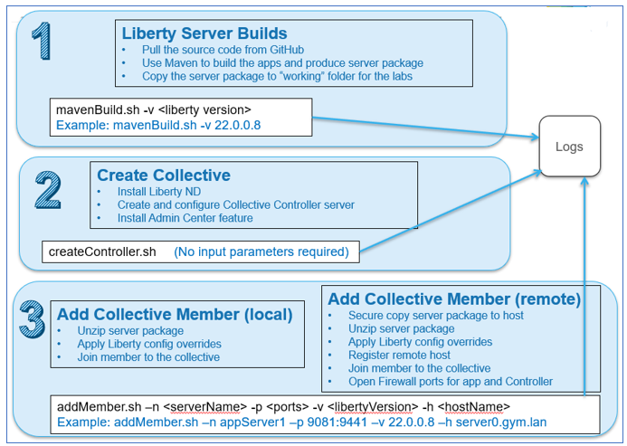

1.  **Liberty Server builds (mavenBuild.sh)**

    The script produces the build output in the form of a Liberty server package zip file that provides the flexibility of deploying and upgrading Liberty and the application as an immutable package, like how container images are deployed to Kubernetes container platforms.

2.  **Create Collective and Collective Controller
    (createController.sh)**

    The script creates a Collective and Collective Controller. Server packages will be deployed to a Liberty Collective. The collective controller is a Liberty server that you configure with features that allow it to serve as an administrative server for the collective.

3.  **Deploy Liberty as Collective members via server package
    deployments to nodes / machines**

    - The script deploys Liberty server packages to nodes / machines and joins the servers to the Liberty Collective.
    - Collective members are Liberty servers that are configured to be members of the collective.
    - Collective members can be centrally managed from the Collective Controller vi the Admin Center UI or admin scripts.

## **Part 1: Clone the GitHub repo for this workshop**

This lab requires artifacts that are stored in a GitHub repository. Run the command below to clone the repository to the local VM used for the lab.

1.  If you have not already Cloned the GitHub repo in a previous lab, clone it now. The repo contains lab artifacts needed for the lab.

1.  Open a new terminal window on the “**server0.gym.lan**” VM

> 

2.  Clone the GitHub repository required for the lab

        git clone https://github.com/IBMTechSales/liberty_admin_pot.git

3.  Navigate to the “**lab-scripts**” directory in the cloned repo

        cd ~/liberty_admin_pot/lab-scripts

4.  Add the “**execute**” permissions to the lab-scripts directories and
    shell scripts

        chmod -R 755 ./

## **Part 2: Produce Liberty “server packages” as build output**

Following recommended practices for flexible deployment of Liberty
applications, you will produce a server package as build output, which
includes the Liberty runtime, server configuration, and the application,
as a zip archive file.

Producing the build output in the form of a Liberty server package zip
file provides the flexibility of deploying and upgrading your version of
Liberty and applications as an immutable package, like how container
images are deployed to Kubernetes container platforms.

In the lab, the “**mavenBuid.sh**” script provides the following
capabilities for producing server packages for deployment to a Liberty
collective.

  - Pull the application source code from the source code repository
    (GitHub)

  - Build the application and produce a Liberty Server package

  - Store the Liberty server package in a “working directory” for the lab.

<table>
<tbody>
<tr class="odd">
<td></td>
<td>
<strong>mavenBuild.sh script is NOT an official IBM tool.</strong>

It is a simple script that we provide for this PoT to demonstrate ease of automation of common Liberty tasks.
</td>
</tr>
</tbody>
</table>

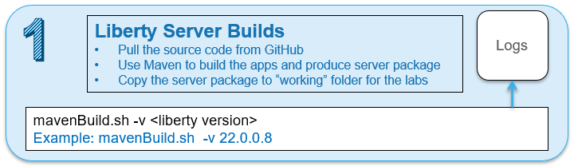

In this section of the lab, you will use the provided shell script that
automates the tasks for producing a server package for deployment to the
collective.

## **Use the Maven Build script to produce a Server package** 

1.  Run the **Maven Build** shell script to build the applications and
    produce a Liberty Server package
    
    a.  Run the following command to **display the usage** statement for  the script
        
        ~/liberty_admin_pot/lab-scripts/mavenBuild.sh

    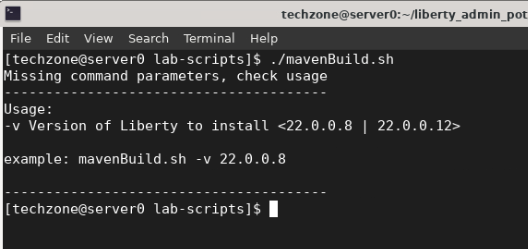

    **Note:** The input parameter **“-v**” is required, which defines the version of the Liberty Kernel that should be included in the build output.

    b.  Run the following command to build the applications and produce a server package, which will use WebSphere Liberty kernel, version 22.0.0.8

        ~/liberty_admin_pot/lab-scripts/mavenBuild.sh -v 22.0.0.8

    **Note:** there are additional steps performed aside from what is depicted in the output above which only shows the completion
 
    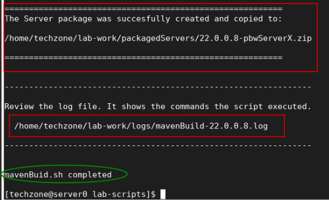

2.  Review the log file and to understand the steps the script
    performed.

        gedit ~/lab-work/logs/mavenBuild-22.0.0.8.log

     The log file displays the command that you executed, a list of
 environment information, and the commands that were executed by the
 script.
 
     In the log, you will observe that the script performed the ollowing actions.

    -  **Clone Git Repo Step:**

        - Clone the source code repository that contains the application  source as a Maven Project.

    -  **Maven Build Step:**

        - Run Maven command to build the applications and produce a Server  Package

    -  **Post Build Step:**

        - Create the “working directory structure” where the Liberty
    packages will be placed: **(lab-work/packagedServers)**

        - Copy the Server package from the Maven “target” directory to the new “working Directory” used in the labs.

        > **/home/techzone/lab-work/packagedServers/22.0.0.8-pbwServerX.zip**
 
    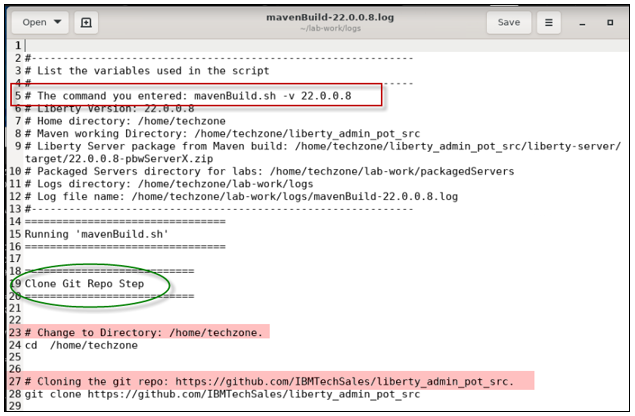
 
    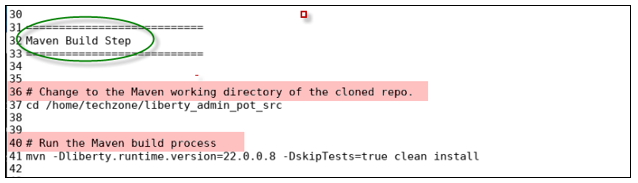
 
    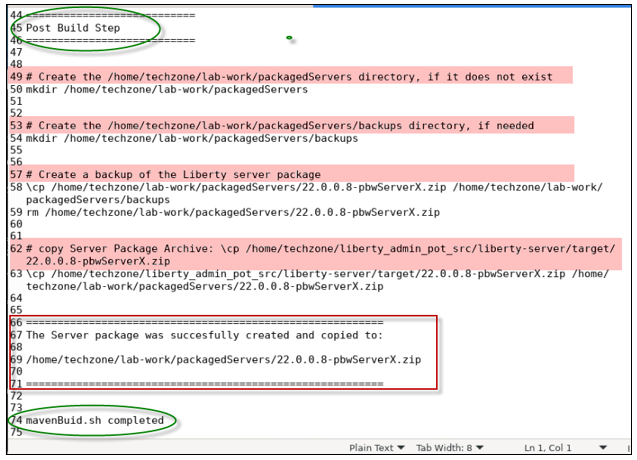

3.  **Close** the editor when you have completed the review of the log file

4.  Using the File viewer on the VM desktop, see that the server package  was produced.
    
    a.  Double mouse-click on the “**Home”** folder on the Desktop VM

    

2.  From the file explorer, navigate to
    **techzone/lab-work/packagedServers** directory.

    **TIP:** the server package is named based on the version of Liberty in the package, and the placeholder server name; “**22.0.0.8-pbwServerX.zip**".
> 
> 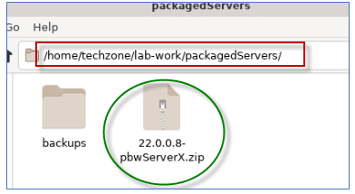

### **What did the Maven Build do?**

The core activity performed by the script is to run Maven to build the
applications and produce a Liberty Server package. The server package is
somewhat customized to include additional artifacts and configuration
overrides that are required to run the applications in Liberty.

The Maven build process leverages the “**Liberty Maven Plugin**”, which
provides for the capabilities to retrieve Liberty binaries from the
maven repo, build the application, and create a Liberty server package.

As illustrated below, Maven configures Liberty using the artifacts
provided in the projects and produced by the build.

  - Maven adds the server.xml file and the application binaries (WAR,
    EAR)

  - Maven adds the configDropins/overrides as required for the
    environment:

Documentation for the Liberty Maven plugin “**build**” is located here:
<https://github.com/OpenLiberty/ci.maven#build>

Documentation for the Liberty Maven plugin “**package**” is located
here:
<https://github.com/OpenLiberty/ci.maven/blob/main/docs/package.md#package>

**Below is a hi-level list of tasks the maven
build process performs:**

  - > Download the Liberty Kernel based on the version specified on the
    > command; for example, version 22.0.0.8

  - > Build the application deployable artifacts for PlantsByWebSphere
    > and WhereAmI applications: EAR, WAR, JAR

  - > Create a Liberty Server named “**pbwServerX**” as a template
    > server that is used for multiple deployments to the collective.

  - > Add the two example applications to the server configuration

  - > Add the required DB2 libraries to the server

  - > Replace the server.xml server configuration file with the
    > server.xml generated by Transformation Advisor

  - > Add the “**memberOverrides.xml**” config/overrides file

  - > Install all the Liberty features as required by the **server.xml**
    > file

  - > Install the Collective Member feature so servers can be included
    > as members in a Liberty Collective

  - > Install the Session Database feature so the application will
    > function with session persistence with fail-over

  - > Produce the Liberty Server package as a zip file, containing the
    > Liberty binaries, applications, and the default configurations.

The output from the “**mavenBuild**” script is a Liberty Server package.
The server package is in the following working directory.

> **/home/techzone/lab-work/packagedServers**

**Congratulations\!** You have used Maven and successfully produced a
Liberty server package, which adheres to the flexible deployment recommended practices.

Now that you have a server package, it can be deployed to local or
remote hosts (VMs / machines) where the Liberty collective members will
host the sample applications.

In the next sections of the lab, you will continue the recommended practice of using automation to create a Liberty Collective and deploy the server package to two hosts (VMs), and add the deployed servers to the Liberty Collective, where the servers can be centrally managed by the collective.

## **Part 3: Create a Liberty Collective Controller** 

A **Liberty Collective** is a set of Liberty servers in a single
management domain.

A collective consists of at least one server with the
**collectiveController-1.0** feature enabled that is called a
***collective controller***.

**TIP:** Liberty Servers that function as Collective Controllers MUST
have Liberty ND licenses, as these servers use the
**collectiveController-1.0** feature that is only available with Liberty
ND.

<table>
<tbody>
<tr class="odd">
<td></td>
<td>
The collective controller provides for a centralized administrative control point to perform operations such as MBean routing, file transfer, and cluster management.

A core role of collective controllers is to receive information, such as MBean attributes and operational state, from the members within the collective so that the data can be retrieved readily without having to invoke an operation on each individual member.
</td>
</tr>
</tbody>
</table>

A collective can have many servers with the **collectiveMember-1.0**
feature enabled in application servers that are called ***collective
members.***

In this section of the lab, you will create the **Collective** and the
**Collective Controller** using automation, via the
**createController**.sh shell script.

<table>
<tbody>
<tr class="odd">
<td></td>
<td>
<strong>createController.sh script is NOT an official IBM tool.</strong>

It is a simple script that we provide for this PoT to demonstrate ease of automation of common Liberty tasks.
</td>
</tr>
</tbody>
</table>

The “**createController.sh**” script provides the following capabilities

  - Create the Collective and Collective Controller

  - Install the **Liberty Admin Center** application into the
     Controller server

  -  Start the Collective Controller server

   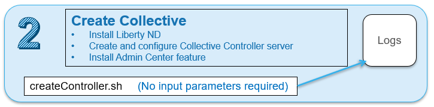

1.  Run commands below to create a Liberty collective controller:

        ~/liberty_admin_pot/lab-scripts/createController.sh

    The createController.sh script creates a Liberty server named
 **CollectiveController.**

    - The CollectiveController server is in the following directory:

      > **/home/techzone/lab-work/liberty-controller/wlp/usr/servers**

    - The CollectiveController server is configured with the
     **collectiveController-1.0** feature which enables the server to act as the managing server for a collective

    - The CollectiveController server is also configured with the
    **adminCenter-1.0** feature, which installs the “Liberty Admin
    Center” UI application.

    - The CollectiveController server runs on HTTPS port **9491** in this lab

    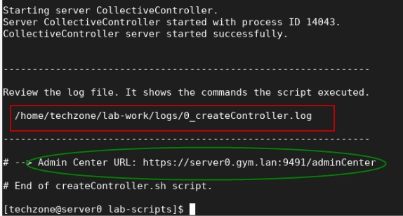

2.  Once the collective controller is started, click its **Admin Center  URL** to launch it in a browser window, then enter the login
    credentials as: **admin** / **admin**.

    **Note:** If you see the “Warning: Potential Security Risk Ahead”, > click **Advanced..-\>Accept Risk and Continue** to continue.
 
    

3.  Login to the **Admin Center** using credentials: **admin** /
    **admin**.

    
 
    The Liberty Collective “**Admin Center”** UI is displayed.
 
    

4.  Click the **Explore** icon to display the servers, applications, and  hosts in the Collective.

    
 
    The collective resource list is displayed, and you can see that you have:

    - one server – The collective controller server

    - one host – the local host that the controller is running on

    - one runtime – Liberty runtime
 
    

5.  Review the log file to see the steps that the script executed to
    create and configure the Collective.

        gedit /home/techzone/lab-work/logs/0_createController.log

    As illustrated below, the **createController** script performs the following tasks:

    - Create the **Liberty-Controller** directory where the Liberty
    controller server will be installed
    
    - Install Liberty (with ND features) as required to function as a collective controller
    
    - Create the **CollectiveController** Liberty Server

    - Create a Liberty Collective

    - Apply server configuration overrides, updating ports to avoid
    potential port conflicts

    - Start the Collective Controller server

    - Display the URL of the Admin Center

    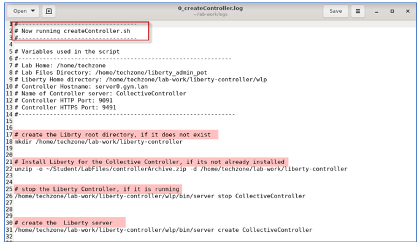
 
    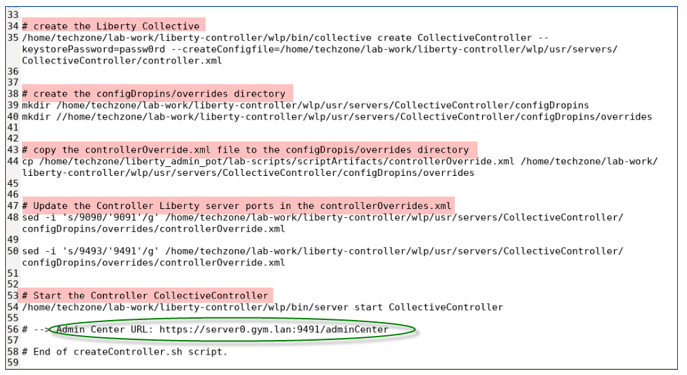

6.  **Close** the **gedit** editor when you have completed reviewing the log file.

## **Part 4: Create Liberty Collective Members**

The collective members are the Liberty servers that run your
applications. For Liberty servers to join a collective, the servers must have the **collectiveMember-1.0** feature enabled.

Membership in a Liberty collective is optional. Liberty servers join a collective by registering with a collective controller to become members. Members share information about themselves with the controller through the controller operational repository.

In this section of the lab, you will join Liberty servers as collective members to the collective, using the server package that you produced previously in the lab.

That server package you created, includes the Liberty binaries, the
sample applications, and default server configuration overrides.

The **collectiveMember-1.0** feature was installed and enabled for the Liberty server that is in the server package.

In this lab, you use the “**addMember.sh**” scrip to deploy the server packages to the nodes, create the collective members, and join the members to the collective.

### The addMember.sh script provides the following capabilities:

  -  Register the Host machine if it is remote VM from the Controller

  -  Copy or send the server package to the host machine where Liberty  will be deployed

  -  Unzip the server package, which is an archive installation of
     Liberty on the hosts machines (VMs)

  -  Apply server configuration overrides for the specific collective member

  - Join the collective member to the collective

  -  Open application port and Collective Controller port for remote
     hosts

<table>
<tbody>
<tr class="odd">
<td></td>
<td>
<strong>addMember.sh script is NOT an official IBM tool.</strong>

It is a simple script that we provide for this PoT to demonstrate ease of automation of common Liberty tasks.
</td>
</tr>
</tbody>
</table>

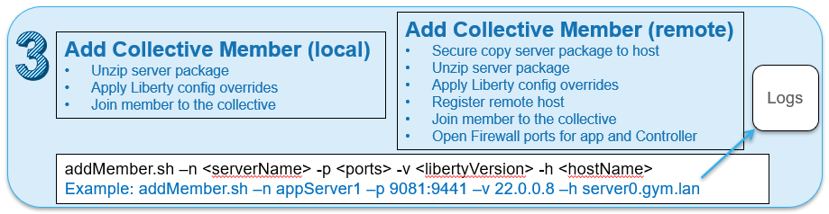

### **Add a collective member to the local host VM, server0.gym.lan**

Use the automation script to deploy the Liberty server from the server
package you created earlier and join the server as a member to the
collective.

1.  Run the addMember.sh script without any parameters to display the script usage statement.

        ~/liberty_admin_pot/lab-scripts/addMember.sh

    Notice the script requires four parameters.
 
    The input parameters instruct the script to deploy the desired version of the Liberty server package and provides the server’s name and ports  to use to override the default configuration in the server package  once it is unpacked on the host.
 
    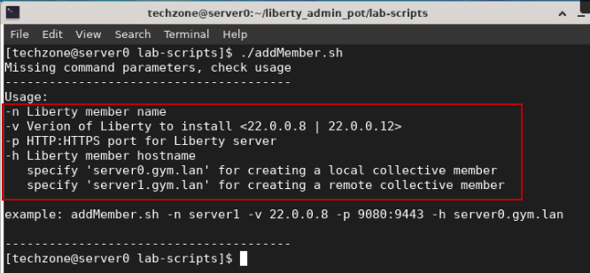

2.  Run commands below to create a local Liberty collective member on **server0.gym.lan** VM.

    The command below performs these tasks:

    >-  deploy the server package for Liberty version 22.0.0.8

    >-  Apply overrides for the HTTP and HTTPS ports with 9081:9441

    >-  Rename the default server name with “appServer1”

    >-  Join the liberty server to the collective

        ~/liberty_admin_pot/lab-scripts/addMember.sh -n appServer1 -v 22.0.0.8 -p 9081:9441 -h server0.gym.lan

    <table>
    <tbody>
    <tr class="odd">
    <td></td>
    <td>
When running the script, it requires <strong>user interaction</strong>.

    
You will need to reply to <strong>accept certificate chains</strong> as Liberty commands are run to join the server to the collective.
</td>
    </tr>
    </tbody>
    </table>

    a.  Enter **y** when prompted with question “**Do you wish to continue with the parameters specified? (y/n)?**”.

    b.  Enter **y** when prompted with question “**Do you want to accept the above certificate chain? (y/n)**”.

    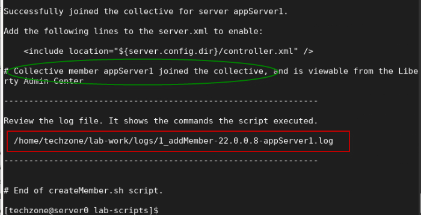
 
    When the script completes, the server **appServer1** is created and added to the collective.

    - The **addMember.sh** script created a local Liberty server called **appServer1** in the following directory on the **server0.gym.lan** VM:

      > **/home/techzone/lab-work/liberty-staging/22.0.0.8-appServer1/wlp/usr/servers**

3.  Go back to the Liberty collective **Admin Center** page, you can see that the **appServer1** server is added to the collective ad a new server. The Server is in the “**Stopped**” state.

    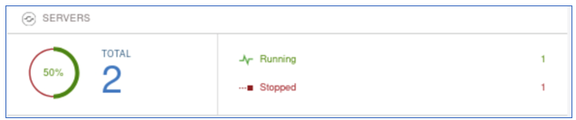

4.  In the Admin Center, click on the **Servers** row to list the two servers that are in the collective.

    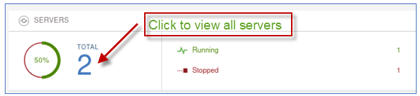
 
    The new server “**appServer1**” is displayed along with the collective controller server.
 
    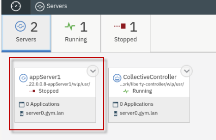

5.  In the Admin Center, click the “**Explorer**” icon to return to the  “**dashboard**” view.

    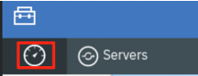
 
    You are now back in the explorer dashboard view.
 
    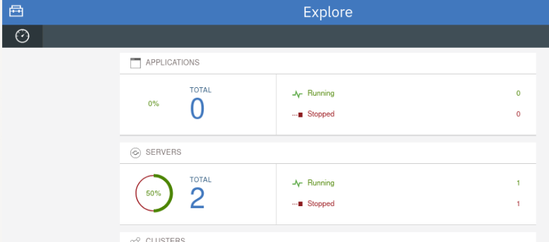

6.  View the log that shows the commands the addMember.sh script ran to deploy the Liberty server package and join the member to the collective

        gedit /home/techzone/lab-work/logs/1_addMember-22.0.0.8-appServer1.log

    As illustrated below, the **addMembe**r script performed the following tasks:

    - Create the **Liberty-staging** directory where Liberty member
    servers will be installed

    - Deploy Liberty via unzipping the server package

    - Apply the server name “appServer1”

    - Apply server configuration overrides, updating ports to avoid
    potential port conflicts

    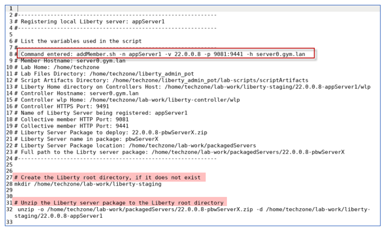
 
    

7.  **Close** the **gedit** editor

### **Add a collective member to the remote host VM, server1.gym.lan**

Now, run the **addMember.sh** script again, using slightly different
parameters, to deploy Liberty to the remote VM, server1.gym.lan.

Joining remote members to a collective requires a couple of additional steps that the script performs for you in the lab environment and are identified below.

**The script performs the following tasks:**

  - Register the remote host to the Liberty collective

  - Secure copy of the server package to the remote host

  - Secure copy a script that will run on the remote host

  - ssh into the remote host and run the script which does the
     following:
    
    - deploy the server package for Liberty version 22.0.0.8
   
    - Apply overrides for the HTTP and HTTPS ports with 9081”9441
    
    - Rename the default server name with “appServer1”
    
    - Join the member to the collective

1.  Run script below to create a remote Liberty collective member on
    **server1.gym.lan** VM, specifying a different server name and
    ports.

        ~/liberty_admin_pot/lab-scripts/addMember.sh -n appServer2 -v 22.0.0.8 -p 9082:9442 -h server1.gym.lan

    <table>
    <tbody>
    <tr class="odd">
    <td></td>
    <td>
When running the script, it requires <strong>user interaction</strong>.

    <ul>
    <li>
You will need to reply to <strong>accept certificate chains (Multiple times)</strong> as Liberty commands are run to join the server to the collective.
</li>
    <li>
You will need to enter the <strong>password for the server1.gym.lan VM</strong> <strong>(Multiple times)</strong> as the script interacts with the remote host.
</li>
    </ul>
    <blockquote>
    
This is because unlike tWAS where a node agent is installed, Liberty is agentless and relies on OS and SSH credentials for remote host access and operation.

    </blockquote></td>
    </tr>
    </tbody>
    </table>

    a.  Enter **y** when prompted with question “**Do you wish to continue with the parameters specified? (y/n)?**”.

    b.  Enter **y** when prompted with question “**Do you want to accept the above certificate chain? (y/n)**”.

    > **NOTE:** You will get prompted multiple time to accept the certificate chain as the script execute various commands.

    c.  Enter **IBMDem0s\!** when prompted with request
    **techzone@server1.gym.lan's password:**

    > **NOTE:** You will get prompted three times for the password, once for each command that interacts with the remote host.
 
    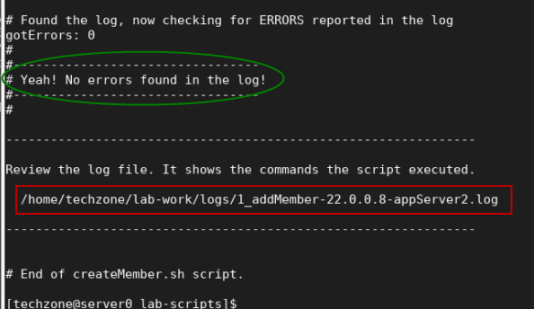
 
    When the script completes, the server **appServer2** is created and added to the collective.

    - The **addMember.sh** script created a Liberty server called
    **appServer2** in the following directory on the **server1.gym.lan** VM:

      > **/opt/IBM/liberty-staging/22.0.0.8-appServer2/wlp/usr/servers**

    - The server uses **9082** and **9442** as its HTTP/HTTPS ports, as defined ad script input parameters.

2.  Go back to the Liberty collective **Admin Center** page and you can  ee the new member, **appServer2**, has been added to the server list and is the **Stopped** state.

    
 
    Showing all servers shows the new “**appSerer2**” server in the
 collective
 
    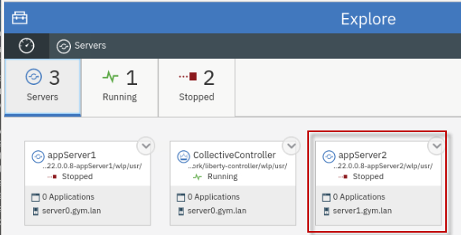

3.  View the log that shows the command the addMember.sh script ran to deploy the Liberty server package and join the **remote member** to  the collective

        gedit /home/techzone/lab-work/logs/1_addMember-22.0.0.8-appServer2.log

    As illustrated below, the **addMembe**r script performed the following tasks:

    - Open port for communication with the Collective Controller and
    remote host

    - Register the remote host with the collective

    - Test the connection

    - Secure copy the server package and script to the remote server

    - SSH into the remote server and run the script to deploy Liberty and add the server to the collective

    - Retrieve the log from the remote server, check if there were errors reported

    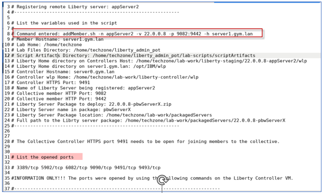
 
    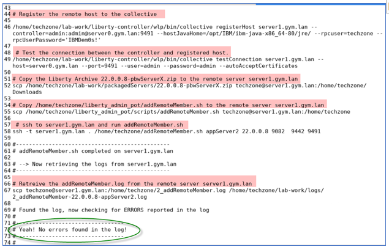

4.  **Close** the gedit editor

## **Part 5: Verify the application deployment in the collective**

You have deployed two Liberty servers as the collective members. In this section, you will start these two servers from the Liberty Admin Center and run the example applications on the individual Liberty servers to ensure the applications run properly.

### **Start the DB2 application database for PlantsByWebSphere**

The PlantsByWebSphere application requires an application database,
which you need to ensure is up and running.

<table>
<tbody>
<tr class="odd">
<td></td>
<td>
<strong>Info:</strong>

You may have already started the db2 container in a preceding lab.

To find out if the db2 container is already running, execute the following command:

<strong>docker ps | grep db2_demo_data</strong>

<strong>FYI:</strong> It is OK to execute the docker start command below, even if the container is already running.
</td>
</tr>
</tbody>
</table>

1.  Before starting the Liberty servers, you need to start the db2
    database used by the **PlantsByWebSphere** application with the
    command below.

        docker start db2_demo_data

### **Start the Liberty servers from the Admin Center**

1.  To start the collective member from the Liberty Admin Center
    **Explorer** page, click the **SERVERS** icon to go to its details
    page.

    

2.  In the server details page, click the dropdown menu icon of
    **appServer1** and select **Start** to start the server.

    
 
    **Note:** If prompted for credentials, enter the Admin Center username and password as: **admin**/**admin**.

3.  Click **Start** to confirm the start **appServer1** server command.

    
 
    Server **appServer1** will start, and you can see it is now in the **Running** state.
 
    The appServer1 server now shows it has two applications running, which are used in the labs in this workshop.

    - PlantsByWebSphere
    - WhoAmI

    

4.  Repeat the same server start procedure for **appServer2** server. Once it is done, the **appServer2** server is started as show below:

    

5.  Click the **Explorer** dashboard icon to go back to the dashboard view.

    
 
    Explore the “**Applications**”, “**servers**”, and “**hosts**” that are registered and running in the collective
 
    
 
    **Applications view:**
 
    
 
    **Servers view:**
 
    
 
    **Hosts view:**
 
    

### **Test the two example applications used in the labs in this workshop series**

In this section, you will test the two applications that are deployed in
the collective.

### **Test the PlantsByWebSphere application:** 

1.  To access the **PlantsByWebSphere** application on appServer1
    
    a.  Open a new tab on the Firefox browser and test PlantsByWebSphere on **appServer1**, which is on **server0.gym.lan**

        http://server0.gym.lan:9081/PlantsByWebSphere

    

    b.  In the application, click on the “**Flowers**” tab to view the catalog of flowers. This action retrieves catalog details from the application DB2 database.

    

2.  Repeat the steps to access the **PlantsByWebSphere** application on appServer2 on host server1.gym.lan
    
    a.  Open a new tab on the Firefox browser and test PlantsByWebSphere on **appServer2**, which is on **server1.gym.lan**

        http://server1.gym.lan:9082/PlantsByWebSphere

### **Test the WhereAmI application:** 

1.  To access the **WhereAmI** application on appServer1
    
    a.  Open a new tab on the Firefox browser and test WhereAmI on
        **appServer1**, which is on **server0.gym.lan**

        http://server0.gym.lan:9081/WhereAmI

    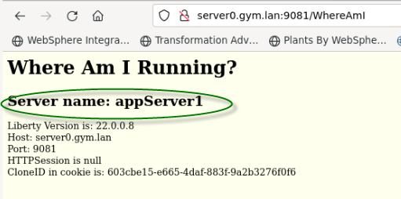

2.  Repeat the steps to access the **WhereAmI** application on
    appServer2 on host server1.gym.lan
    
    a.  Open a new tab on the Firefox browser and test WhereAmI on
        **appServer2**, which is on **server1.gym.lan**

        http://server1.gym.lan:9082/WhereAmI

    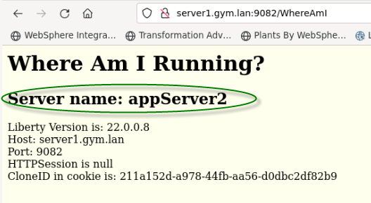

3.  **Close** the browser windows / tabs displaying the
    PlantsByWebSphere and WhereAmI applications

**Congratulations\!** You have successfully deployed the Liberty and
 the sample applications to a Liberty collective, while following
 common recommended practices for a flexible deployment methodology for WebSphere Liberty.

## **Summary**

**Congratulations\!**

**You have successfully completed the lab “Liberty Application
Deployments in Collectives”**

In this Lab, you deployed Liberty applications to a collective, while following recommended practices including, flexible deployments using server packages as build output, applying configuration overrides to servers during deployment, and using automation to achieve greater agility while managing Liberty collectives and application deployments.

**In this lab, you have gained experience with
these key Liberty administrative tasks:**

  - Build Liberty server packages

  - Create a Liberty Collective Controller

  - Deploy Liberty Server packages as collective members

  - Apply Liberty configuration overrides to the collective members

  - Use Liberty Admin Center to start Liberty Member Servers

  - Validate the deployment by testing the sample applications in the
    individual Liberty servers

