# Lab 1030: The value of Dynamic Routing

**Last updated:** March 2023

**Duration:** 45 minutes

Need support? Contact **Kevin Postreich, Yi Tang**

## 

## **Introduction**

In the modern-day business, the application is king. To provide workload
balancing and failover protection for application high availability, the
WebSphere Plug-in can be used with an Apache web server to route HTTP
requests to the application running in application servers.

Traditionally this is done by creating the plug-in configuration for
each application server and using a utility to merge these
configurations into a single file, then copying it to the web server
installation.

The Liberty dynamic routing feature enables routing of HTTP requests to
members of Liberty collectives without regenerating the WebSphere
plug-in configuration file when the environment changes.

When servers, collective members, applications, or virtual hosts are
added, removed, started, stopped, or modified; the new information is
dynamically delivered to the WebSphere plug-in through the Liberty
Collective Controller.

Requests are routed based on up-to-date information. In this approach,
the web server plug-in configuration file (plugin-cfg.xml) only needs to
contain routing information about the collective controller process(es).

The plug-in then contacts the controller to obtain information about all
the servers in the collective and directs HTTP requests to the
appropriate Liberty servers in the collective.

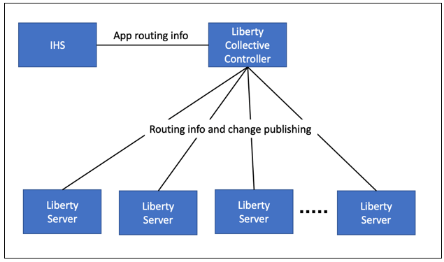

In this Lab, you will learn how to setup and use Liberty dynamic routing
capability to provide high availability for your applications.

## **Accessing the environment**

If you are doing this lab as part of an instructor led workshop (virtual
or face to face), an environment has already been provisioned for you.
The instructor will provide the details for accessing the lab
environment.

Otherwise, you will need to reserve an environment for the lab. You can
obtain one here. Follow the on-screen instructions for the “**Reserve
now**” option.

KLP: TBD LINK TO ENV RESERVATION

The lab environment contains two (2) Linux VMs.

A Published Service is configured to provide access to the **server0**
VM through the noVNC interface for the lab environment.

1.  Access the lab environment from your web browser.

    a. When the environment is provisioned, right-mouse click on the
 **Published Service** link/ Then select “**Open link in New Tab**”
 from the context menu.
 
    
 
    b. Click on the **"vnc.html"** link to open the lab environment
 through the **noVNC** interface.
 
    
 
    c. Click the **Connect** button
 
    
 
    d. Enter the password as: **passw0rd**. Then click the **Send
 Credentials** button to access the lab environment.
 
    **Note:** That is a numeric zero in passw0rd
 
    

2.  Login to the **server0** VM using the credentials below:
    
      - User ID: **techzone**
    
      - Password: **IBMDem0s\!**

## **Tips for working in the lab environment**

1.  You can use your Browsers **zoom in** and **zoom out** options toresize the virtual desktop to fit your screen.

    The examples below are using Firefox and Chrome browsers.

    - Firefox example:

      

    - Chrome example:

      

2.  You can copy / paste text from the lab guide into the lab
    environment using the clipboard in the noVNC viewer.

    a. Copy the text from the lab guide that you want to paste into the lab environment
 
    b. Click the **Clipboard** icon and **paste** the text into the noVNC  clipboard
 
    
 
    c. Paste the text into the VM, such as to a terminal window, browser  window, etc.
 
    d. Click on the **clipboard** icon again to close the clipboard
 
    **NOTE:** Sometimes pasting into a Terminal window in the VM does not  work consistently. In this case you might try again or paste the text  into a **Text Editor** in the VM, and then paste it into the Terminal  window in the VM.

3.  An alternative to using the noVNC Copy / Paste option, you may consider opening the lab guide in a web browser inside of the VM.

    Using this method, you can easily copy / paste text from the lab guide without having to use the noVNC clipboard.

## Lab: The value of Dynamic Routing

For the Dynamic Routing function to work, the **dynamicRouting-1.0**
feature is required only for the **collective controllers**.

There is no requirement to upgrade every collective member. Dynamic
Routing can be used to route to applications installed in any Liberty
server in a collective, including:

  - Liberty Application Server Network Deployment

  - Liberty Application Server Liberty Base edition

  - Liberty Application Server Core

<table>
<tbody>
<tr class="odd">
<td></td>
<td>
<strong>Tip:</strong>

The ability to leverage Liberty’s dynamic routing capability for any edition of Liberty is powerful and cost effective.

You get request HA for Liberty Base and Core editions, without requiring Liberty ND licenses. It also eliminates time-consuming plug-in merges and manual updates to the HTTP server plugin configuration if servers are added or removed from the configuration.
</td>
</tr>
</tbody>
</table>

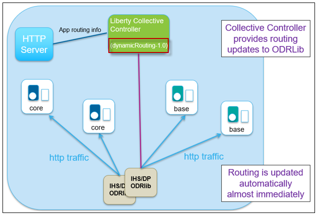

## **Clone the GitHub repo for this workshop**

This lab requires artifacts that are stored in a GitHub repository. Run
the command below to clone the repository to the local VM used for the
lab.

1.  If not already done so in a previous lab, clone the GitHub repo that
    contains lab artifacts needed for the lab.

    a.  Open a new terminal window on the “**server0.gym.lan**” VM

    

    b.  Clone the GitHub repository required for the lab

        git clone https://github.com/IBMTechSales/liberty_admin_pot.git

    c.  Navigate to the “**lab-scripts**” directory in the cloned repo

        cd ~/liberty_admin_pot/lab-scripts

    d.  Add the “**execute**” permissions to the lab-scripts directories and shell scripts

        chmod -R 755 ./

## **Part 1: Verify the HTTP server**

In this lab, you generate a special web server plug-in configuration
file that provides dynamic routing information to allow a web server to
spray HTTP requests across two liberty servers that are running the two
sample applications, **PlantsByWebSphere** and **WhereAmI**.

You will start and stop members in the collective to experience the
dynamic routing behavior.

**This lab contains the following activities:**

  - Verify the HTTP server

  - Create a Liberty Collective Controller **(If you did not complete
    Lab\_1020)**

  - Configure Dynamic Routing

  - Deploy Liberty as collective Members **(If you did not complete
    Lab\_1020)**

  - Start Liberty Member Servers from Liberty Admin Center

  - Testing the Dynamic Routing Features

  - Configure and Testing the Dynamic Routing Rule

  - Summary

A **web server** and **WebSphere Plug-in** (Plug-in) are two important
components in this workload balancing and failover protection solution.
You must have a web server that is supported by the web server plug-in
for WebSphere Application Server.

In this lab the web server used is **IBM HTTP Server** (IHS).

For the simplicity of the lab, IHS and the Plug-in have been
pre-installed and configured on the **server0.gym.lan** VM in the
following directory locations and HTTP port.

  - The installation directory of IHS is **/opt/IBM/HTTPServer**

  - The installation directory for Plug-in is
    **/opt/IBM/WebSphere/Plugins**.

  - IHS is configured with a listening port of **8080**

In this section, you ensure the IBM HTTP Server starts and runs as
expected

1.  Double-click **File System** icon on the desktop to open the file  explorer

    

2.  From a new terminal window run command to start **IHS** server

        /opt/IBM/HTTPServer/bin/apachectl start

3.  Open a web browser window by double-clicking the **Firefox** icon on     the desktop.

    

4.  From the browser, go to the **IHS** URL:

        http://server0.gym.lan:8080

    **Note:** The HTTP server is running on port **8080**, not the default port 80
 
    The **IHS** home page is displayed.
 
    

5.  Run command below to **stop** the **IHS** server

        /opt/IBM/HTTPServer/bin/apachectl stop

## **Part 2: Ensure the Liberty Collective Controller is running**

Liberty dynamic routing requires that the application servers aremembers of a Liberty collective. **The learning module for creating Liberty collectives is “Lab\_1020”**.

In this section you will ensure that a Liberty administrative collective is available, and the controller is deployed with the Liberty Admin Center application.

<table>
<tbody>
<tr class="odd">
<td></td>
<td>
<strong>IMPORTANT: Please read!</strong>

If you have completed the <strong>Lab 1020</strong> of this series, you have already created the Liberty collective controller.

In other words, you can skip <strong>Part 2</strong> of the lab and continue with <strong>Part 3</strong> if you have already completed Lab 1020 in this series.

The Admin Center ULR is: <a href="https://server0.gym.lan:9491/adminCenter">https://server0.gym.lan:9491/adminCenter</a>

The Admin Center credentials are: <strong>admin</strong> / <strong>admin</strong>
</td>
</tr>
</tbody>
</table>

1.  Run the command below to ensure a Liberty collective controller is  created:

        /home/techzone/liberty_admin_pot/lab-scripts/createController.sh

    The createController.sh script will do the following:

    - If the Controller already exists, the script will ensure the controller is started

    - If the Controller does NOT exist, the script will create it, and display the URL of the Admin Center.

2.  Once the collective controller is started, click its **Admin Center** URL to launch it in a browser window:

    a.  Enter the login credentials as: **admin** / **admin**

    
 
    **Note:** If you see the “Warning: Potential Security Risk Ahead”,  click **Advanced..-\>Accept Risk and Continue** to continue.
 
    The Liberty collective Admin Center page is displayed.
 
    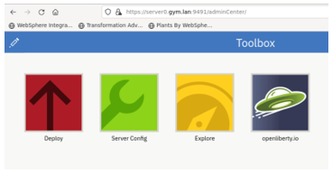

3.  Click the **Explore** icon

    
 
    The collective resource list is displayed, and you can see that you  have one server, one host and one runtime running in the collective.
 
    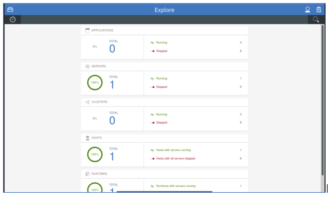

## **Part 3: Configure Dynamic Routing Feature**

In this section, you configure the Dynamic Routing feature to route HTTP requests to members of Liberty collectives without having to regenerate the WebSphere plug-in configuration file when the environment changes.

The Dynamic Routing feature, “**dynamicRouting-1.0**”, provides the Dynamic Routing service, which dynamically retrieves routing information from the collective repository and delivers this information to the
WebSphere plug-in.

To configure dynamic routing for a Liberty collective, you need to perform the following tasks:

  - **Add dynamicRouting-1.0 feature to the Collective controller**

    This feature must be added to the Collective Controller’s server.xml file.

  - **Create a Plug-in configuration file for the HTTP Server**

    The “dynamicRouting setup” command generates the “keystore” and “plug-in configuration files” required for dynamic routing.

  - **Establish a secure connection between the plug-in and the collective controller**

    The generated plug-in configuration file and keys must be copied to the appropriate locations to establish the secure connection.

**The high-level steps to configure Dynamic Routing are listed below, as described in the IBM documentation:**

<table>
<tbody>
<tr class="odd">
<td></td>
<td>
<strong>Tip:</strong>

In this lab, you are provided an <strong>automation script</strong> that performs ALL the following steps for you!
</td>
</tr>
</tbody>
</table>

  - Enable Dynamic Routing in the controller by adding the
    dynamicRouting-1.0 feature to the collective controller server.xml file

  - Ensure the Controller server is started, once dynamic routing is enabled

  - Run the “**dynamic routing setup**” command from the controller server, which generates the keystore and plug-in configuration files

  -  Copy the generated plugin-key.p12 and plugin-cfg.xml files to a temporary directory on the web server host

  - Convert the keystore to Certificate Management System (CMS) format, which is the supported format for the HTTP Server

  - Copy the generated plug-in files to the IHS server

  - Start the HTTP Server

Additional details for setting up Dynamic Routing for a collective and
running the “dynamicRouting” command can be found in the IBM
Documentation links below:

**IBM Documentation - Setting up Dynamic Routing for a Collective:**

<https://www.ibm.com/docs/en/was-liberty/nd?topic=SSAW57_liberty/com.ibm.websphere.wlp.zseries.doc/ae/twlp_wve_enabledynrout_single.htm>

**IBM Documentation – Dynamic Routing Command:**

<https://www.ibm.com/docs/en/was-liberty/nd?topic=SSAW57_liberty/com.ibm.websphere.wlp.zseries.doc/ae/rwlp_wve_dynroutcollect.htm>

### **Setup Dynamic Routing**

In this section, you will use an automation script, which we provide in the lab environment, to perform the steps described above to setup and configure Dynamic Routing.

1.  Run the setupDynamicRouting.sh script shown below to setup the plugin configuration for dynamic routing.

    The **setupDynamicRouting.sh** script performs all the tasks described above which configures dynamic routing in the collective

        /home/techzone/liberty_admin_pot/lab-scripts/setupDynamicRouting.sh

    a.  Enter **y** when prompted with question “**Do you want to accept the above certificate chain? (y/n)**”.

    
 
    Once the command is completed, the pug-in configuration files are  created and configured for the IHS server.
 
**Dynamic routing in the Liberty Collective is now ready to use\!**
 

### **Examine the generated “plugin-cfg.xml” file**

The **plugin-cfg.xml** file contains configuration information that determines how the web server plug-in forwards requests to the Liberty servers in the collective.

The plugin only needs to connect to the Collective Controller to get topology information. It does not need to know the host/port of the application servers.

The plugin-cfg.xml file is in the following directory:

> **/opt/IBM/WebSphere/Plugins/config/webserver1**

1.  Examine the generated **plugin-cfg.xml**

        gedit /opt/IBM/WebSphere/Plugins/config/webserver1/plugin-cfg.xml

    With Dynamic Routing, HTTP requests are sent to members of Liberty collectives without regenerating the WebSphere plug-in configuration file when the environment changes.

    <table>
    <tbody>
    <tr class="odd">
    <td></td>
    <td>
<strong>Note:</strong>

    
The plugin-cfg.xml no does not contain the host and port information for the application servers.

    
Instead, the plugin-cfg.xml contains the host and port information for the collective controller which provides the application and application server information dynamically to the plugin.
</td>
    </tr>
    </tbody>
    </table>

    When servers, cluster members, applications, or virtual hosts are  added, removed, started, stopped, or modified; the new information is  dynamically delivered to the WebSphere plug-in from the Liberty  Collective Controller.
 
    In this configuration, requests are routed based on up-to-date information.
 
    

2.  **Close** the **gedit** editor. DO NOT SAVE ANY CHANGES\!

### **Examine the Web Server’s “httpd.conf” file**

The **httpd.conf** file contains the HTTP Server configuration.

The WebSphere plug-in module is loaded by appending configuration to the
httpd.conf file in the web server.

The web server’s httpd.conf file is in the following directory:

>**/opt/IBM/HTTPServer/conf**

1.  Examine the generated **httpd.conf** file

        gedit /opt/IBM/HTTPServer/conf/httpd.conf

    a.  Scroll to the last line of the httpd.conf file, which is the configuration to load the WebSphere plugin module.

    b.  Notice the configuration points to the **plugin-cfg.xml** file,  which is used to determine how to direct the http requests to the Liberty servers in the collective.

    

2.  **Close** the **gedit** editor. DO NOT SAVE ANY CHANGES\!

## **Part 4: Ensure the Liberty Collective Members are created**

Liberty dynamic routing requires that the application servers are
members of a Liberty collective.

In this section, you will produce a Liberty server package and deploy it
as two Liberty servers in the collective.

**The learning module for creating Liberty server packages and
deployment to a collective is “Lab\_1020”**. If you previously completed
Lab-1020 you don’t perform Part 4 of this lab.

**Avoid Trouble\!** Shell scripts are provided to automate the
deployment of the Liberty servers into the collective. However, they
should only be executed if you have not already completed Lab\_1020.

<table>
<tbody>
<tr class="odd">
<td></td>
<td>
<strong>IMPORTANT: Please read!</strong>

If you have completed the <strong>Lab 1020</strong> of this series, you have already created the Liberty severs in the collective.

In other words, you MUST skip Part 4 of the lab and continue with Part 5 if you have already completed Lab 1020 in this series.
</td>
</tr>
</tbody>
</table>

1.  Run command below to build the Liberty server package that will be deployed to the collective.

        /home/techzone/liberty_admin_pot/lab-scripts/mavenBuild.sh -v 22.0.0.8

    The **mavenBuild.sh** script creates a Liberty version 22.0.0.8 server package named **22.0.0.8** and is in the following directory.
 
    >**/home/techzone/lab-work/packagedServers**
 
    This package is going to be used to create individual Liberty server members with Liberty version 22.0.0.8.

2.  Run command below to create a local Liberty collective member on  **server0.gym.lan** VM.

        /home/techzone/liberty_admin_pot/lab-scripts/addMember.sh -n appServer1 -v 22.0.0.8 -p 9081:9441 -h server0.gym.lan

    a.  Enter **"y"** when prompted with question “**Do you wish to continue with the parameters specified? (y/n)?**”.

    b.  Enter **"y"** when prompted with question “**Do you want to accept the above certificate chain? (y/n)**”.

    When the script is done, the server **appServer1** is created and added to the collective.

    - The server is in the following directory on the **server0.gym.lan** VM:

      > **/home/techzone/lab-work/liberty-staging/22.0.0.8-appServer1/wlp/usr/servers**

    - The HTTP / HTTPS ports are 9081 / 9441

    - PlantsByWebSphere and WhereAmI apps are installed on the server

    - The output is recorded in a log file:

      > **/home/techzone/liberty_admin_pot/logs/1_addMember-22.0.0.8-appServer1**

3.  From the browser, go back to the Liberty collective Admin Center  page, you can see that the **appServer1** server is added to the  server list and it is in Stopped status.

        https://server0.gym.lan:9491/adminCenter/#explore

    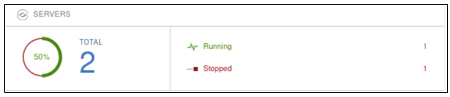

4.  Run command below to create a remote Liberty collective member on
    **server1.gym.lan** VM.

        /home/techzone/liberty_admin_pot/lab-scripts/addMember.sh -n appServer2 -v 22.0.0.8 -p 9082:9442 -h server1.gym.lan

    <table>
    <tbody>
    <tr class="odd">
    <td></td>
    <td>
When running the script, it requires <strong>user interaction</strong>.

    <ul>
    <li>
You will need to reply to <strong>accept certificate chains (Multiple times)</strong> as Liberty commands are run to join the server to the collective.
</li>
    <li>
You will need to enter the <strong>password for the server1.gym.lan VM</strong> <strong>(Multiple times)</strong> as the script interacts with the remote host
</li>
    </ul></td>
    </tr>
    </tbody>
    </table>

    a.  Enter **"y"** when prompted with question “**Do you wish to continue with the parameters specified? (y/n)?**”.

    b.  Enter **"y"** when prompted with question “**Do you want to accept the     above certificate chain? (y/n)**”.

    >**NOTE:** You will get prompted multiple time to accept the certificate chain as the script execute various commands.

    c. Enter **IBMDem0s\!** when prompted with request
    **techzone@server1.gym.lan's password:**

    >**NOTE:** You will get prompted three times for the password, once for each command that interacts with the remote host.

    

    When the script completes, the server **appServer2** is created and added to the collective.

    - The **addMember.sh** script created a Liberty server called  **appServer2** in the following directory on the **server1.gym.lan**  VM:

      > **/opt/IBM/liberty-staging/22.0.0.8-appServer2/wlp/usr/servers**

    - The server uses **9082** and **9442** as its HTTP/HTTPS ports, as defined ad script input parameters.

    - The output is recorded in a log file:

      > **/home/techzone/liberty\_admin\_pot/logs/1\_addMember-22.0.0.8-appServer2**

5.  Go back to the Liberty collective Admin Center page and you can see the two new members have been added to the server list and they are in **Stopped** status.

    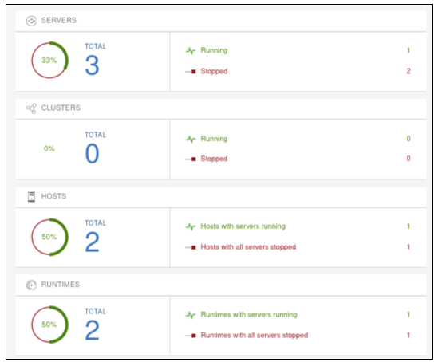

## **Part 5: Start Liberty collective member servers** 

At this point, you should have two Liberty collective members should now be created in the collective, and named as follows:

  - appServer1
  - appServer2

    In this section, you will **start** these two servers from the Liberty Admin Center.

    

<table>
<tbody>
<tr class="odd">
<td></td>
<td>
<strong>IMPORTANT: Please read!</strong>

If the two servers illustrated above are NOT in your collective, then you cannot continue with the lab.

Ensure that you completed <strong>Lab 1020</strong> of this series, or you have completed the <strong>Part 4</strong> of this lab.

If you already completed Lab 1020, then you don’t need to perform Part 5, if the two Liberty servers are in the “<strong>running</strong>” state.
</td>
</tr>
</tbody>
</table>

The PlantsByWebSphere application requires an application database,
which you need to ensure is up and running.

<table>
<tbody>
<tr class="odd">
<td></td>
<td>
<strong>Info:</strong>

You may have already started the db2 container in a preceding lab.

To find out if the db2 container is already running, execute the following command:

<strong>docker ps | grep db2_demo_data</strong>

<strong>FYI:</strong> It is OK to execute the docker start command below, even if the container is already running.
</td>
</tr>
</tbody>
</table>

 

1.  Before starting the Liberty servers, you need to start the db2 database used by the **PlantsByWebSphere** application with the command below.

        docker start db2_demo_data

2.  To start the collective member from the Liberty Admin Center **Explorer** page, click the **SERVERS** icon to go to its details page.

    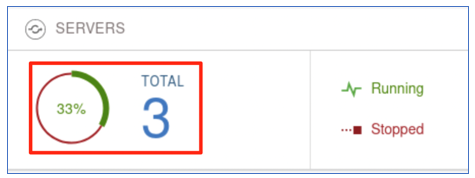

3.  In the server details page, click the dropdown menu icon of
    **appServer1** and select **Start** to start the server.

    
 
    **Note:** If prompted, enter the Admin Center username and password as:  **admin** / **admin**

4.  Click **Start** to confirm the start **appServer1** server command.

    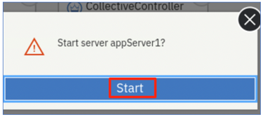
 
    Server **appServer1** will get started, and you can see it is "Running" status with 2 applications. 
 
    

5.  Repeat the same server start procedure for **appServer2** server. Once it is done, the **appServer2** server is started as show below:

    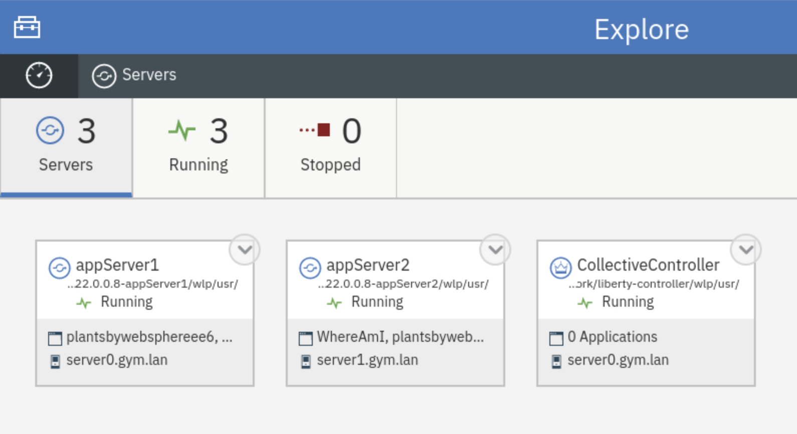

6.  Click the **Explorer** dashboard icon to go back to the dashboard  view.

    
 
    You will see all the two applications on both member servers are up nd running.
 
    

## **Part 6: Testing the Dynamic Routing Features**

In this section, you are going to test the dynamic routing you
configured for the Liberty collective.

You are going to conduct two testing scenarios:

  - In the first test case, you are using the **PlantsByWebSphere**
    application to test the high availability of the application and
    verify you can always access the application directly from the IHS
    server if at least one of the member servers is running.

    > When you stop one of the app servers, the dynamic routing
automatically redirects the traffic to another surviving app server without any user intervention or application interruption.

  - The second test case demonstrates round robin load balancing and the dynamic routing distributes traffic to the collective members based on their workloads.

    > The **WhereAmI** application is used in this testing because it does NOT use sticky sessions, whereas the PlantsByWebSphere application does.
    > 
    > When you refresh the application URL link in the web browser window, you can see the dynamic routing performs round-robin style routing among the servers.

### **Test Case 1:**

This test case uses PlantsByWebSphere application. The design of this application uses HTTP Sessions to store application state in the internal http session object. By default, the http session object is local to the Liberty server, and not persisted in any external store.

WebSphere traditional and WebSphere Liberty use a JSESSIONID in this case, which identifies the server handing the request that includes uses an http session. Then on subsequent transactions or requests, the JSESSIONID is read by the web server plugin, and requests continue to be routed to the SAME server.

If the server handing the requests goes down, then the web server plugin will redirect the requests to any surviving servers.

However, without session persistence configured, any session data is lost, such as items in a shopping cart, or login cookies, etc.

1.  To access the **PlantsByWebSphere** application through IHS server     and plugin, open a new browser window and enter the application URL as:

        http://server0.gym.lan:8080/PlantsByWebSphere

    The application “**Home” page** is displayed.
 
    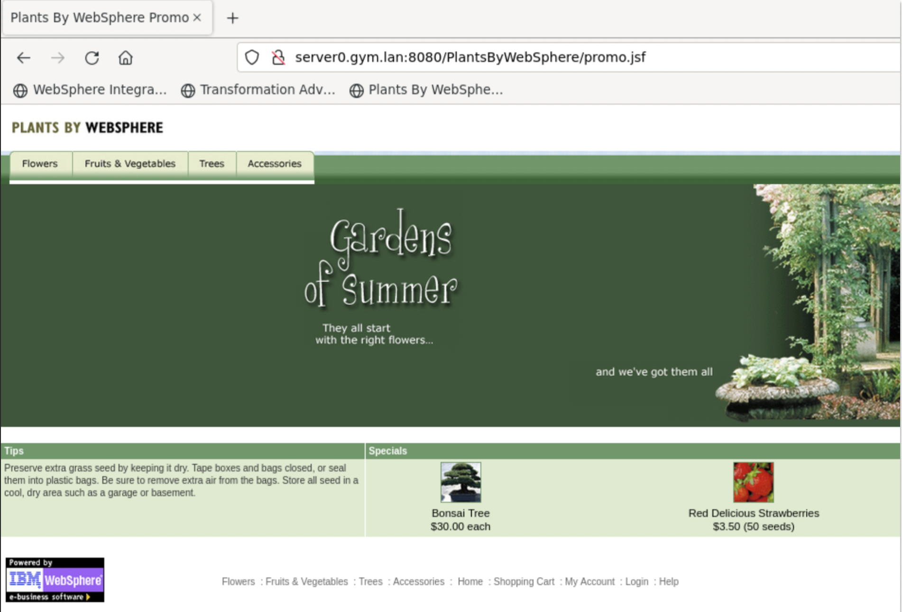

2.  You can navigate and visit different pages of the application. You can see that although the application is running on two Liberty  servers with different HTTP/HTTPS ports, the dynamic routing function of the Liberty collective is able to direct the incoming traffic through the specified IHS server port (8080) to the application.

    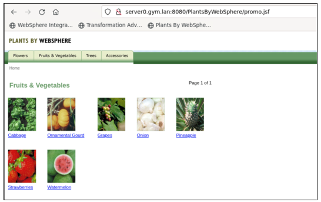

3.  Click the **Help** link to go to application **Help** page.

    
 
    The application Help page is displayed. On this page, you can see which Liberty server the request was routed.
 
    As showing in the screen shot below, the application is running from **appServer2** which might be different in your case.
 
    

4.  **Stop** the Liberty server that is identified as handling the  request, as shown on the PlantsByWebSphere application **"Help"** page.
    
    a. Go back to Liberty collective **Admin Center Servers** page
    
    b. **Stop** the server that was identified on the application Help page, as illustrated below:

    

    If prompted, enter the Admin Center credentials as: **admin / admin**.
 
    The server is stopped.
 
    

5.  From the **PlantsByWebSphere** application page, click the
    “**Flowers**” tab, to show the catalog of flowers.

    

6.  Click the **Help** link to go to application **Help** page, you can  see now the application is running from a different application erver.

    
 
    This demonstrates that the Liberty dynamic routing detects the application server is down and directs the traffic to another application server automatically.
 
    The application high availability test is completed.

### **Clear Firefox Browsing Data**

1.  Clear the browsing data that is cached in Firefox before continuing to Test Case 2
    
    a. From Firefox, click on the “**Clear Browsing Data**” icon
        located in the upper right-corner of the browser window.

    

    b. Select “**All Data Types**” from the menu

    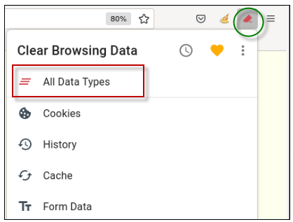

    c. **Close** the “Clear Browsing Data” message box

    

### **Test Case 2:**

In this test case, the **WhereAmI** application is used. This
application does not use http sessions, and therefore the web server plugin can direct requests to the Liberty servers in a round-robin style.

1.  **Start** both application servers (appServer1 and appServer2) from Liberty collective Admin Center.

2.  Open a new browser window and enter the **WhereAmI** application URL as:

        http://server0.gym.lan:8080/WhereAmI

    The output shows that currently the application is running from **appServer1** server.
 
    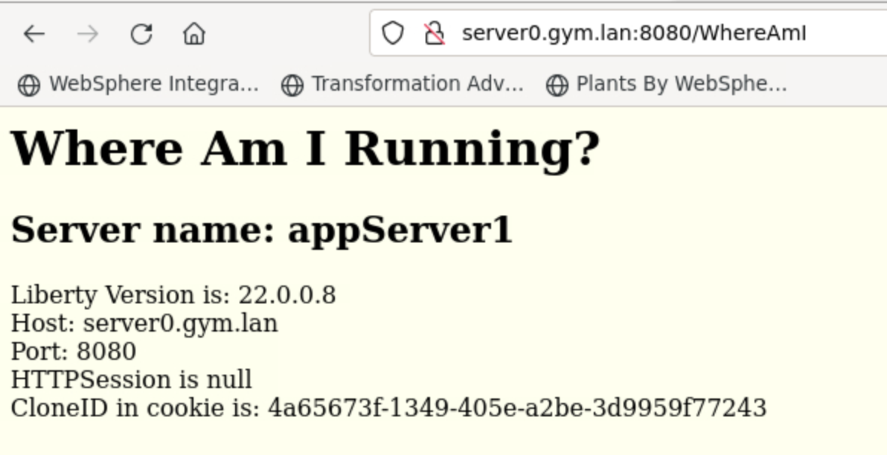

3.  Refresh the application page by clicking the **refresh icon** on the browser.

    You can see the output showing that Liberty dynamic routing feature directs the request traffic to **appServer2** server.
 
    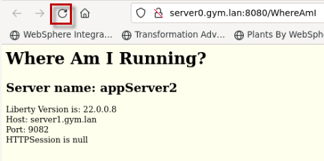

4.  Refresh the browser again a few more times and see that the requests get routed to **appServer1** and **appServer2** accordingly.

    The round robin load balancing test is completed.

## **Part 7: Configure and Test Dynamic Routing Rules**

With dynamic routing enabled, you can use routing rules in Liberty to customize exactly which servers are used to handle specific requests.

By default, dynamic routing balances load requests across all servers that can handle the request. To override the default behavior, you must configure routing rules. Routing rules can route requests to specific server resources, redirect requests, or reject requests.

Each **\<routing Rules\>** element can define the applicable set of **web servers** where the rules are published. In this example, there is only one web server, named “**webserver1**”.

When a web server connects to the DynamicRouting service, the service delivers rules to that web server.

**Example:**

In this example, the routing rules will be applied to the
“**webserver1**” HTTP server.

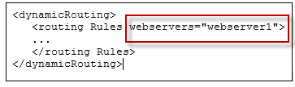

  - The Web Server matches requests against the **match Expressions** that are found in the \<routingRule\>.

  - The \<loadBalanceEndpoints\> defines the set of servers (**endpoint destinations**) that are permitted to handle the request based on the routing rules match expressions.

**Example:**

In the example, requests that match **“/WhereAmI%”** will be routed to the Liberty server, appServer1.

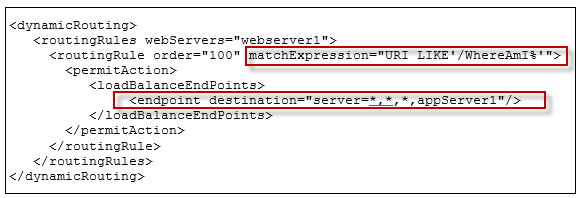

**IBM Documentation** – Configuring routing rules from Dynamic Routing:

<https://www.ibm.com/docs/en/was-liberty/nd?topic=SSAW57_liberty/com.ibm.websphere.wlp.zseries.doc/ae/twlp_wve_routing_rules.htm>

1.  From the browser, go to the **WhereAmI** application URL again:

        http://server0.gym.lan:8080/WhereAmI

2.  Refresh the browser window for **WhereAmI** so you can see that the requests are getting routed to **appServer1** and **appServer2** accordingly as you observed in the previous section of the lab.

3.  Run the following script, that is provided for the lab, to add the dynamic routing rules such that only appServer1 will handle the WhereAmI application requests.

        ~/liberty_admin_pot/lab-scripts/applyRoutingRules.sh -s appServer1

    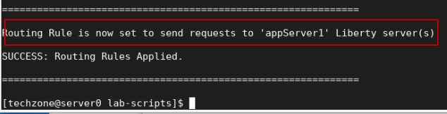

    <table>
    <tbody>
    <tr class="odd">
    <td></td>
    <td>
<strong>Tip:</strong>

    
The dynamic rules are added to the Collective Controller by including the configuration in the server’s <strong>configDropins/overrides</strong> directory.

    
Liberty dynamically applies the updated configuration to the controller.
</td>
    </tr>
    </tbody>
    </table>

4.  See the new routing rule illustrated below. The new routing rule  states:
    
    - The rules apply to the “webserver1” HTTP server
    
    - The rule applies to requests that match “/WhereAmI” URI
    
    - If the routing rule matches the expression, route the requests to Liberty server ONLY “**appServer1**”
    
    - WhereAmI application will now only be routed to  “**appServer1**”

    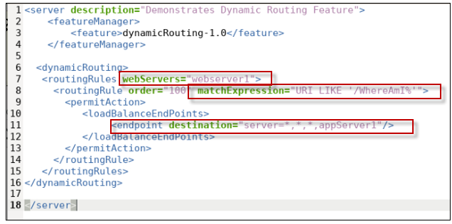

5.  Refresh the browser window for **WhereAmI** again and now you see that the requests are only routed to **appServer1**.

6.  Run the following script again to change the destination to ONLY **appServer2**

        ~/liberty_admin_pot/lab-scripts/applyRoutingRules.sh -s appServer2

    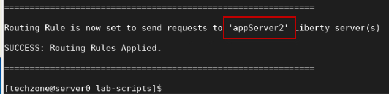

7.  Refresh the browser window for **WhereAmI** again and now you see that the requests are only routed to **appServer2**.

    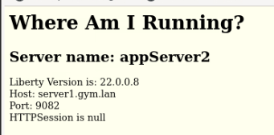

8.  Run the following script to again to change the destination to  **both** Liberty servers

        ~/liberty_admin_pot/lab-scripts/applyRoutingRules.sh -s all

    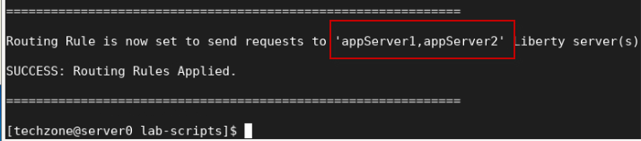

9.  Refresh the browser window for **WhereAmI** a few times. You will  see that the requests get routed to **appServer1** and
    **appServer2** in a round-robin fashion.

## Summary

**Congratulations\!**

**You have successfully completed the lab “The value of Dynamic
Routing”**

In this Lab, you have seen how to configure the Dynamic Routing feature in Liberty collective to provide dynamic routing information to the web server plugin.

The ability to leverage Liberty’s dynamic routing capability for any edition of Liberty is powerful and cost effective.

You getget HA for **Liberty Base** and **Liberty Core** editions,
without requiring Liberty ND licenses. It also eliminates time-consuming plug-in merges and manual updates to the configuration if servers are added or removed from the configuration.

This can also be very useful in topologies where servers or applications are regularly being added, changed, or removed.

