# Lab 1040: HTTP Session Persistence and Failover with Liberty

**Last updated:** March 2023

**Duration:** 45 minutes

Need support? Contact **Kevin Postreich, Yi Tang**

<table>
<tbody>
<tr class="odd">
<td></td>
<td><strong>IMPORTANT: Please read!</strong>

This lab requires the completion of <strong>Lab 1030 – Dynamic Routing</strong> of this series. 

 In other words, you cannot perform this lab until you have completed <strong>Lab 1030 – Dynamic Routing</strong> 
</td>
</tr>
</tbody>
</table>

 

## **Introduction**

In many web applications, user choices or actions determine where the
user is sent next, how the application behaves, or what the page
displays.

For example, if the user clicks a checkout button on a site, the next
page must contain the user's shopping choices and information. The Java
servlet specification provides a mechanism for servlet applications to
maintain a user's state information. This mechanism is known as a **HTTP
session;** **(**or just session**)**.

The **session** allows the servlet engine to “personalize” the user
experience by keeping track of the individual users during navigation.

In a digital purchasing scenario, sessions can be used to provide online
shopping carts. All purchases are tracked using the user’s session
object.

A servlet distinguishes users by their unique session ID. In the case or
WebSphere Liberty, this is via a “JESSIONID”. Session tracking can be
configured using **cookies** or **URL rewriting**. The illustration
below depicts using cookies to track sessions.

The HTTP Server and Web server plug-in are configured to maintain
session affinity, also referred to as “sticky sessions” using JSESSIONID
which assigns clients to specific Liberty server. It always forwards
requests from the same client to the same server.

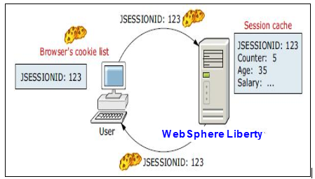

### **Session affinity and failover**

Session can be distributed, which provide for the distribution of the
session to other servers to provide for failover. There are multiple
mechanisms for session distribution, but this lab will use a database to
provide a common persistent session store. In a failure scenario the web
server plug-in for WebSphere Liberty routes the requests for a given
session to the server with affinity, as illustrated below

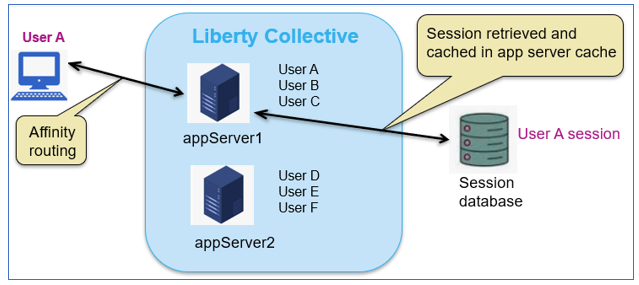

After a server failure when the request times out, the web server
plug-in redirects the user to another cluster member, and the user's
session affinity switches to this replacement Liberty collective member.

After the initial read from the persistent store, the replacement member
places the user's session object in the in-memory cache. From then on,
requests for that session go to the selected Liberty member. The
requests for the session can go back to the failed cluster member when
it is recovered.

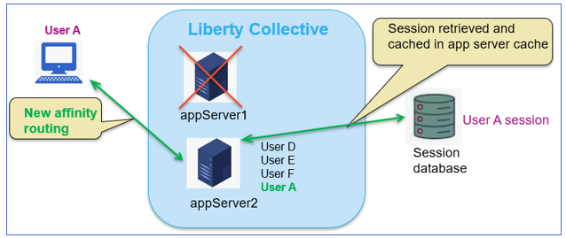

WebSphere Liberty offers features that support Session Distribution via
a **database provider** such as DB2 for session persistence, or
in-memory replication using a JCache **provider** such as Hazelcast.

<table>
<tbody>
<tr class="odd">
<td></td>
<td>
<strong>Info:</strong>

It’s often (mistakenly) believed that in-memory replication is faster than session persistence.

The reality is that most of the overhead of session distribution is the serialization of the session by the local session manager, and deserialization by the session store, which is common to both database persistence and in-memory replication.

The difference between these session distribution mechanisms lies in the speed to the read and write of the session object and with decades of experience in optimization of reads and writes, databases outperform in in-memory replication.
</td>
</tr>
</tbody>
</table>

The configuration is straightforward and direct programmatic interaction
is not required. This configuration allows multiple servers to share the
same session data, and the session data can be recovered in the event of
a server failure.

In this Lab, you will learn how to use the Liberty session database
persistence feature to improve your application availability and user
experience.

Specifically, the lab demonstrates the persistence of the users shopping
cart, so that items in the shopping cart are not lost in the event of a
server failure.

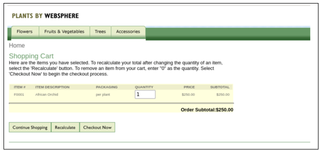

<table>
<tbody>
<tr class="odd">
<td></td>
<td>
<strong>IMPORTANT: Please read!</strong>

This lab requires the completion of <strong>Lab 1030 – Dynamic Routing</strong> of this series.

In other words, you cannot perform this lab until you have completed <strong>Lab 1030 – Dynamic Routing</strong>
</td>
</tr>
</tbody>
</table>

## **Accessing the environment**

If you are doing this lab as part of an instructor led workshop (virtual
or face to face), an environment has already been provisioned for you.
The instructor will provide the details for accessing the lab
environment.

Otherwise, you will need to reserve an environment for the lab. You can
obtain one here. Follow the on-screen instructions for the “**Reserve
now**” option.

KLP: TBD LINK TO ENV RESERVATION

The lab environment contains two (2) Linux VMs.

A Published Service is configured to provide access to the **server0**
VM through the noVNC interface for the lab environment.

1.  Access the lab environment from your web browser.

    a. When the environment is provisioned, right-mouse click on the  **Published Service** link/ Then select “**Open link in New Tab**”  from the context menu.
 
    
 
    b. Click on the **"vnc.html"** link to open the lab environment  through the **noVNC** interface.
 
    
 
    c. Click the **Connect** button
 
    
 
    d. Enter the password as: **passw0rd**. Then click the **Send
 Credentials** button to access the lab environment.
 
    **Note:** That is a numeric zero in passw0rd
 
    

2.  Login to the **server0** VM using the credentials below:
    
      - User ID: **techzone**
    
      - Password: **IBMDem0s\!**

## **Tips for working in the lab environment**

1.  You can use your Browsers **zoom in** and **zoom out** options to resize the virtual desktop to fit your screen.

    The examples below are using Firefox and Chrome browsers.

    - Firefox example:

      

    - Chrome example:

      

2.  You can copy / paste text from the lab guide into the lab
    environment using the clipboard in the noVNC viewer.

     a. Copy the text from the lab guide that you want to paste into the lab environment
 
    b. Click the **Clipboard** icon and **paste** the text into the noVNC  clipboard
 
    
 
    c. Paste the text into the VM, such as to a terminal window, browser  window, etc.
 
    d. Click on the **clipboard** icon again to close the clipboard
 
    **NOTE:** Sometimes pasting into a Terminal window in the VM does not  work consistently. In this case you might try again or paste the text  into a **Text Editor** in the VM, and then paste it into the Terminal  window in the VM.

3.  An alternative to using the noVNC Copy / Paste option, you may
    consider opening the lab guide in a web browser inside of the VM.

    Using this method, you can easily copy / paste text from the lab  guide without having to use the noVNC clipboard.

## Lab: HTTP Session Persistence and Failover with Liberty

In this lab you configure the Liberty servers with session persistence
feature using a DB2 database. Using this configuration, the Liberty
servers persist the session data to the DB2 database where session data
can be recovered in the event of a Liberty server failover.

The sample application you are going to use to test the session
persistence is **PlantsByWebSphere**.

You will start and stop members in the collective to experience the
session persistence and failover behavior.

**This lab contains the following
activities:**

  - Test the PlantsByWebSphere application without session persistence
    enabled

  - Configure database persistence feature in WebSphere Liberty

  - See the value of session persistence and session failover

  - Summary

<table>
<tbody>
<tr class="odd">
<td></td>
<td>
<strong>IMPORTANT: Please read!</strong>

This lab requires the completion of <strong>Lab 1030 – Dynamic Routing</strong> of this series.

In other words, you cannot perform this lab until you have completed <strong>Lab 1030 – Dynamic Routing</strong>
</td>
</tr>
</tbody>
</table>

## **Clone the GitHub repo for this workshop**

This lab requires artifacts that are stored in a GitHub repository. Run the command below to clone the repository to the local VM used for the lab.

This lab requires artifacts that are stored in a GitHub repository. Run the command below to clone the repository to the local VM used for the
lab.

1.  If not already done so in a previous lab, clone the GitHub repo that contains lab artifacts needed for the lab.

    a.  Open a new terminal window on the “**server0.gym.lan**” VM

    

    b.  Clone the GitHub repository required for the lab

        git clone https://github.com/IBMTechSales/liberty_admin_pot.git

    c.  Navigate to the “**lab-scripts**” directory in the cloned repo

        cd ~/liberty_admin_pot/lab-scripts

    d.  Add the “**execute**” permissions to the lab-scripts directories and shell scripts

        chmod -R 755 ./

## **Part 1: Ensure the Liberty collective member servers are running** 

In this section, you will launch the Liberty Admin Center, and ensure
the servers are running. start these two servers from the Liberty Admin
Center.

1.  Before starting the Liberty servers, you need to start the db2
    database used by the **PlantsByWebSphere** application with the
    command below.

    <table>
    <tbody>
    <tr class="odd">
    <td></td>
    <td>
<strong>Info:</strong>

    
You may have already started the db2 container in a preceding lab.

    
To find out if the db2 container is already running, execute the following command:

    
<strong>docker ps | grep db2_demo_data</strong>

    
<strong>FYI:</strong> It is OK to execute the docker start command below, even if the container is already running.
</td>
    </tr>
    </tbody>
    </table>

        docker start db2_demo_data

     

2.  Login to the Liberty Admin Center
    
    a. From the Browser, open a new tab and access the Liberty Admin Center URL

        https://server0.gym.lan:9491/adminCenter

    b. Login to the Admin Center using the login credentials: **admin / admin**

     **Note:** If you see the “Warning: Potential Security Risk Ahead”, click **Advance..-\>Accept Risk and Continue** to continue.
 
    The Liberty collective Admin Center page is displayed.
 
    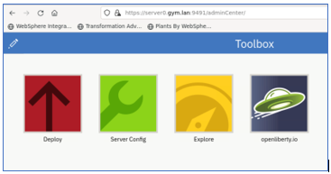

    c.  Click the **Explore** icon

    

3.  List the Liberty servers in the collective.

    a.  Click **Server** section to display the Liberty servers in the  collective

    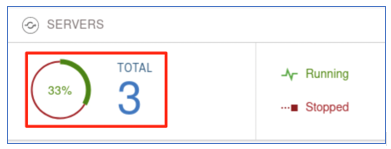
 
    At this point, you should have two Liberty collective members in the collective, and named as follows:

    - appServer1
    - appServer2

    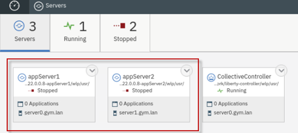

<table>
<tbody>
<tr class="odd">
<td></td>
<td>
<strong>IMPORTANT: Please read!</strong>

If the two servers illustrated above are NOT in your collective, then you cannot continue with the lab.

Ensure that you completed <strong>Lab 1030</strong> of this series.
</td>
</tr>
</tbody>
</table>

4.  In the server details page, click the dropdown menu icon of
     **appServer1** and select **Start** to start the server.

    

     **Note:** If prompted, enter the Admin Center username and password as: **admin / admin**

5.  Click **Start** to confirm the start **appServer1** server command.

    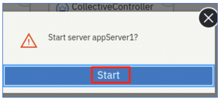
 
    Server **appServer1** will start, and you can see it is "Running" status.
 
    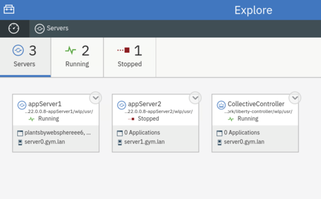

6.  Repeat the same server start procedure for **appServer2** server. Once it is done, the **appServer2** server is started as show below:

    

## **Part 2: Test the application WITHOUT Session Persistence**

In this section, you are going to test the **PlantsByWebSphere**
application without session persistence. Without session persistence, if
you stop the application server where the application is running, the
Liberty dynamic routing will re-direct the traffic to another
application server and you can still access the application. However,
the shopping cart data is lost because it was stored in the local
session object in the Liberty server.

### **Clear Firefox Browsing Data**

1.  Clear the browsing data that is cached in Firefox before continuing
    to Test Case
    
    a. From Firefox, click on the “**Clear Browsing Data**” icon
        located in the upper right-corner of the browser window.

    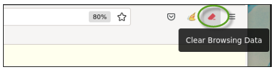

    b. Select “**Cache**” from the menu

    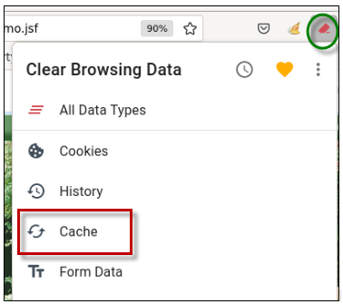

    c.  **Close** the “Clear Browsing Data” message box

    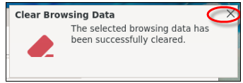

### **Test the application without session persistence**

1.  To access the **PlantsByWebSphere** application through IHS server  and plugin, open a new browser window and enter the application URL as:

        http://server0.gym.lan:8080/PlantsByWebSphere

    The application **Home** page is displayed.
 
    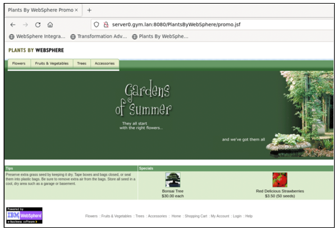

2.  Click the **Help** link to go to application **Help** page.

    
 
    The application Help page is displayed. On this page, you can see  which Liberty server handled the request. As shown in the screen shot  below, the application is running from **appServer1**, which could be  different in your case.
 
    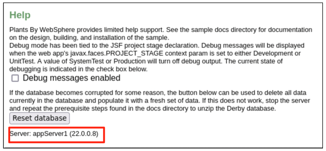

3.  Navigate to the application Catalog page, select a catalog, and
    click one of products listed.

    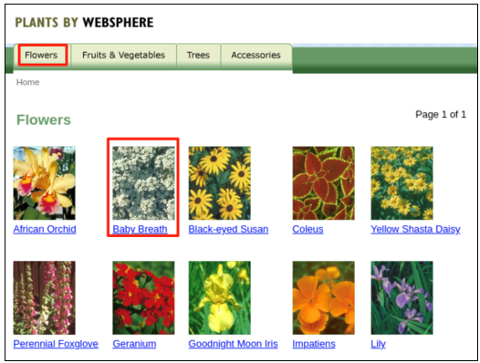

4.  In the product details page, click “**Add to cart”** to add the
    product your shopping cart.

    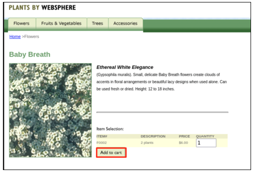
 
    The product is added to your shopping cart.
 
    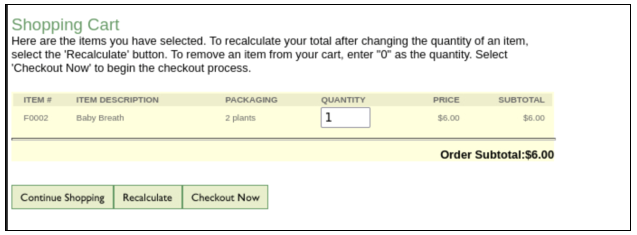

5.  You can see the message showing that you have 1 item in your
    shopping cart, and you can check it by clicking the **SHOPPING
    CART** link.

    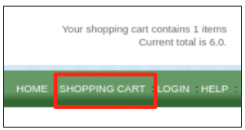

6.  **Stop** the Liberty server that was identified in the application Help page, as the server handing the PlantsByWebSphere requests.
    
    a.  Now go back to Liberty collective **Admin Center** Servers page.
    
    b.  **Stop** the application server showing in the **Help** page of the **PlantsByWebSphere** application to simulate the server  down situation

    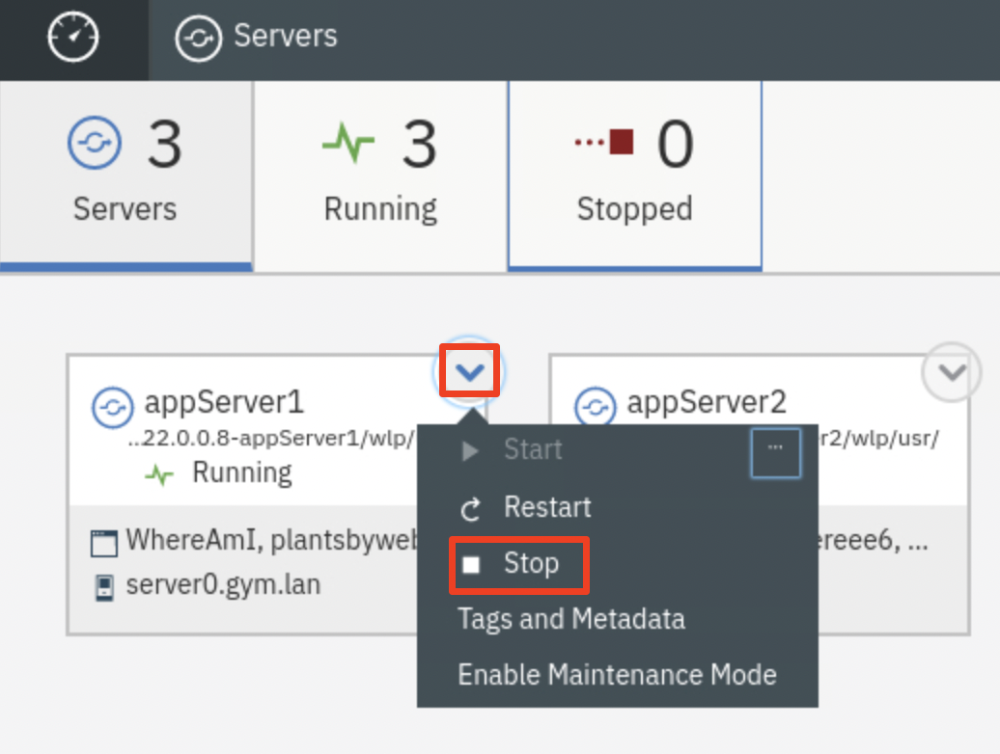
 
    If prompted, enter the Admin Center credentials as: **admin / admin**.
 
    The server is stopped.
 
    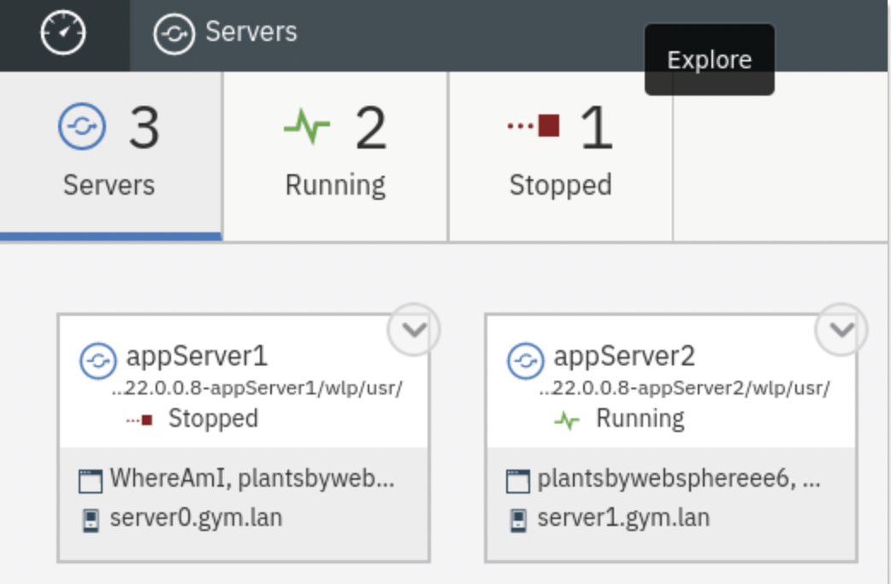

7.  From the **PlantsByWebSphere** application page, click any link on the page to navigate away from current page, you will see an error message like this one:

    
 
    This is an expected error, because the **PlantsByWebSphere**
 application is using session data and currently the Liberty server is not configured to support the session persistence yet.

8.  Click the back icon on the web page to return to the previous page, then click the **HOME** link on the page.

    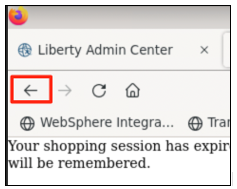
 
    
 
    Now you can access all pages of the application.

9.  Click the **SHOPPING CART** link to go to application **Shopping Cart** page, you can see the shopping cart list is empty indicating that the shopping cart data is lost in the server down incident.

    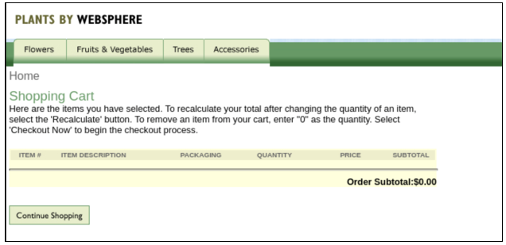

## **Part 3: Configure Liberty Session Persistence with Database**

WebSphere Liberty offers features that support Session Persistence,
which provides session cache via a **database provider** such as DB2, or a **jcache provider** such as Hazelcast.

In this section of the lab, you will session database persistence in Liberty to ensure items in the user’s shopping cart is not lost in the event of a Liberty server outage.

To enable session persistence, you can define a shared session
management configuration for the Liberty servers. This configuration allows multiple servers to share the same session data, and session data can be recovered in the event of a failover.

To define a shared session management configuration for Liberty servers, you need to do the followings:

  - Add **sessionDatabase-1.0** feature

  - Define session data source

  - Refer to the data source from the session database configuration

  - Refer to the persistent storage location from the session management
    configuration.

### **Run the automation script to configure the session database persistence**

For the session persistence to work, the Liberty **sessionDatabase-1.0** feature is required in Liberty servers configuration. This feature enables persistence of HTTP sessions to a data source using JDBC.

In this lab, the feature is added to the Liberty servers using an
automation script that adds the configuration for
**sessionDatabase-1.0** feature via a Liberty server override xml file named “**httpSessionPersistence.xml”.**

1.  Run commands below to copy the **httpSessionPersistence.xml** to **appServer1**

        /home/techzone/liberty_admin_pot/lab-scripts/applyOverrides.sh -n appServer1 -v 22.0.0.8 -h server0.gym.lan SESSIONDB

2.  Run commands below to copy the **httpSessionPersistence.xml** to **appServer2**

        /home/techzone/liberty_admin_pot/lab-scripts/applyOverrides.sh -n appServer2 -v 22.0.0.8 -h server1.gym.lan SESSIONDB

    a.  Enter **IBMDem0s\!** when prompted with request for
    **techzone@server1.gym.lan's** password

    The Liberty session persistence is now configured for **appServer1** and **appServer2**.

### **Review the sessionDatabase-1.0 feature configuration**

The following configuration was added to the Liberty server
configuration for appServer1 and appServer2 to enable the
sessionDatabase-1.0 feature.

The configuration includes the following:

  - Add the sessionDatabase-1.0 feature to the server configuration

  - Adds the datasource and database driver details to the server
    configuration

  - Adds the httpSessionDatabase parameters

  - Adds the httpSession parameters
    
1.  Examine the httpSessionPersistence.xml file

        gedit /home/techzone/liberty_admin_pot/lab-scripts/scriptArtifacts/httpSessionPersistence.xml

    - The Liberty **feature** added is the sessionDatabase-1.0 feature
 
      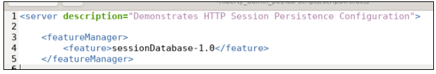
 
    - The **data source** contains the connection details to the session database:
 
      - DB2 session persistence database name: **sdb**

      - This database is running in the same container as the
    db2\_demo\_data that hosts the pbw database for the
    PlantsByWebSphere application.

      

    - The data source is associated with **session database** as shown below:

      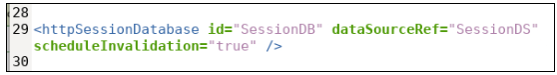

    - The **persistent storage location** is defined as follows:

      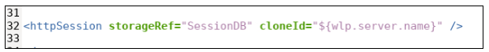

    - The HTTP server plugin uses the **clone ID** that is inserted into  the response/request header to maintain session affinity between requests.

    - While the clone ID is normally unchanging, in Liberty, the clone ID is generated when you start a server for the first time.

    - In this lab the clone ID is the Liberty server name.

## **Part 4: Testing the application with Session Persistence configured**

With session persistence enabled, you can repeat the same testing steps used in **Part 2** of the lab to verify the high availability and session failover scenario.

1.  Ensure the two Liberty servers are running
    
    a. Go back to Liberty collective Admin Center Servers page.
    
    b. Start the application server you stopped in **Part 2** of the lab

2.  Both **appServer1** and **appServer2** should now be running:

    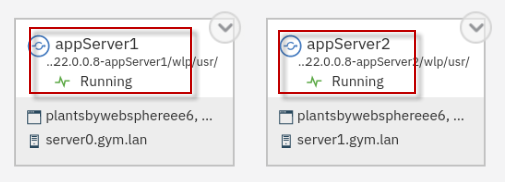

3.  From the browser, return to the PlantsByWebSphere application

        http://server0.gym.lan:8080/PlantsByWebSphere

4.  In the **PlantsByWebShere** window, click **HOME** link.

    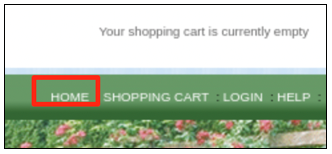

5.  Click the **Help** link to go to application **Help** page.

    
 
    The application Help page is displayed, and you can see that the application is running from which application server.
 
    As showing in the screen shot below, the application is running from **appServer1** which might be different in your case.
 
    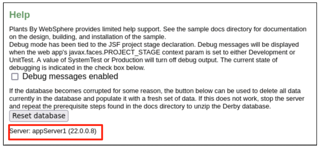

6.  Navigate to the application **Catalog** page, select a catalog, and click one of products listed.

    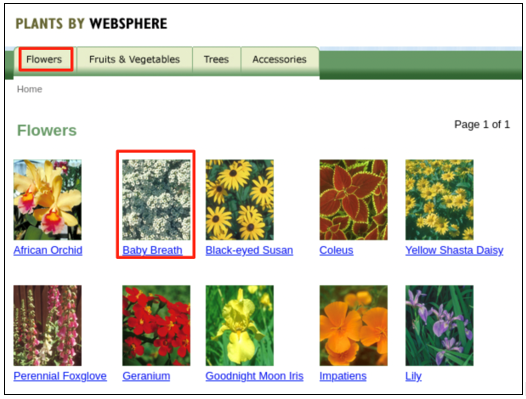

7.  In the **product details** page, click **Add to cart** to add the product your shopping cart.

    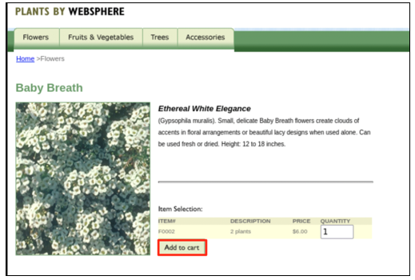
 
    The product is added to your shopping cart.
 
    

8.  You can see the message showing that you have 1 item in your
    shopping cart, and you can check it by clicking the **SHOPPING
    CART** link.

    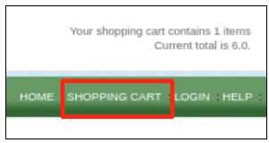

9.  **Stop** the Liberty server that was identified in the application Help page, as the server handing the PlantsByWebSphere requests.
    
    a. Now go back to Liberty collective **Admin Center** Servers
       page.
    
    b. **Stop** the application server showing in the **Help** page
        of the **PlantsByWebSphere** application to simulate the
        server down situation

    
 
    If prompted, enter the Admin Center credentials as: **admin / admin**.
 
    The server is stopped.
 
    

10. From the **PlantsByWebSphere** application page, click the **HOME** link on the page.

    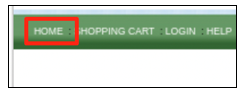

11. Click the **Help** link to go to application **Help** page.

    

    You can see the application is now running on the other server.

    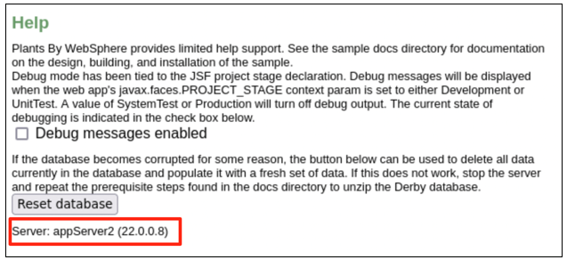

12. Click the **SHOPPING CART** link to go to application **Shopping Cart** page, you can see your shopping cart data is still listed after the server down incident.

    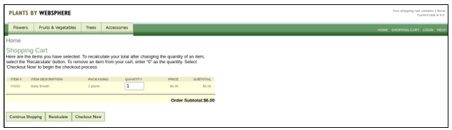

## **Summary**

**Congratulations\!**

**You have successfully completed the lab “HTTP session persistence and Failover with WebSphere Liberty”**

In this lab, you learned the value of configuring the
sessionDatabase-1.0 feature for WebSphere Liberty to enable Session
Persistence, which provides session cache via a **database provider.**

This configuration allowed multiple servers to share the same session data, and the session data can be recovered from the session database in the event of a server failure.

Specifically, in this lab, you were able to demonstrate persistence of the users shopping cart, so that items in the shopping cart are not lost in the event of a server failure.

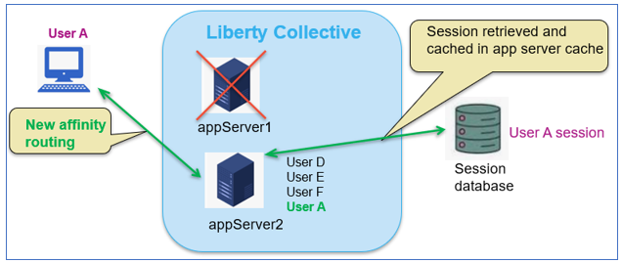
