# Lab 1050: Zero-migration upgrade with Liberty

**Last updated:** March 2023

**Duration:** 45 minutes

Need support? Contact **Kevin Postreich, Yi Tang**

## Introduction to the Lab

The goal of this lab is to provide practical guidance and hands-on
experience following best practices for version-to-version
(fixpack-to-fixpack) upgrades of WebSphere Liberty.

Because of the Liberty’s **feature model** and its **Zero Migration
architecture**, Liberty follows a single stream continuous delivery
model.

There is only one stream of Liberty, no version upgrades necessary.
Better still, each new release resets the 5-year support window and so
there’s no need for support extensions.

Simply install new fixpacks to get the latest performance enhancements,
features, and bug fixes. Then use your existing build process to produce
a new Liberty Server package that contains the updated Liberty binaries,
your existing application and configuration, and then deploy to a dual
installation location. This removes the largest headaches for managing
technical debt for your applications, which is keeping current on
software updates.

In the lab, you will follow these recommended practices to upgrade the
version of Liberty in the Collective.

  - Update through build process

  - Blue / Green deployments
    
      - Dual install locations
    
      - Ripple start (stop old/start new, JVM by JVM)
    
      - Delete old instances at your convenience

An illustration of the result from an upgrade process is depicted below.

**Note:** The server names, paths, and ports used in the lab are
different than those illustrated.

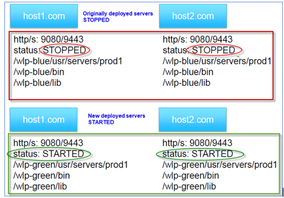

Following this methodology, you will gain an understanding of how you
might apply your own build processes or automation to achieve
significant agility and flexibility managing Liberty collectives with
repeatable automated processes that significantly reduces risk to your
business.

After completing the lab, you should have an appreciation for how simple
it is to upgrade Liberty leveraging its zero-migration architecture and
the recommended practices described in the lab.

**This lab contains the following hands-on activities:**

  - Build a new Liberty server package that includes an updated fixpack of Liberty

  - Deploy the new Liberty Server package to a dual installation
    location.

  - Add the servers as new collective Members into the Collective

  - Use Liberty Admin Center to “**Ripple Start**” the new Liberty
    Servers

  - Test the application with the upgraded Liberty fixpack

**The lab environment consists of two Host VMs:**

  - server0.gym.lan

  - server1.gym.lan

You will use the same Linux shell “**Build and Deploy**” scripts, that
you used in the previous labs, to build a new Liberty server package
(using Liberty 22.0.0.12) and deploy the server package to both host VMs
and join the collective.

## **Accessing the environment**

If you are doing this lab as part of an instructor led workshop (virtual
or face to face), an environment has already been provisioned for you.
The instructor will provide the details for accessing the lab
environment.

Otherwise, you will need to reserve an environment for the lab. You can
obtain one here. Follow the on-screen instructions for the “**Reserve
now**” option.

KLP: TBD LINK TO ENV RESERVATION

The lab environment contains two (2) Linux VMs.

A Published Service is configured to provide access to the **server0**
VM through the noVNC interface for the lab environment.

1.  Access the lab environment from your web browser.

    a. When the environment is provisioned, right-mouse click on the
 **Published Service** link/ Then select “**Open link in New Tab**”
 from the context menu.
 
    
 
    b. Click on the **"vnc.html"** link to open the lab environment
 through the **noVNC** interface.
 
    
 
    c. Click the **Connect** button
 
    
 
    d. Enter the password as: **passw0rd**. Then click the **Send
 Credentials** button to access the lab environment.
 
    **Note:** That is a numeric zero in passw0rd
 
    

2.  Login to the **server0** VM using the credentials below:
    
    - User ID: **techzone**
    - Password: **IBMDem0s\!**

## **Tips for working in the lab environment**

1.  You can resize the viewable area using the **noVNC Settings** options to resize the virtual desktop to fit your screen.

    a. From the environemnt VM, click on the **twisty** on the noNC control pane to open the menu.  

    

    b. To increase the visible area, click on `Settings > Scaling Mode` and set the value to `Remote Resizing`
      
     

2.  You can copy / paste text from the lab guide into the lab environment using the clipboard in the noVNC viewer. 
   
    a. Copy the text from the lab guide that you want to paste into the lab environment
    
    b. Click the **Clipboard** icon and **paste** the text into the noVNC clipboard

    
    
    c. Paste the text into the VM, such as to a terminal window, browser window, etc. 

    d. Click on the **clipboard** icon again to close the clipboard

    > **NOTE:** Sometimes pasting into a Terminal window in the VM does not work consistently. 
    
    > In this case you might try again, or open another Terminal Window and try again, or  paste the text into a **Text Editor** in the VM, and then paste it into the Terminal window in the VM. 

3. An alternative to using the noVNC Copy / Paste option, you may consider opening the lab guide in a web browser inside of the VM. Using this method, you can easily copy / paste text from the lab guide without having to use the noVNC clipboard. 

 

## **Part 1: Clone the GitHub repo for this workshop**

This lab requires artifacts that are stored in a GitHub repository. Run the command below to clone the repository to the local VM used for the lab.

1.  Clone the GitHub repo that contains lab artifacts needed for the lab if you have not already done so in a previous lab in this series.

    a.  Open a new terminal window on the “**server0.gym.lan**” VM

    

    b.  Clone the GitHub repository required for the lab

        git clone https://github.com/IBMTechSales/liberty_admin_pot.git

    c.  Navigate to the lab-scripts directory in the cloned repo

        cd ~/liberty_admin_pot/lab-scripts

    d.  Add the “execute” permissions to the lab-scripts directories and  shell scripts

        chmod -R 755 ./

## **Part 2: Ensure the Liberty Collective is deployed**

Liberty dynamic routing requires a Liberty Collective, and the application servers which host the applications used in the labs to be members of the Liberty collective. The learning module for creating the Liberty collective is “Lab_1020”. 

In this section you will ensure that a Liberty administrative collective is available, and the application servers are deployed to the collective.  

<table>
<tbody>
<tr class="odd">
<td></td>
<td>
<strong>IMPORTANT: Please read!</strong>

If you have completed the <strong>Lab 1020</strong> or <strong>Lab 1030</strong> of this series, you have already created the Liberty collective controller.

In other words, you can skip <strong>Part 2</strong> of the lab and continue with <strong>Part 3</strong> if you have already completed Lab 1020 or Lab 1030 in this series.

The Admin Center ULR is: <a href="https://server0.gym.lan:9491/adminCenter">https://server0.gym.lan:9491/adminCenter</a>

The Admin Center credentials are: <strong>admin</strong> / <strong>admin</strong>
</td>
</tr>
</tbody>
</table>

### 2.1: If you have not completed lab 1020 or lab 1030, the following steps provide a “Fast path” to creating the Liberty collective required for this lab, "Lab 1050". 

1.	Run the command below to ensure a Liberty collective is created:

        /home/techzone/liberty_admin_pot/lab-scripts/deployCollective.sh

    The deployCollectve.sh script will do the following: 

    - If the Controller already exists, the script will ABORT, as a collective already exists
    - If the Controller does NOT exist, it will be created 
    - Build and produce a Liberty Server package to deploy to Liberty application servers
    - Create two Liberty Servers, “appServer1” and “appServer2”, deploy the server package, and join the servers to the Liberty Collective
    - Configure Dynamic Routing in the Collective Controller

2.	Once the script completes, access the **Admin Center**. Enter the login credentials as: **admin** / **admin**

        https://server0.gym.lan:9491/adminCenter

    **Note:** If you see the “Warning: Potential Security Risk Ahead”,  click **Advanced..-\>Accept Risk and Continue** to continue.
 
    The Liberty collective Admin Center page is displayed.
 
    

3.  Click the **Explore** icon

    
 
    The collective resource list is displayed, and you can see that you have three servers.
 
    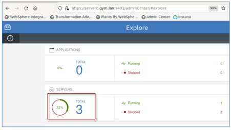

4.	Click the Servers list to see the three servers, appServer1, appServer2, and CollectiveController    
 
    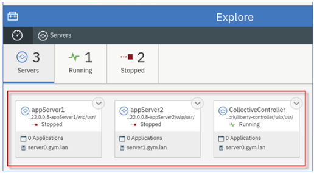

    **AVOID TROUBLE!** 

    If you ran the “**deployCollectve.sh**” command, and it ended with the following information, as illustrated in the screen shot below, it means that the script detected the Collective Controller has already been created. 

    Therefore, the scripts existed and displayed the URL to the Admin Center. 

    Go to the Admin Center URL and verify that the collective contains the two collective members, “appServer1” and “appServer2” as illustrated above. 

    **Troubleshooting!**

    Admin Center app cannot run, or the two application servers are not part of the collective, then manual cleanup of the collective is required, and you should contact the lab instructor. 

    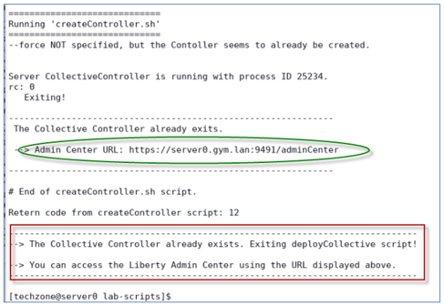

## **Part 3: Ensure the Liberty collective member servers are deployed** 

At this point, you should have two Liberty collective members should now be created in the collective, and named as follows:

  - appServer1
  - appServer2

1.	Access the Liberty Admin Center from the browser

    a.	Enter the login credentials as: admin / admin

        https://server0.gym.lan:9491/adminCenter

2.	Go to the Servers view in the Admin Center

    a.	From the Admin Center, go to the  **Explorer** page, click the **SERVERS** icon to go to its details page.

    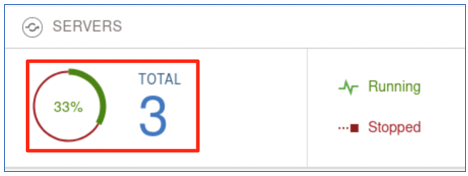

    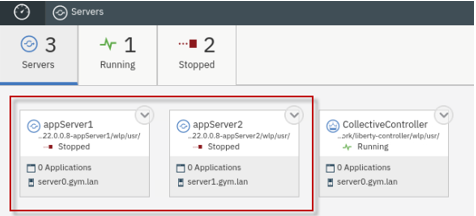

	
At this point, **appServer1** and **appServer2** should be shown in the collective. 

It is OK if they are not currently in the “Running” state. You will start them later in the labs.

## **Part 4: Produce a new “server package” using Liberty 22.0.0.12**

In this section of the lab, you will use the same automated
“**mavenBuild**” script that was used in previous labs to produce a
NEW Liberty server package, with only one notable difference; the server package will include Liberty 22.0.0.12 instead of 22.0.0.8.

Producing the build output in the form of a Liberty server package zip file provides the flexibility of deploying and upgrading your version of Liberty and applications as an immutable package, like how container images are deployed to Kubernetes container platforms.

In this section of the lab, you will use the provided shell script that automates the tasks for producing a server package for deployment to the collective.

### **Use the Maven Build script to produce a Server package with Liberty 22.0.0.12**

1.  Run the following command to build the applications and produce a
    server package, which will use WebSphere Liberty kernel, version
    22.0.0.12

        ~/liberty_admin_pot/lab-scripts/mavenBuild.sh -v 22.0.0.12

    Take note that a new Liberty server package was created with the name: “**22.0.0.12-pbwServerX.zip”**

    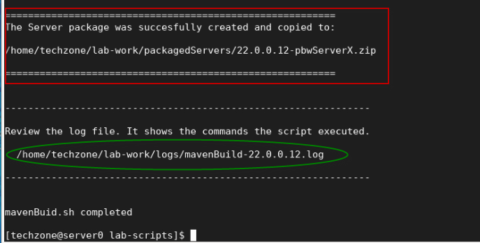

    The output from the “**mavenBuild**” script is a Liberty Server package.

    The server package is in the following working directory.

    > **/home/techzone/lab-work/packagedServers**

2.  Using the File viewer on the VM desktop, see that the server package was produced.
    
    a.  Double mouse-click on the “**Home”** folder on the Desktop VM

    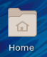

    b.  From the file explorer, navigate to
    **techzone/lab-work/packagedServers** directory.

    **TIP:** the server package is named based on the version of Liberty in the package, and the placeholder server name; “**22.0.0.12-pbwServerX.zip**.
 
    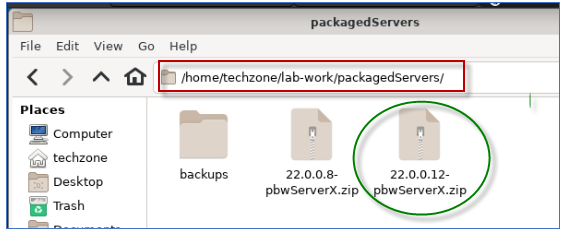
 
**Congratulations\!** You have used Maven and successfully produced a new Liberty server package that contains your applications and WebSphere Liberty 22.0.0.12.
 
In the next sections of the lab, you will continue the best practice
 of using automation to deploy the server package to two hosts (VMs)
 and join the deployed servers to the Liberty Collective.

## **Part 5: Deploy the new server package to the Collective**

In this section of the lab, you deploy new Liberty servers as collective members to the collective, using the server package that you produced in the previous section of the lab.

That server package you created, includes the Liberty binaries for
22.0.0.12 and your SAME sample applications using the SAME default
server configuration as the previous deployment in Liberty 22.0.0.8.

In this lab, you use the same “**addMember.sh**” script used in previous labs to deploy the server packages to the nodes, deploy the server package, create the collective members, and join the members to the collective.

### **Launch the Liberty Admin Center in the Web Browser**

1.  If the Liberty Adin Center is not already open in the Web Browser, open it now, using the following URL:

        https://server0.gym.lan:9491/adminCenter/

2.  Login to the **Admin Center** using credentials: **admin** /
    **admin**.

    
 
    The Liberty Collective “**Admin Center”** UI is displayed.
 
    

3.  Click the **Explore** icon to display the servers, applications, and in the Collective.

    

4.  Click the **Servers** view to display the servers in the Collective.

    >**Note:** You should already see two servers deployed in the collective.

    >The servers are running **Liberty 22.0.0.8**. And the server should be in the “**Running**” state.

5.  **If the appServer1 or appServer2 servers are NOT running, go ahead and **start** them now.**

    These servers were deployed in the previous labs.
 
    

### **5.1 Deploy collective member to the local host VM, server0.gym.lan**

Use the automation script to deploy the Liberty server from the server package you created earlier and join the member to the collective.

**The script below performs the following:**
   
   >- deploy the server package for Liberty version 22.0.0.12
   >- Apply overrides for the HTTP and HTTPS ports with “9081 / 9441”
   >- Rename the default server name with “appServer1”
   >- Join the server to the collective

1.  From a terminal window on the VM, run the command below to create a local Liberty collective member on **server0.gym.lan** VM using the 22.0.0.12 server package.

        ~/liberty_admin_pot/lab-scripts/addMember.sh -n appServer1 -v 22.0.0.12 -p 9081:9441 -h server0.gym.lan

    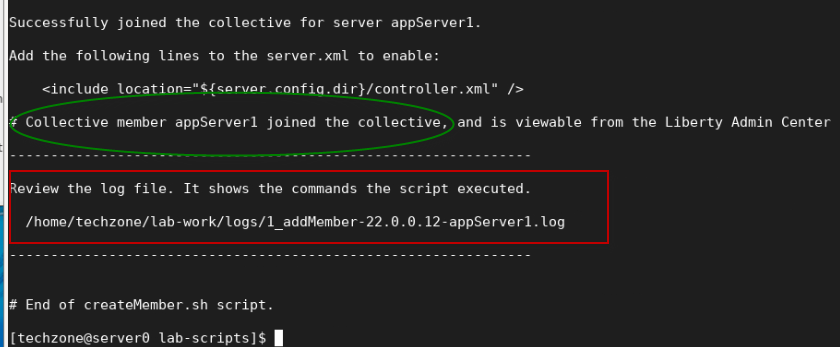
 
    When the script completes, the server **appServer1** with Liberty
 22.0.0.12 is created and added to the collective.
 
    The **addMember.sh** script created a local Liberty server called
 **appServer1** in the following directory on the **server0.gym.lan**
 VM:
 
    > **/home/techzone/lab-work/liberty-staging/22.0.0.12-appServer1/wlp/usr/servers**

2.  Go back to the Liberty collective Admin Center’s Server page, you
    can see that the **appServer1** server in directory
    “**22.0.0.12-appServer1**” is added to the collective as a new
    server.

    The Server is in the “**Stopped**” state.

    > 

### **5.2 Deploy a collective member to the remote host VM, server1.gym.lan**
 

Now, run the script again, using slightly different parameters, to
deploy Liberty to the remote VM, **server1.gym.lan**. And, then join the remote member to the collective.

Joining remote members to a collective requires a couple of additional steps that the script performs for you in the lab environment and are identified below.

1.  Run command below to create a remote Liberty collective member on
    **server1.gym.lan** VM, specifying a different server name and
    ports.

        ~/liberty_admin_pot/lab-scripts/addMember.sh -n appServer2 -v 22.0.0.12 -p 9082:9442 -h server1.gym.lan

    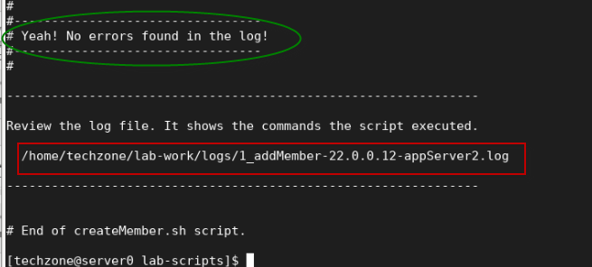

    - When the script completes, the server **appServer2** with Liberty
    22.0.0.12 is created and added to the collective.

    - The **addMember.sh** script created a local Liberty server called
    **appServer2** in the following directory on the **server1.gym.lan**  VM:

      > **/opt/IBM/liberty-staging/22.0.0.12-appServer2/wlp/usr/servers**

    - The server uses **9082** and **9442** as its HTTP/HTTPS ports, as defined ad script input parameters.

2.  Go back to the Liberty collective Admin Center’s “**servers**” view  and you can see the new member, **appServer2**, has been added to the server list and is the **Stopped** state.

    

### **5.3 Ripple Start the new 22.0.0.12 servers**

Now that the new Liberty servers with Liberty version 22.0.0.12 have
been deployed to the collective, all you need to do now is ripple start the servers.

Ripple starting the servers will allow the new application servers to
accept incoming request without incurring an application outage.

The ripple start will be manually performed in the Admin Center in this lab. However, like the other automated scripts you have used, this process can also be easily automated.

**Steps to ripple start the new servers:**

  - Stop 22.0.0.8-appServer1
  - Start 22.0.0.12-appServer1
  - Stop 22.0.0.8-appServer2
  - Start 22.0.0.12-appServer2

   

1.  Before starting the Liberty servers, you need to ensure the db2
    database used by the **PlantsByWebSphere** application is running.

        docker start db2_demo_data

2.  **Stop** the collective member “**22.0.0.8-appServer1”** from the
    Liberty Admin Center.
    
    a.  In the **server** details page, click the dropdown menu icon
         of “**22.0.0.8-appServer1”** and select **Stop** to stop the
         server.

    
 
    **Note:** If prompted for credentials, enter the Admin Center username and password as: **admin  / admin**.

    b. Click **Stop** to confirm the stop for **22.0.0.8-appServer1**
    server

    
 
    Server **appServer1** will stop, and you can see it is now in the
 **Stopped** state.
 
    .

3.  **Start** the collective member “**22.0.0.12-appServer1**” from the Liberty Admin Center.
    
    a.  In the **server** details page, click the dropdown menu icon
        of “**22.0.0.12-appServer1”** and select **Start** to start
       the server.

    

    b. Click **Start** to confirm the stop for **22.0.0.12-appServer1** server.

    
 
    Server **22.0.0.12-appServer1** will start, and you can see it is now in the **Running** state.
 
    .

### **Checkpoint of the current state**

At this point, you should see the following server states:

**On VM server0.gym.lan:**

  - 22.0.0.8-appServer1 - **Stopped**

  - 22.0.0.12-appServer1 -**Running**

**On VM server1.gym.lan:**

  - 22.0.0.8-appServer2 - **Running**

  - 22.0.0.12-appServer2 -**Stopped**

Next, ripple start the **22.00.12-appServer2** server on VM
**server1.gym.lan** following the same steps as above.

4.  **Stop** the collective member **22.0.0.8-appServer02** from the
    Liberty Admin Center.

5.  **Start** the collective member **22.0.0.12-appServer02** from the Liberty Admin Center.

The final state should reflect the 22.0.0.12 servers are RUNNING, and
the 22.0.0.8 servers are STOPPED.

**Congratulations\!** You have just completed the upgrade from Liberty
22.0.0.8 to 22.0.0.12 using WebSphere Liberty’s zero-migration
architecture and common practices for deployments using immutable server
packages for flexible deployments.

The final activity in this lab is to demonstrate the applications
continue to run as-is after the upgrade.

## **Part 6: Test the applications after the Liberty upgrade**

You have successfully ripple started the new 22.0.0.12 servers in the
collective.

In this section, you will test the PlantsByWebSphere and WhereAmI
applications and ensure the applications run properly after the upgrade to Liberty 22.0.0.12.

### **Part 6: Test the applications used in the labs in this workshop series**

In this section, you will test the two applications that are deployed in
the collective.

### **6. 1 Test the PlantsByWebSphere application:** 

1.  To access the **PlantsByWebSphere** application on appServer1
    
    a.  Open a new tab on the Firefox browser and test PlantsByWebSphere on **appServer1**, which is on **server0.gym.lan**

        https://server0.gym.lan:9441/PlantsByWebSphere

    **Note:** If you see the “Warning: Potential Security Risk Ahead”, click Advanced..->Accept Risk and Continue to continue.

    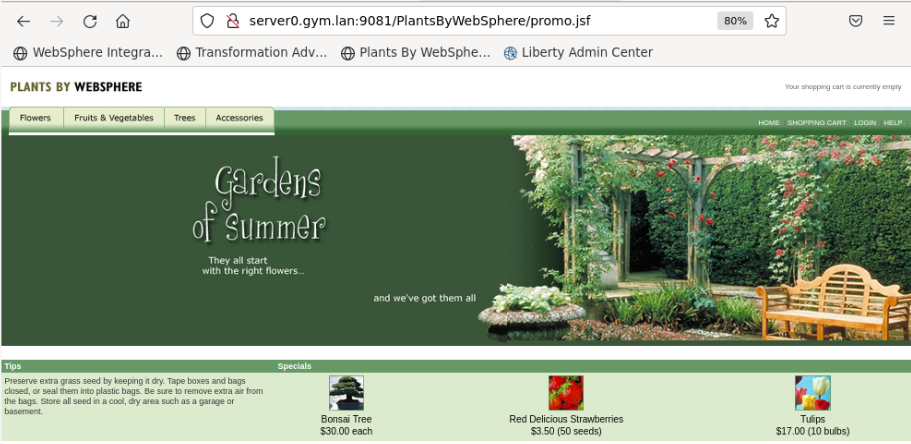

    b.  In the application, click on the “**Help**” link, located on the upper right corner of the application page.

    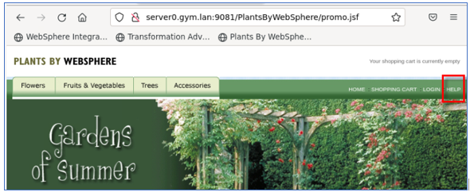

    c.  On the “**Help**” page, you will see the Server name and the version of Liberty that is running for the server that handled this specific request.

    

    d.  In the application, click the “**Home**” link to return to the PlantsByWebSphere Home page.

    

2.  OPTIONAL: Repeat the steps to access the **PlantsByWebSphere**
    application on appServer2 on host server1.gym.lan

        https://server1.gym.lan:9442/PlantsByWebSphere

    **Note:** If you see the “Warning: Potential Security Risk Ahead”, click Advanced..->Accept Risk and Continue to continue.

    

### **6.2. Test the WhereAmI application:** 

1.  To access the **WhereAmI** application on appServer1
    
    a.  Open a new tab on the Firefox browser and test WhereAmI on
        **appServer1**, which is on **server0.gym.lan**

        https://server0.gym.lan:9441/WhereAmI

    b.  Note that the application is running on Liberty version 22.0.0.12

    

2.  OPTIONAL: Repeat the steps to access the **WhereAmI** application on appServer2 on host server1.gym.lan

        https://server1.gym.lan:9442/WhereAmI

    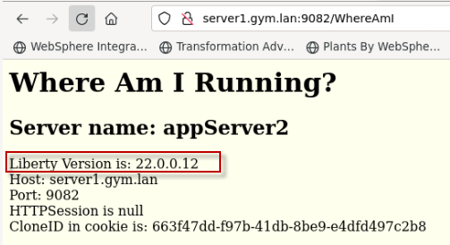

### **6.3 Test Dynamic Routing after the Liberty upgrade**

<table>
<tbody>
<tr class="odd">
<td></td>
<td>
<strong>IMPORTANT!</strong>

This section is optional and can only be performed if you have completed Lab “<strong>1030 -Dynamic Routing</strong>” in this PoT series, or if you ran the <strong>deployCollective.sh</strong> script in "Part 2" of this lab, Lab 1050.
</td>
</tr>
</tbody>
</table>

In this part of the lab, you demonstrate that Liberty’s Dynamic Routing capabilities is now automatically directing incoming requests from the HTTP server to the new Liberty 22.0.0.12 servers, after the upgrade. 

### **Test the dynamic routing after the Liberty upgrade**

1.  To access the **WhereAmI** application through the IBM HTTP Server and plugin, open a new browser window and enter the application URL as:

        https://server0.gym.lan:8443/WhereAmI

    The output shows the application running on **appServer1** on the initial request.
 
    > **Note:** It is possible that the request is routed to **appServer2** instead of appServer1.
 
    Importantly, note the Liberty Version is: **22.0.0.12**, validating that the Dynamic Routing capability has automatically detected the new  Liberty Servers and is directing incoming requests to the new Liberty  22.0.0.12 servers after the upgrade.
 
    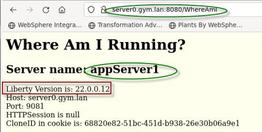

2.  Refresh the application page by clicking the Browsers **refresh**
    icon on the page.

    You can see the output showing that Liberty dynamic routing feature directs the request traffic to **appServer2** server.
 
    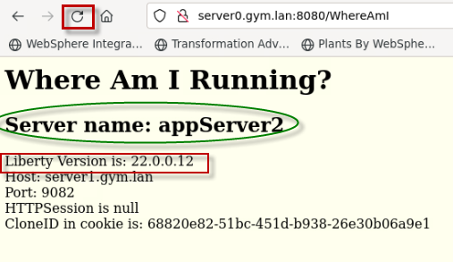

3.  Refresh the browser again a few more times and see that the requests get routed to **appServer1** and **appServer2** accordingly.

    The round robin load balancing test is completed.

## **Summary**

**Congratulations\!**

**You have successfully completed the lab “Zero-migration upgrades with Liberty”**

In the lab, you followed these best practices to upgrade the version of Liberty in the Collective.

  - Update through build process
  - Blue / Green deployments
     -  Dual install locations
     -  Ripple start (stop old/start new, JVM by JVM)
     -  Delete old instances at your convenience

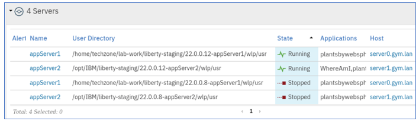

Following this methodology, you gained an understanding of how you mightapply your own build processes or automation to achieve significant agility and flexibility managing Liberty collectives with repeatable automated processes that significantly reduces risk to your business.

You have gained an appreciation for Liberty’s “**no-migration**”
architecture and how simple it is to upgrade Liberty following the
common practices described in the lab.

**In this lab, you have gained hands-on experience with the following administrative activities for upgrading Liberty:**

  - Build a new Liberty server package that includes an updated fixpack of Liberty
  - Deploy the new Liberty Server package to a dual installation
    location.
  - Blue / Green deployment
  - Add the servers as new collective Members into the Collective
  - Use Liberty Admin Center to “**Ripple Start**” the new Liberty
    Servers
  - Test the application after a zero-migration upgrade of Liberty
