# Lab 1070: Liberty observability with Instana

**Last updated:** March 2023

**Duration:** 60 minutes

Need support? Contact **Kevin Postreich, Yi Tang**

## **Introduction**

Observability is becoming a new disruption for the whole monitoring industry. As companies modernize their applications and infrastructureto meet the demands of digital business, they often realize that existing operational routines are not sufficient anymore.

The goal of delighting customers by quickly delivering new capabilities is negatively impacted by poor performance and unreliable services. It is much harder (if not impossible) to avoid performance bottlenecks when applications use heterogenous runtime technologies and target environments that could be distributed across multiple clouds.

These could range from virtual machines (VMs), to containers, to legacy systems of record. With application changes being deployed daily instead of monthly, most companies are losing visibility into what’s going on in their enterprise application space.

IBM WebSphere Liberty is an open-source Java EE / Jakarta EE server implementation, built on top of the Open Liberty project. WebSphere Liberty supports the Java EE 6/7/8 profiles and Java EE 7 Web Profile.

Instana WebSphere Liberty Monitoring provides comprehensive
configuration, performance, and health monitoring for this crucial
component of application server-based infrastructures. To optimize
application performance and implement performance management workflows, Instana’s automatic WebSphere Liberty Monitoring provides a comprehensive set of management and monitoring features beyond standard metrics gathering:

  - Discovery of JVMs, WebSphere Liberty instances and deployed services

  - Automatic code instrumentation for the JVM and Java applications

  - Creation and visualization of Service dependency maps

  - End-to-end tracing of requests across all systems from website to backend services

  - JVM, Application server and service performance and health
    monitoring

Comprehensive WebSphere Liberty Monitoring requires performance
visibility for the physical or virtual host, potential containers, the JVM, WebSphere Liberty instances, and any applications and services using the instance.

For a comprehensive across the stack application insight, Instana
discovery all WebSphere Liberty instances and the deployed applications or services, configures the necessary monitoring sensors and begins tracing the platform, applications, and requests. In addition, Instana determines the health of all components. That makes Instana the quickest and easiest way to monitor WebSphere Liberty and the supporting technologies like the JVM and Java EE applications.

Once deployed, the Instana Agent automatically identifies all running WebSphere Liberty instances – then automatically deploys and configures Instana’s monitoring sensor. Instana’s curated knowledge base already knows what performance metrics are relevant for collection and how to collect them. To monitor WebSphere Liberty health, additional metrics are also collected. Since Instana’s automatic configuration collects all relevant information, monitoring instances couldn’t be easier.

As illustrated in the diagram below, this Lab environment uses three VMs.

  - **VM1** contains an IBM HTTP Server (IHS), a Liberty server and a DB2 server

  - **VM2** hosts a Liberty server

  - **VM3** has Instana installed

Instana agents are deployed the VM1 and VM2. Instana monitors and
observes VM1, VM2 infrastructures and their application components with the agents deployed.

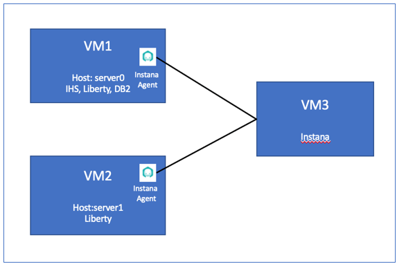

## **Accessing the environment**

If you are doing this lab as part of an instructor led workshop (virtual or face to face), an environment has already been provisioned for you.
The instructor will provide the details for accessing the lab
environment.

Otherwise, you will need to reserve an environment for the lab. You can obtain one here. Follow the on-screen instructions for the “**Reserve now**” option.

KLP: TBD LINK TO ENV RESERVATION

The lab environment contains three (3) Linux VMs.

A Published Service is configured to provide access to the **server0**
VM through the noVNC interface for the lab environment.

1.  Access the lab environment from your web browser.

    a. When the environment is provisioned, right-mouse click on the  **Published Service** link/ Then select “**Open link in New Tab**”  from the context menu.
 
    
 
    b. Click on the **"vnc.html"** link to open the lab environment  through the **noVNC** interface.
 
    
 
    c. Click the **Connect** button
 
    
 
    d. Enter the password as: **passw0rd**. Then click the **Send
 Credentials** button to access the lab environment.
 
    **Note:** That is a numeric zero in passw0rd
 
    
 
    The **server0** VM Desktop is displayed.
 
    

## **Tips for working in the Lab environment**

1.  You can resize the viewable area using the **noVNC Settings** options to resize the virtual desktop to fit your screen.

    a. From the environemnt VM, click on the **twisty** on the noNC control pane to open the menu.  

    

    b. To increase the visible area, click on `Settings > Scaling Mode` and set the value to `Remote Resizing`
      
     

2.  You can copy / paste text from the lab guide into the lab environment using the clipboard in the noVNC viewer. 
   
    a. Copy the text from the lab guide that you want to paste into the lab environment
    
    b. Click the **Clipboard** icon and **paste** the text into the noVNC clipboard

    
    
    c. Paste the text into the VM, such as to a terminal window, browser window, etc. 

    d. Click on the **clipboard** icon again to close the clipboard

    > **NOTE:** Sometimes pasting into a Terminal window in the VM does not work consistently. 
    
    > In this case you might try again, or open another Terminal Window and try again, or  paste the text into a **Text Editor** in the VM, and then paste it into the Terminal window in the VM. 

3. An alternative to using the noVNC Copy / Paste option, you may consider opening the lab guide in a web browser inside of the VM. Using this method, you can easily copy / paste text from the lab guide without having to use the noVNC clipboard. 

 

## Lab: Liberty Observability with Instana

In this Lab, you will learn how IBM Instana helps quickly identify and resolve an incident in a web-based application. 

The application in this Lab is called **PlantsByWebSphere**, and it is a three-tiers application with web server, application server and database server.

**This lab contains the following activities:**

  - Build Lab Environment
  - Start Liberty Member Servers from Liberty Admin Center.
  - Install and Configure Instana Agent.
  - Create Instana Application Perspective.
  - Work with Instana Application Perspective
  - Summary.

## **Part 1: Setup the Lab Environment** 

This Lab requires a Liberty Collective with a Collective Controller and its members. It also required the **PlantsByWebSpere** application to be deployed to the collective members and Liberty Dynamic Routing to be enabled.

<table>
<tbody>
<tr class="odd">
<td></td>
<td>
<strong>IMPORTANT: Please read!</strong>

In this section, you will run a script, which is provided, to configure the lab environment to start this lab, 1070.
</td>
</tr>
</tbody>
</table>

### Clone the GitHub repo for this workshop

This Lab uses artifacts that are stored in a GitHub repository. Run the command below to clone the repository to the local VM used for the lab.

1.  Clone the GitHub repo that contains lab artifacts needed for the  Lab.

    a.  Open a new terminal window on the “**server0.gym.lan**” VM.

    

    b.  Clone the GitHub repository required for the Lab.

        git clone https://github.com/IBMTechSales/liberty_admin_pot.git

    c.  Navigate to the “**lab-scripts**” directory in the cloned 
    
        cd ~/liberty_admin_pot/lab-scripts

    d.  Add the “**execute**” permissions to the lab-scripts directories and shell scripts.

        chmod -R 755 ./ 

### Setup the lab environment to start lab 1070

1.  Run the command below to setup the lab environment

        /home/techzone/liberty_admin_pot/lab-scripts/resetEnvironment.sh

    a.  Type “**`7`”** to reset the environment to start lab 1070

    b.  Type “**`y`**” when prompted to continue

    **Note:** The script will take about **`5 – 7 minutes`** to complete.
 
    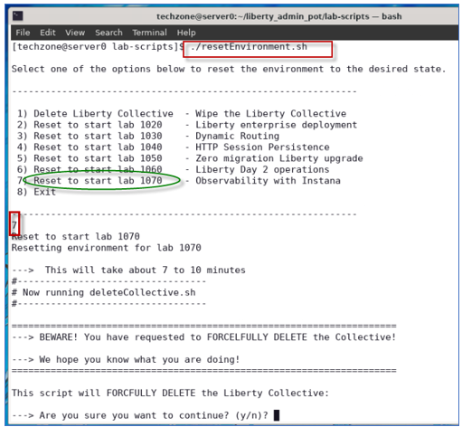
 
    **Note:** The script will take about **`5 – 7 minutes`** to complete.

    c.  When the script completes, and you see the message “**`Ready to start lab 1070`**”, you can continue with the next section of the lab

    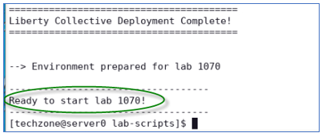
 
    The **resetEnvironment.sh** script performed the following tasks:

    - Remove and cleanup any previously deployed Liberty Collective, Liberty servers and processes.
    - Create a fresh Liberty Collective.
    - Build and produce a Liberty Server package to deploy to Liberty application servers.
    - Create two Liberty servers, “appServer1” and “appServer2”, deploy  the server package, and join the servers to the Liberty Collective.
    - Deploy the **PlantsByWebSphere** and **WhereAmI** applications to these two Liberty servers.
    - Enable Liberty Dynamic Routing

### **Start Liberty member servers** 

You have created and configured two Liberty servers as the collective members. In this section, you will start these two servers from the Liberty Admin Center.

1.  Before starting the Liberty servers, you need to start the db2
    database used by the **PlantsByWebSphere** application with the     command below.

        docker start db2_demo_data

2.  To start the collective members from the Liberty Admin Center
    **Explorer** page, double-click the web Browser icon on the VM
    Desktop.

    

3.  Click Liberty Admin Center bookmark to open its UI page.

    
 
    **Note:** If you see the “Warning: Potential Security Risk Ahead”, click **Advance..-\>Accept Risk and Continue** to continue.
 
    The Liberty collective Admin Center Login page is displayed.

4.  **Login** to the Admin Center. The login credentials ae: **`admin` / `admin`**

    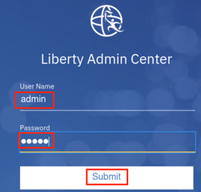
 
    Liberty Admin Center Home page is displayed.
 
    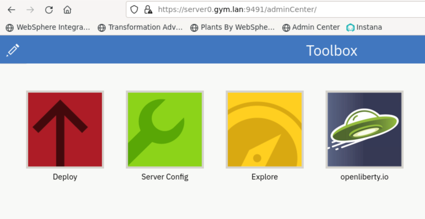

5.  Click the **Explore** icon.

    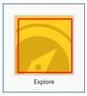
 
   The collective resource list is displayed, and you can see that you  have three servers, and two hosts in the collective.

6.  Click **`SERVERS`** icon to go to its details page.

    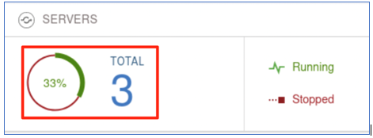

7.  In the server details page, click the dropdown menu icon of
    **`appServer1`** and select **`Start`** to start the server.

    
 
    **Note:** If prompted, enter the Admin Center username and password as: **`admin`**/**`admin`**.

8.  Click **`Start`** to confirm the start **`appServer1`** server command.

    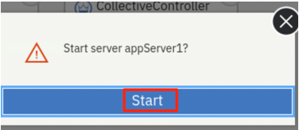
 
    Server **`appServer1`** will get started, and you can see it is  **`Running`** status with 2 applications and now you have 2 servers in Running status.
 
    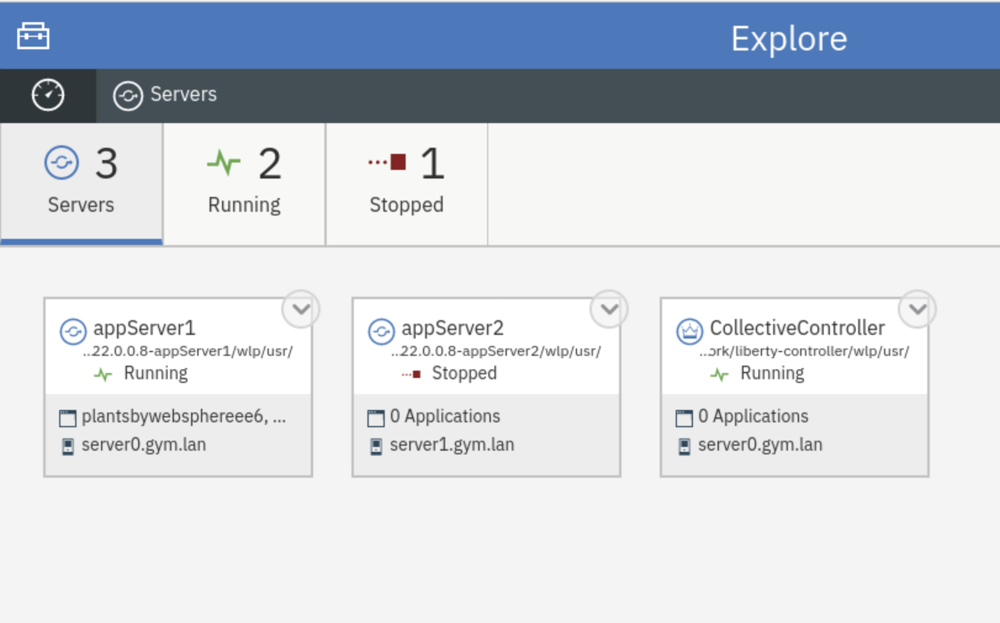

9.  Repeat the same server start procedure for **`appServer2`** server. Once it is done, the **appServer2** server is started as show below:

    

10. Click the **`Explorer dashboard`** icon to go back to the dashboard  view.

    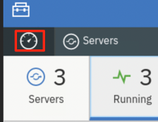
 
    You will see all the two applications on both member servers are up and running.
 
    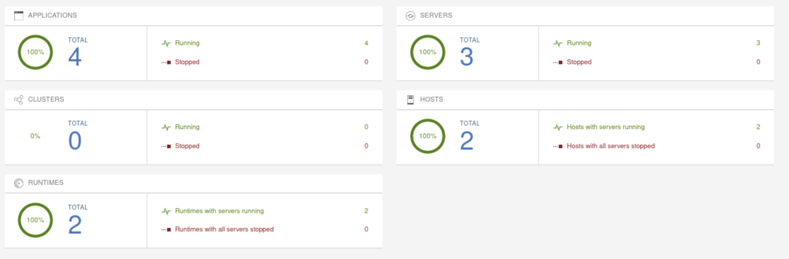

## **Part 2: Configure Liberty Server for Instana Monitor**

Instana uses its Agent to monitor and observe Liberty infrastructure.
Once the Agent is installed, the **`Instana WebSphere Liberty sensor`** is automatically deployed and installed. The sensor starts to monitor the following:

  - Metrics collection
    - Configuration data
        - Name
        - Version
        - Install Dir
        - Ports
        - Application States
    - Performance metrics
        - Thread Pool
        - Servlets
          - Name
          - Requests
          - Average Response Time
        - Database Connections Pools
        - Sessions
  - Tracing (with JMX enabled)

In this section, you are going to configure the two Liberty servers by enabling the Liberty **`monitor feature`** (enabling JMX), so they can be monitored by Instana.

You are also going to add Instana tags to the Liberty servers so they can use easily identified in the Instana infrastructure.

To enable the Liberty monitor feature, you just need to add the following line to the **server.xml**.

`<feature>monitor-1.0</feature>`

To add Instana tags, you set a Liberty server
environment variable: `INSTANA_SERVICE_NAME=<Your App Server Name>` to the **`server.env`** file.

In this Lab, scripts are provided to perform these configuration tasks.

1.  From the Terminal window, run the following commands to add
    monitoring feature to **appServer1** and **appServer2** Liberty  servers

        /home/techzone/liberty_admin_pot/lab-scripts/applyOverrides.sh -n appServer1 -v 22.0.0.8 -h server0.gym.lan MONITOR

        /home/techzone/liberty_admin_pot/lab-scripts/applyOverrides.sh -n appServer2 -v 22.0.0.8 -h server1.gym.lan MONITOR

    The **`applyOverrides.sh`** script adds
 `<feature>monitor-1.0</feature>` to server.xml files of
 **appServer1** and **appServer2.**

2.  Run the following command to add the “Instana tags” to the
    **server.env** file in Liberty:

        /home/techzone/liberty_admin_pot/lab-scripts/instanaAddServerTags.sh

    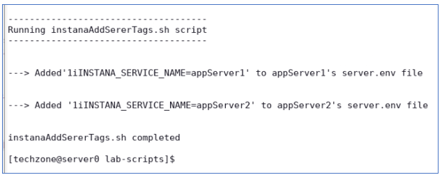
 
    The **instanaAddServerTags.sh** script does the following:

      - adds "**INSTANA\_SERVICE\_NAME=appServer1** to **server.env** file of **appServer1**
      -  adds "**INSTANA\_SERVICE\_NAME=appServer2** to **server.env** file of **appServer2**

3.  After the changes, **`restart`** both Liberty servers the Liberty  Collective Admin Center.

    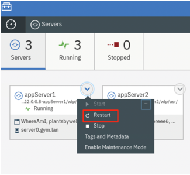
 
    If prompted, enter the Admin Center credentials as: **`admin`** / **`admin`**.
 
    The Liberty server configuration for Instana is completed.

## Part 3: Install and Configure Instana Agent

To use Instana to monitor and observe your IT infrastructure and
applications, you need to install an Instana agent to your environment.

Since you are using two VMs, **server0.gym.lan** and
**server1.gym.lan**, to support Liberty collective in this lab, the Instana agent needs to be installed in these two VMs.

For simplicity, an Instana agent has been installed and configured in the **server1.gym.lan** VM.

In this section, you are going to learn how to install and configure the Instana agent in the **server0.gym.lan** VM.

1.  From the web browser, open a new window and click the **`Instana bookmark`** to launch the Instana console.

    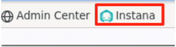
 
    When prompted, enter the login credentials as:
 
    UserName: **`admin@instana.local`**
 
    Password: **`Kwn19Rrnz2`**
 
    The Instana Home page is displayed.
 
    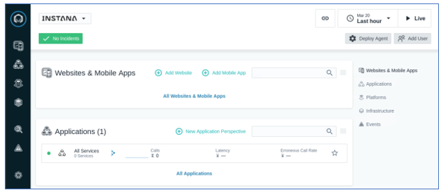

2.  Click `More > Agents` to open the Instana **Agents** page.

    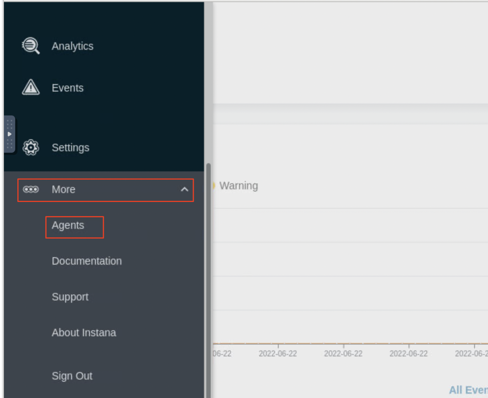

3.  Click **`Installing Instana Agents`**.

> 

4.  Install a **Linux “dynamic”** agent on the VM
    
    a.  Under the **OS** section, select **`Linux`**
    
    b.  Under the “**agent packaging**” header select **`Dynamic`** radio button
    
    c.  Under the “**Agent runtime**” header, select **`Eclipse OpenJ9 11`**
    
    d.  Under the “**Installation mode**” header, select
         **`Interactive`** mode

    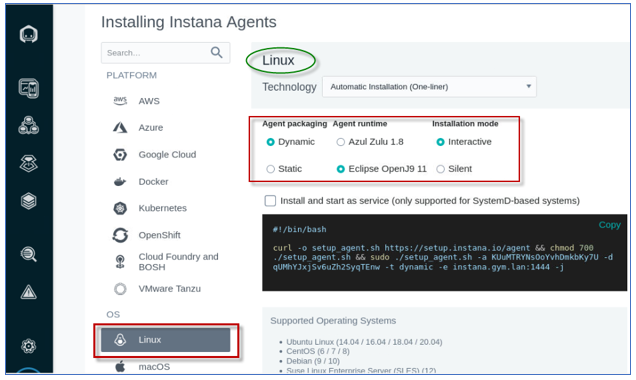

    e. Click **`Copy`** to copy the script (to the clipboard) for
     installing the Instana agent

    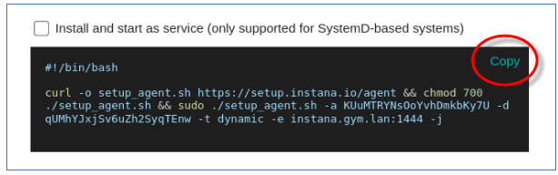
 
    The Instana Host Agent has two types, **`dynamic`** and **`static`**,  based on whether it can update itself or not.
 
    A `dynamic host agent` downloads on startup the latest set of
 sensors from repositories. By default, a dynamic agent updates itself daily with the latest and greatest capabilities that are released.
 
    A `static host agent` is a self-contained host agent that includes all the latest available components at the time of its release and has no dynamic update capabilities.

5.  Run the script to install the Instana agent on the VM
    
    a.  Go back to the Terminal window, right-click and select **`Paste`** to paste the Instana agent installation script.

    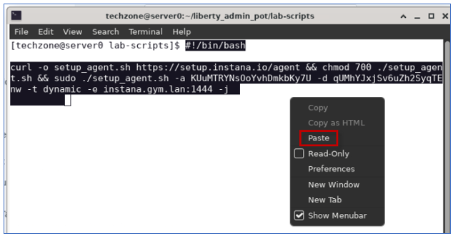

    b.  Press **`Enter`** to start the agent installation

    c.  Type “**`y`**” when prompted for question “Are you sure?” and press **`Enter`**.

    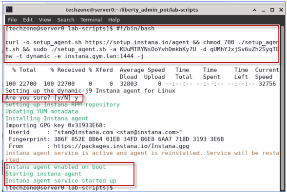
 
    The script installs Instana Agent in **/opt/instana/agent** directory, creates an agent service and starts the agent.

6.  After the Agent is installed, you need to configure it for the
    **PlantsByWebSphere** application environment. In this lab, a script is provided to you to perform the configuration task, run the command below:

        /home/techzone/liberty_admin_pot/lab-scripts/updateInstanaAgentConfiguration.sh

    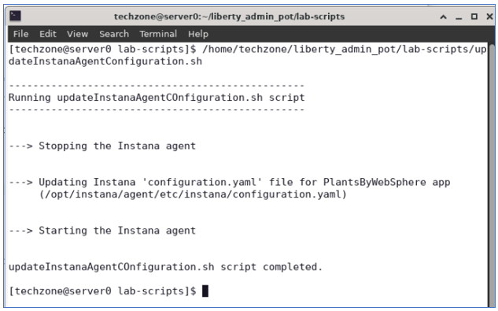
 
    The **`updateInstanaAgentConfiguration.sh`** script performed the following updates to its **`configuration.yaml`** file, located at: **/opt/instana/agent/configuration.yaml** 

    1.  Define Instana **`Infrastructure Zone`** by configuring the **`Hardware & Zone`**

    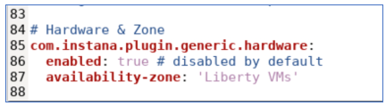

    2.  Enable **`tracing`** for Apache httpd (**IHS server**), under the **`Apache Httpd`** section

    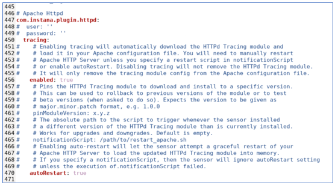

    3.  Enable **`tracing`** for the **PlantsByWebSphere DB2 database**, under the `DB2` section

    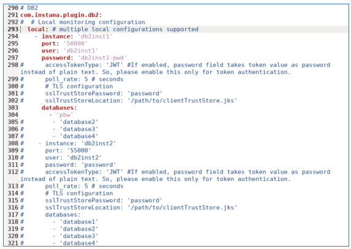

    4.  The script **restarts** the Instana Agent service

    Instana Agent is now configured and started.

7.  Verify the Instana agent installation

    **Note:** After the agent is started, it might take a few minutes for the agent to sync with Instana server.

    a.  Go back to the `More -> Instana Agents` page in web browser

    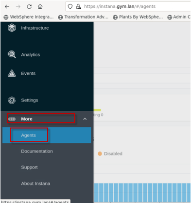

    b.  Change the **`Time Range`** to **`Last 5 minutes`**, this sets the basic Instana monitor feature to monitor the Liberty VMs and display in 5 minutes interval.

    
 
    You can see that there are two Agents reporting, including the one you just installed and configured.
 
    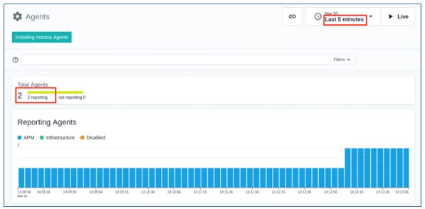

    c.  Scroll to the bottom of the page, you can see these two agents are listed in the **`Agent Details`** section.

    **Note:** There is a **`Linux VM agent`** on each of the two VMs in the lab environment: (**server0.gym.lan** and **server1.gym.lan**)
 
    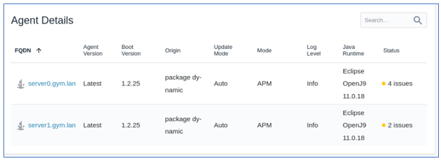

8.  View the details in Instana **`Infrastructure Zone`**.
    
    a.  From the left navigation panel, click the **`Infrastructure`** icon.

    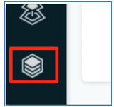
 
    You see that the infrastructure zone you defined is displayed. It  shows the two Liberty VMs in the “**Liberty VMs**” zone that was  configured by the script thay you ran moments ago.
 
    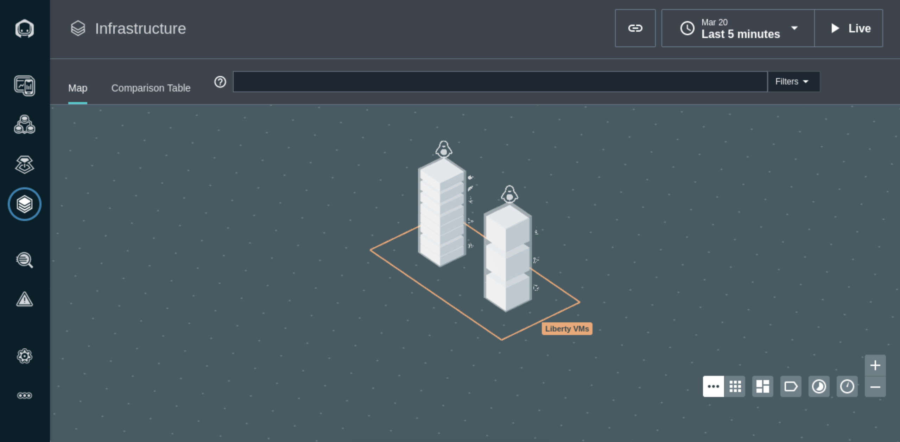
 
    In each Liberty VM, you see different layer blocks which represent the  all the process Instana detected in the VM, including the **`Java  processes`** for the **`collective controller`** and **`collective  members`**, the python and node processes, and **`Apache Httpd`** process  and **`container`** process, etc.

    b.  Hover your mouse over each of the **`Liberty VM`** box and its layer blocks, you can see all processes running in that VM.

    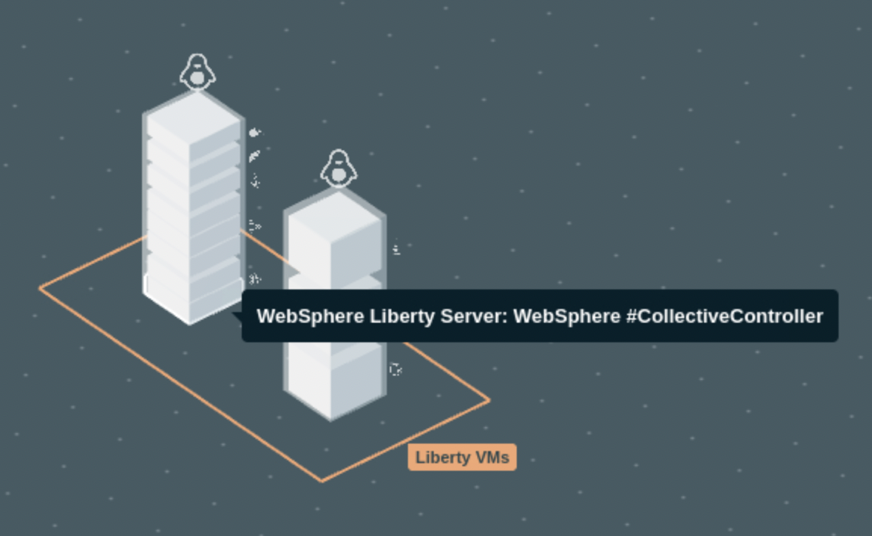
 
    As you can see that Instana has detected the following processes  running:
 
    On the **`server0.gym.lan`** VM

      - WebSphere Liberty CollectiveController
      - WebSphere Liberty server appServer1
      - python3
      - /usr/bin/python3
      - Instana Agent on server0
      - Apache HTTPd
      - Docker Container: ibmoms/db2express-c

    On the **`server1.gym.lan`** VM

      - WebSphere Liberty server appServer2
      - /usr/bin/python3
      - Instana Agent on server1

9.  View the performance metrices collection for Liberty server
    “appServer1”
    
    a. Click **`WebSphere Liberty server appServer1`** block in the
       **server0.gym.lan** VM
    
    b. Click **`Open Dashboard`** to access **appServer1** performance metrics collection.

    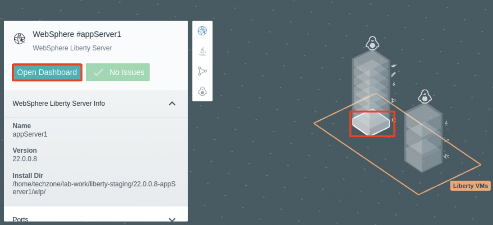
 
    The **appServer1** performance metrics collection page is displayed.
 
    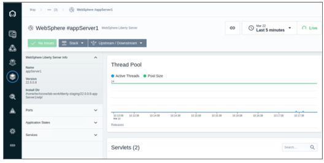

## **Part 4. Create Instana Application Perspective**

**Application Perspectives** in Instana allow any user, from DevOps to Developer, to organize information into the exact visualizations and context they need to monitor, examine, and optimize the applications and/or services they’re responsible for.

Each Application Perspective auto-generates a feature rich monitoring dashboard for the [golden
signals](https://www.ibm.com/links?url=https%3A%2F%2Flanding.google.com%2Fsre%2Fsre-book%2Fchapters%2Fmonitoring-distributed-systems%2F%23xref_monitoring_golden-signals) and more. It organizes a team, so they stay focused on the services they are interested in and aren’t distracted. Alerts, errors, and logs are scoped to an AP to focus the troubleshooting. An Application Perspective achieves this by enabling you to dynamically scope the visibility to “just the right” size to meet your needs

Application perspectives are applied across every aspect of the
Enterprise Observability Platform – creating a personalization across Instana’s entire platform – service and infrastructure maps, dashboards, alerts, traces, profiles, incidents, even analytics.

**Out-of-the-box `Application Perspectives templates`** provide quick and easy ways to create your personal view in one of the standard ways that make sense to your task load.

The templates enable you to select the type of perspective you want to create along with the means to select the tags for the to-be-monitored application information.

In this section, you are going to create an **`application perspective`** for the **`PlantsByWebSphere`** application. Since the application is a legacy three tiers application, with web server, application server and database server, you are using the following steps to create its application perspective.

Additional details about Instana Application Perspective can be found in the on-line documentation:
<https://www.ibm.com/docs/en/instana-observability/current?topic=applications-application-perspectives>

Now, create a custom application perspective to observer the
PlantsByWebSphere application.

1.  Click **`Applications`** icon from the Instana console navigation menu  on the left.

    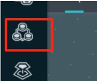
 
 The **Application Perspectives** page is displayed.
 
 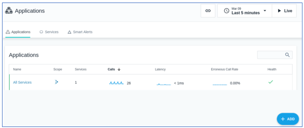

2.  Click **`+ADD`** and select **`New Application Perspective`** to create a new application perspective.

    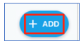
 
    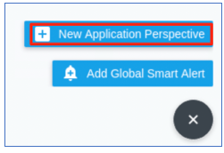

3.  Ensure the **`Services and Endpoints`** model is selected. Click **`Next`** to continue.

    Instana includes several out-of-the-box **`blueprints`** that support  many common use cases for observability. In this lab, you use the  **`Services and Endpoint`** blueprint, which is a simple way to construct an Application Perspective (AP) by selecting the collection  of **services** or **endpoints** directly.
 
    Additional information about AP blueprints can be found here:
 <https://www.ibm.com/docs/en/instana-observability/current?topic=applications-application-perspectives#step-1-select-a-blueprint>
 
    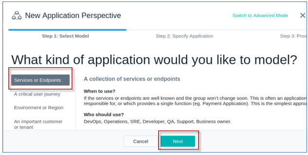
 
    Next you will define the `filters` for the PlantsByWebSphere application and its component.
 
    **Note:** the `filters` you define will select the following components:

      - the Liberty servers (**appServer1** and **appServer2**)
      - the IHS server (**server0.gym.lan**)
      - DB2 database server (**db2express-c**) used by the
    **PlantsByWebSphere** application.

4.  Create the **filters** to select the **service components** used by the PlantsByWebSphere application only. To do that, click **`Add filter`**.

    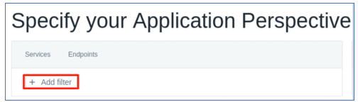

5.  Select the first filter as **`Agent`** \> **`Zone`**.

    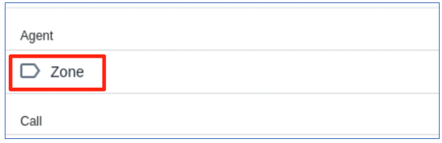

6.  Set the filter as **`Agent > Zone = Liberty VMs`**.

    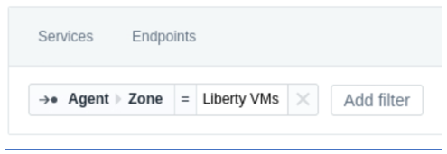

7.  Click the **`Add Filter`** button and add the next filter
    
    a.  Search for **`service`** and select the next filter as
        **`Service > Name`**.

    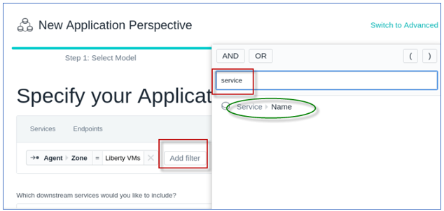

    b.  Type **`appServer`** for the service name filter, and select **`contains`** as the **operand** as illustrated below:

    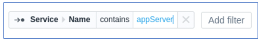
 
    **Note:** this “**appServer**” filter will match Liberty
 **appServer1** and **appServer2** as you defined in the Liberty
 Collective environment.

8.  Add the next filter as **`Service > Name = server0.gym.lan`**
    
    

9.  Add the next filter as **`Service > Name = db2express-c`**
    
    

     At this point, the primary filters are in place as shown below. 

    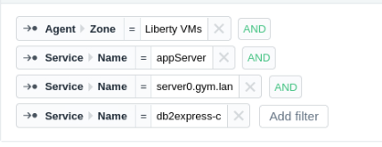
 
    Next you need to  insert the appropriate **`Operands`**, and **`parenthesis`** to define  the appropriate filter.

    The **pbw app filer** definition should match when:

    - The “zone” is “Liberty VMs”, **AND** any of the following:
      - **(** service name **CONTAINS** appServer **OR**
      - service name = server0.gym.lan **OR**
      - service name = db2express-c **)**

10. Change the `AND` / `OR` **Operators, **`CONTAINS` operand**,** and **`(` `)`** parenthesis grouping as follows to compete the
    application perspective filters.

    **Tip:** To insert the operand and parenthesis, just position the  mouse between the filters, and select the operand or parenthesis to insert or modify them. The final pbw app filter should look like the illustration below.
 
    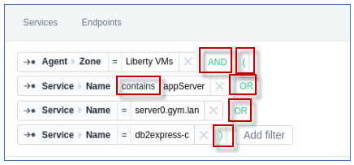
 
    **Tips** for configuring filters for the **service or endpoint
 blueprint** can be found here:
 
    <https://www.ibm.com/docs/en/instana-observability/current?topic=applications-application-perspectives#tips-on-using-the-services-or-endpoints-blueprint>

12. Scroll down and select **`All downstream services`** and click
    **`Next`**.

    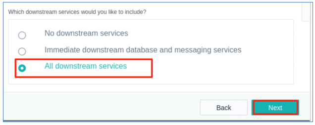

13. Complete the new application perspective settings
    
    a. Add **`pbw app`** as the **Application Perspective name**
    
    b. Select **`All Calls`** option
    
    c. Click **`Create`**.

    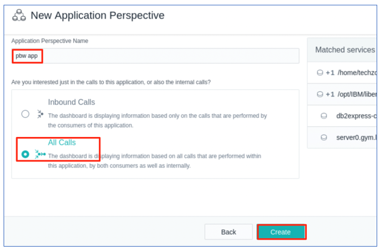
 
    The application perspective is created.
 
    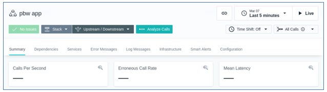
 
    **Tip:** You can always **update** the Application Perspective configuration, as needed

    1.  On the sidebar, click **Applications** and then select your
    application perspective.
    2.  Select the **Configuration** tab.
    3.  Click the **Save** button when you are ready to save your updates

    <https://www.ibm.com/docs/en/instana-observability/current?topic=applications-application-perspectives#update-an-application-perspective>
 
    Currently you will not see any data for the **pbw app** Application  Perspective **Summary page** because there is no workload making requests to the PlantsByWebSphere application.
 
    In the next section of the lab, you will exercise the PlantsByWebSphere application.

## Part 5: Work with Instana Application Perspective

In this section, you are going to add some workload to the
**PlantsByWebSphere** application and use the Instana **`Application Perspective`** to monitor and observe the health condition of the application.

1.  Click **`Dependences`** tab in **`pbw app`** application perspective, you see the “No Services yet” message showing on the page.

    

2.  Open a new web browser window and enter the **PlantsByWebSphere** application URL:

        https://server0.gym.lan:8443/PlantsByWebSphere 

    The application “**Home” page** is displayed.
 
    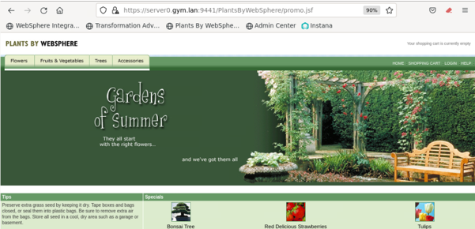

3.  Navigate and visit different pages of the application to add some load to the application.

    

4.  Go back to **`pbw app`** application perspective in `Instana` and click  **`Live`** to get the latest data. Wait a few minutes for the `dependency graphs` to display

    a. Select `Last 5 minutes` of data to display

    b. Wait a few minutes for the dependency graphs to display

    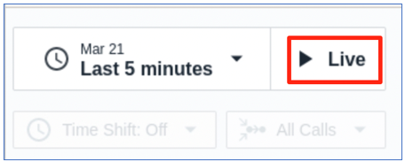

5.  you can see that Instana have automatically picked up the components of the application as shown in the `Dependencies diagram`. It also starts to show the monitor data in the **Summary** page.

    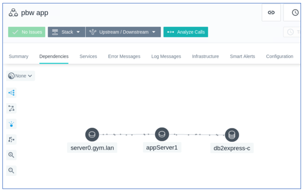
 
    

### 5.1 Run a load test to see Liberty observability with Instana

 In the last section, you ran a few requests for PlantsByWebSphere
 application to verify that the `pbw app` in Instana’s Application Perspective is configured to observe the following services for PlantsByWebSphere application.

  - `Http server` on server0.gym.lan
  - `Liberty application servers` appServer1 and appServer2
  - `DB2` application database

 In this section, you use the JMeter tool to generate a simulated
 workload of multiple users using the PlantsByWebSphere application.
 
  Then, you will produce a DB2 database outage and observe Instana’s
 incident detection for WebSphere Liberty applications, using
 out-of-the box capabilities.

1.  Now add more workload to the PlantsByWebSphere application with the following command, which starts a JMeter load test:

        /home/techzone/liberty_admin_pot/lab-scripts/pbwLoadTest.sh

    This script runs a **`Jmeter`** Load Test on the **PlantsByWebSphere** application with `500 loops` and `5 simultaneous threads` (Users)

2.  In Instana, view the details for the **pbw** app in the
    **application perspective “Summary”** page
    
    a.  Once the workload script is running, go back to Instana **pbw app** application perspective **Summary page** to see the
        details
    
    b.  Ensure the **`pbw app`** perspective is set to show `last 5 minutes` of `Live` data

    

    c.  Scroll down through the page

    d. Hover your mouse pointer over each diagram, you will see the
    detailed summaries

    
 
    

3.  Go to the **`Dependencies`** tab on the **`pbw`** **application
    perspective**

    You will observe the service dependencies that were discovered based on the application perspective configuration you provide in the previous section.
 
    

4.  Now you are going to create a **`situation`** where the **DB2 database is down** and see how Instana monitors, observes, and identify such incident.
    
    a.  Keep the JMeter script running the terminal window
    
    b.  Open a new Ternal Window and run the command below to `stop the DB2 database` server.

        docker stop db2_demo_data

5.  In the terminal window that is running the JMeter load test, you will start to see the `Error` for requests that depend on the backend database.

    

6.  In Instana, within a few minutes, you will see that workflow diagram in the Instana **`Dependencies`** view update as illustrated below.

    This is because during this time, Instana is trying to observe the database using the **`jdbc`** service.

    Since Instana detected that the application cannot access the
 database, it raises an **`issue`** and continues to **`investigate`** as shown in the diagram below.
 
    
 
    Initially Instana finds that the issue will impact all components in  the workflow and marks these components with a **`yellow`** WARNING color as  shown in the diagram below.
 
    
 
    Finally, Instana identifies that the **`root cause`** of the issue is from the `database server` component and marks it **`red`** indicating issues, as shown in the diagram below.
 
    

7.  From the **`Summary`** Tab, you can also see the error message and reports related to this issue.

    

8.  Go back to **`Dependencies`** tab, click the **`db2express-c`**
    component, and click **`Go to Dashboard`**.

    

9.  In the **`db2express-c`** Dashboard, click **`Calls`** diagram and select **`View in Analyze`**.

    

10. In the **`Analyze`** page, click **`CONNECT`** Endpoint. Then click the first **`CONNECT`** call.

    
 
    In the `CONNECT Calls` detail page, Instana has clearly identified that the issue is with the DB2 database connection.
 
    
 
    As you see from this example, Instana can help you to quickly identify  the root cause of an issue in your environment and provide you with  the opportunity to resolve it.

11. `Restart` the DB2 database with command:

        docker start db2_demo_data

12. Wait for a few minutes and go back to Instana console, you will see  that the issue is resolved.
    
    a.  In the **`pbw app`** Application Perspective, ensure you set  `last 5 minutes` and `Live` Mode.
    
    b.  You will see that the errors and response codes are back to
         normal now that the database is back on-line

    

13. `Exit` the JMeter Load test by using **`Ctrl_c`** key combination

## **Summary**

In this Lab, you learned how to integrate Instana with Liberty
Collective to provide Application Performance Monitoring (APM) with
Observability solution.

Instana can automatically observe and monitor any application, service, or request, and help quickly identify the root cause of any application performance issue.

**Congratulations\!**

**You have successfully completed the lab “Liberty observability with Instana”**
